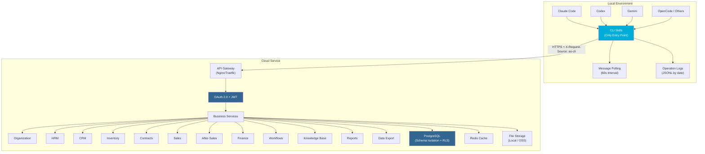

<div align="center">

# AI-Automated-office

**Agent-Driven Enterprise SaaS — No Frontend, Just API + CLI**

[](LICENSE)
[](https://go.dev)
[](https://postgresql.org)
[](https://docker.com)
[](https://github.com/panxiangyu1995/AI-Automated-office/actions/workflows/ci.yml)
[](https://github.com/panxiangyu1995/AI-Automated-office/actions/workflows/release.yml)

[English](#english) · [中文](#中文)

</div>

---

<a id="english"></a>

## Why AI-Automated-office?

Traditional SaaS gives enterprises a frontend UI for humans to operate. **AI-Automated-office gives enterprises a backend API for Agents to operate — Agents are the digital employees.**

> *"Traditional SaaS gives enterprises a UI for humans; we give enterprises an API for Agents. Agents are the digital workforce."*

### Core Principles

| Principle | Description |
|-----------|-------------|
| **No-Frontend SaaS** | No web/desktop UI. Employees interact through local Agents (Claude Code, Codex, Gemini, OpenCode, etc.) |
| **Agent→CLI→API** | The only interaction chain: User talks to Agent → Agent calls CLI Skill → CLI sends HTTPS to API |
| **Data as a Service** | Agent fetches data via API, generates HTML/docs for visualization |
| **Permissions as Barriers** | Multi-tenant isolation + RBAC ensures Agents only access authorized data |
| **Open Source + LAN Deploy** | AGPL v3 licensed, supports on-premise / LAN deployment |

### vs. Traditional SaaS

| Dimension | Traditional SaaS | AI-Automated-office |
|-----------|-----------------|---------------------|
| **Product Form** | Web/Desktop UI + Backend | **Pure Backend API + Local CLI** |
| **User Interaction** | Humans operate UI | **User ↔ Agent ↔ CLI ↔ API** |
| **Data Display** | Frontend rendering | **Agent generates HTML/docs** |
| **Notifications** | WebSocket/Push | **CLI polling (60s) + Agent notification** |
| **Deployment** | Cloud only | **Cloud + LAN / On-premise** |
| **License** | Proprietary | **AGPL v3 + Commercial** |

---

## Features

### Business Modules (MVP)

| Module | Description |
|--------|-------------|
| **Organization & Permissions** | Enterprise / Department / Employee CRUD, RBAC, cross-enterprise access |
| **HRM** | Employee records, onboarding, offboarding, transfers |
| **CRM** | Customers, contacts, opportunities |
| **Inventory (IMS)** | Materials (5 SKU types), suppliers, procurement, sales, multi-warehouse, transfers, inventory counts |
| **Contract Management** | CRUD, attachments, approval workflows |
| **Sales Management** | Sales orders, contract linkage |
| **After-Sales Service** | Service tickets, quotes, repair orders, customer sign-off |
| **Finance** | Receivables, payment registration, billing |
| **Approval Workflows** | Configurable approval flows |
| **CLI + Skills** | CRUD Skills, message polling |
| **Billing & Subscriptions** | Plans, online payment, invoices, auto-suspend on arrears |
| **Reports & Analytics** | Sales/finance/inventory/HR statistics, cross-enterprise aggregation |
| **Data Import/Export** | Universal import framework, template download, duplicate detection |
| **Audit Log** | Before/after values, data version chain, sensitive operation alerts |
| **Private Deployment** | Cross-platform Docker / native binary, configurable ports/paths, TLS, online upgrade |
| **i18n** | Chinese + English: Skills, error codes, generated files, notifications |

### Target Users

- **Cloud Service Operator** — Operates the platform, creates enterprises, manages all tenants
- **Group Owner** — Owns multiple enterprises, views cross-enterprise data
- **Enterprise Admin** — Manages employees, departments, business data
- **Department Manager** — Manages department staff and operations
- **Employee** — Uses business functions (no admin access)

---

## Tech Stack

| Layer | Technology | Purpose |
|-------|-----------|---------|
| API Gateway | Nginx / Traefik | HTTPS termination, load balancing |
| Authentication | OAuth 2.0 + JWT | Refresh Token mechanism |
| Backend | Go (Gin) | High-performance API service |
| Database | PostgreSQL 15+ | Schema-level multi-tenant isolation |
| ORM | GORM | Database operations |
| Cache | Redis | Session, hot data |
| CLI | Go (Cobra) | Cross-platform CLI tool |
| Container | Docker Compose | One-command deployment |

---

## Architecture



**Key Architecture Rule:** Agent→CLI→API is the **only** interaction chain. Agents must never call business API endpoints directly (no curl). All operations go through `ao-cli skill execute`. CLI manages authentication, request signing, and error recovery.

---

## Installation

### CLI (`ao-cli`)

Choose your preferred method:

#### Homebrew (macOS / Linux)

```bash
brew tap panxiangyu1995/tap
brew install ao-cli
```

#### go install (any OS with Go)

```bash
go install github.com/panxiangyu1995/AI-Automated-office/cli/cmd/ao-cli@latest
```

#### Scoop (Windows)

```bash
scoop bucket add panxiangyu1995 https://github.com/panxiangyu1995/scoop-bucket
scoop install ao-cli
```

#### Binary from GitHub Releases

```bash
# macOS / Linux
curl -sL https://github.com/panxiangyu1995/AI-Automated-office/releases/latest/download/ai-automated-office_$(uname -s)_$(uname -m).tar.gz | tar xz
sudo mv ao-cli /usr/local/bin/

# Windows (PowerShell)
Invoke-WebRequest -Uri "https://github.com/panxiangyu1995/AI-Automated-office/releases/latest/download/ai-automated-office_Windows_x86_64.zip" -OutFile ao-cli.zip
Expand-Archive ao-cli.zip
```

#### Debian / Ubuntu / RPM

```bash
# Download .deb or .rpm from latest release
sudo dpkg -i ao-cli_*_linux_amd64.deb   # Debian/Ubuntu
sudo rpm -i ao-cli-*_linux_amd64.rpm    # RHEL/Fedora
```

### API Server (`ao-api`)

#### Docker (Recommended)

Pre-built images are available on **GitHub Container Registry** — no Docker account required:

```bash
# Pull the latest image
docker pull ghcr.io/panxiangyu1995/ao-api:latest

# Run with PostgreSQL + Redis
docker compose -f deploy/docker-compose/docker-compose.yml up -d
```

Available tags:

| Tag | Description |
|-----|-------------|
| `latest` | Latest stable release |
| `vX.Y.Z` | Specific version |
| `latest-amd64` / `latest-arm64` | Architecture-specific |

> **No Docker account needed.** Public ghcr.io images can be pulled anonymously. You only need to log in if you want to push images.

#### Build from Source

```bash
git clone https://github.com/panxiangyu1995/AI-Automated-office.git
cd AI-Automated-office/api
go build -o ao-api ./cmd/server/main.go
```

---

## Quick Start

### Prerequisites

- [Docker](https://docker.com) + Docker Compose v2
- `ao-cli` installed (see [Installation](#installation))

### 1. Start the API Server

```bash
# Clone the repo (only needed for docker-compose config)
git clone https://github.com/panxiangyu1995/AI-Automated-office.git
cd AI-Automated-office

# macOS: start Docker runtime
colima start --cpu 2 --memory 4

# Start all services (API + PostgreSQL + Redis + Nginx)
docker compose -f deploy/docker-compose/docker-compose.yml up -d
```

Or use pre-built images directly:

```bash
docker pull ghcr.io/panxiangyu1995/ao-api:latest
docker pull ghcr.io/panxiangyu1995/ao-cli:latest
```

### 2. Login with the CLI

```bash
ao-cli auth login
# Enter your server URL (e.g., http://localhost:8080)
# Enter your credentials
```

### 3. Execute a Skill

```bash
ao-cli skill execute hrm_employee_list --enterprise-id=your-enterprise-id
```

### Verify

```bash
# Health check
curl http://localhost:8080/api/v1/health

# Database status
docker exec ao-postgres pg_isready -U ai_office -d ai_office
```

---

## Project Structure

```
AI-Automated-office/
├── api/                        # Go Backend API (Go/Gin)
│   ├── cmd/server/             # Entry point
│   ├── internal/
│   │   ├── handler/            # HTTP handlers
│   │   ├── service/            # Business logic
│   │   ├── repository/         # Data access
│   │   ├── model/              # Data models
│   │   ├── middleware/         # Auth, RBAC, tenant, CORS, logging
│   │   └── pkg/                # Internal shared packages
│   └── pkg/                    # Public packages (API client, config)
├── cli/                        # CLI tool (Go/Cobra)
│   ├── cmd/                    # Commands: auth, poll, skill
│   └── internal/
│       ├── skill/              # Skill definitions & execution
│       ├── poller/             # Message polling
│       └── config/             # CLI configuration
├── deploy/                     # Deployment
│   └── docker-compose/         # Docker Compose + Dockerfiles + Nginx
├── docs/                       # Documentation & OpenAPI spec
└── tests/                      # Test suites
    ├── unit/
    ├── integration/
    └── e2e/
```

---

## API Overview

| Module | Endpoint Prefix | Description |
|--------|----------------|-------------|
| Auth | `/auth/*` | Login, refresh token, logout |
| Organization | `/org/*` | Enterprise, department, employee CRUD |
| HRM | `/hrm/*` | Onboarding, offboarding, transfers, performance |
| CRM | `/crm/*` | Customers, contacts, opportunities |
| Inventory | `/ims/*` | Procurement, sales, stock, warehouses, transfers |
| Contracts | `/contract/*` | CRUD, attachments |
| Sales | `/sales/*` | Sales orders, outbound |
| After-Sales | `/service/*` | Tickets, quotes, repairs |
| Finance | `/finance/*` | Receivables, payables, invoices |
| Workflows | `/workflow/*` | Approval flow config, approval actions |
| Files | `/file/*` | Upload, download, preview |
| Knowledge Base | `/kb/*` | Documents, RAG search |
| Messages | `/message/*` | Message list, read status |
| Data Export | `/data-export/*` | Agent-driven data export |
| Audit Log | `/audit-log/*` | Audit log query, export |

Full API documentation: [docs/api/openapi.yaml](docs/api/openapi.yaml)

---

## CLI & Skills

The CLI (`ao-cli`) is the **only gateway** to business APIs. Agents interact with the system through Skills.

### Key Commands

```bash
ao-cli init                    # Initialize CLI configuration
ao-cli auth login              # Authenticate (OAuth 2.0)
ao-cli auth refresh            # Refresh access token
ao-cli auth logout             # Revoke tokens
ao-cli skill execute <skill>   # Execute a business skill
ao-cli skill list              # List available skills
ao-cli poll                    # Start message polling (60s interval)
```

### Skill Naming Convention

`{module}_{entity}_{action}` — e.g., `hrm_employee_create`, `crm_customer_list`, `ims_stock_query`

### Operation Logs

CLI automatically logs all Skill executions to `~/.ai-office-cli/logs/YYYY-MM-DD.jsonl`, enabling Agents to recall operation history and maintain conversation continuity.

---

## Multi-Tenancy & Security

### Tenant Isolation

- **PostgreSQL Schema-level isolation** — each enterprise gets its own schema
- **Row-Level Security (RLS)** — additional data-level protection
- **All repository queries must include `enterprise_id`** — no cross-tenant data leakage

### Authentication & Authorization

- **OAuth 2.0 + JWT** with Refresh Token rotation
- **RBAC + ABAC** hybrid permission model
- **CLI-only access** — server validates `X-Request-Source: ao-cli` header, rejects direct HTTP calls
- **Structured error codes** — Agent-recoverable errors with explicit recovery actions

---

## Deployment

### Docker Compose (Recommended for MVP)

```bash
# Copy environment template
cp deploy/docker-compose/.env.example deploy/docker-compose/.env

# Edit .env with your production values (JWT_SECRET, DB_PASSWORD, etc.)

# Start all services (uses pre-built ghcr.io images)
docker compose -f deploy/docker-compose/docker-compose.yml up -d
```

The `docker-compose.yml` pulls images from `ghcr.io/panxiangyu1995/` by default. To build from source instead, set the `build` context in the compose file.

### Docker Images

All images are hosted on **GitHub Container Registry (ghcr.io)** — free, no account required to pull.

| Image | Registry |
|-------|----------|
| API Server | `ghcr.io/panxiangyu1995/ao-api:latest` |
| CLI | `ghcr.io/panxiangyu1995/ao-cli:latest` |

Multi-arch manifests support both `amd64` and `arm64` automatically.

### On-Premise / LAN Deployment

- Cross-platform Docker or native binary
- Configurable ports and data directories
- Self-signed TLS support
- Online upgrade mechanism
- Health check endpoints

### Service Ports

| Service | Default Port |
|---------|-------------|
| API (Gin) | 8080 |
| PostgreSQL | 5432 |
| Redis | 6379 |
| Nginx | 80 / 443 |

---

## License

This project is dual-licensed:

- **Open Source**: [GNU AGPL v3](LICENSE) — free to use, modify, and distribute under copyleft terms
- **Commercial**: [Commercial License](COMMERCIAL_LICENSE.md) — for proprietary use without AGPL obligations

If you modify AI-Automated-office and provide it as a network service, you must release your source code under AGPL v3. For proprietary use, [contact us for a commercial license](mailto:license@ai-office.com).

---

## Contributing

We welcome contributions! Please read our [Contributing Guide](CONTRIBUTING.md) for:

- Development setup instructions
- Code style and commit conventions
- Testing requirements
- Pull request process
- Multi-tenant safety rules

Please also follow our [Code of Conduct](CODE_OF_CONDUCT.md).

---

## Contact

- **Issues**: [GitHub Issues](https://github.com/panxiangyu1995/AI-Automated-office/issues)
- **Discussions**: [GitHub Discussions](https://github.com/panxiangyu1995/AI-Automated-office/discussions)
- **Commercial License**: [license@ai-office.com](mailto:license@ai-office.com)
- **Security**: [security@ai-office.com](mailto:security@ai-office.com)

---

---

<a id="中文"></a>

<div align="center">

# AI-Automated-office

**面向 Agent 的企业级云服务 SaaS — 无前端，只有 API + CLI**

</div>

## 为什么选择 AI-Automated-office？

传统 SaaS 给企业一个前端界面让人操作。**AI-Automated-office 给企业一个后端 API 让 Agent 操作——Agent 就是企业的数字员工。**

> *"传统 SaaS 给企业一个 UI 让人操作；我们给企业一个 API 让 Agent 操作，Agent 就是数字劳动力。"*

### 核心理念

| 原则 | 说明 |
|------|------|
| **无前端 SaaS** | 不提供 Web/桌面 UI，员工通过本地 Agent（Claude Code、Codex、Gemini、OpenCode 等）对话操作系统 |
| **Agent→CLI→API** | 唯一交互链路：用户与 Agent 对话 → Agent 调用 CLI Skill → CLI 发送 HTTPS 请求到 API |
| **数据即服务** | Agent 调用 API 获取数据后，生成 HTML/文档进行可视化展示 |
| **权限即壁垒** | 多租户隔离 + RBAC 权限体系，确保 Agent 只能访问授权范围内的数据 |
| **开源+局域网部署** | AGPL v3 开源，支持社区局域网部署 |

### 与传统 SaaS 对比

| 维度 | 传统 SaaS | 本产品 |
|------|----------|--------|
| **产品形态** | Web/桌面 UI + 后端 | **纯后端 API + 本地 CLI** |
| **用户交互** | 人操作界面 | **用户 ↔ Agent ↔ CLI ↔ API** |
| **数据展示** | 前端渲染 | **Agent 生成 HTML/文档** |
| **消息通知** | WebSocket/Push | **CLI 轮询（60秒）+ Agent 通知** |
| **部署方式** | 仅云端 | **云端 + 局域网/私有化部署** |
| **开源程度** | 闭源 | **AGPL v3 + 商业授权** |

---

## 功能模块（MVP）

| 模块 | 说明 |
|------|------|
| **组织架构/权限** | 企业/部门/员工 CRUD、RBAC、跨企业权限 |
| **HRM** | 员工档案、入职、离职、调岗 |
| **CRM** | 客户、联系人、商机 |
| **进销存** | 物料（5类SKU）、供应商、采购入库、销售出库、多仓库、调拨、盘库 |
| **合同管理** | CRUD、附件上传、审批流 |
| **销售管理** | 销售订单、关联合同 |
| **售后管理** | 售后工单、报价、维修单、客户签字 |
| **财务管理** | 应收款、回款登记、发票 |
| **审批工作流** | 可配置审批流 |
| **CLI + Skill** | 基础 CRUD Skill、消息轮询 |
| **计费与订阅** | 订阅计划、在线支付、账单、欠费自动处理 |
| **业务统计报表** | 销售/财务/库存/人事统计、跨企业汇总 |
| **数据导入导出** | 通用导入框架、模板下载、重复检测 |
| **审计日志** | 变更前后值、数据版本链、敏感操作告警 |
| **私有化部署** | 跨平台 Docker/原生二进制、端口可配置、TLS、在线升级 |
| **多语言** | 中英文双语：Skill、错误码、生成文件、消息通知 |

---

## 技术栈

| 层级 | 技术 | 用途 |
|------|------|------|
| API 网关 | Nginx / Traefik | HTTPS 终结、负载均衡 |
| 认证授权 | OAuth 2.0 + JWT | Refresh Token 机制 |
| 后端框架 | Go (Gin) | 高性能 API 服务 |
| 数据库 | PostgreSQL 15+ | Schema 级多租户隔离 |
| ORM | GORM | 数据库操作 |
| 缓存 | Redis | Session、热点数据 |
| CLI | Go (Cobra) | 跨平台 CLI 工具 |
| 容器化 | Docker Compose | 一键部署 |

---

## 安装

### CLI (`ao-cli`)

选择你偏好的安装方式：

#### Homebrew (macOS / Linux)

```bash
brew tap panxiangyu1995/tap
brew install ao-cli
```

#### go install（任何安装了 Go 的系统）

```bash
go install github.com/panxiangyu1995/AI-Automated-office/cli/cmd/ao-cli@latest
```

#### Scoop (Windows)

```bash
scoop bucket add panxiangyu1995 https://github.com/panxiangyu1995/scoop-bucket
scoop install ao-cli
```

#### 从 GitHub Releases 下载二进制

```bash
# macOS / Linux
curl -sL https://github.com/panxiangyu1995/AI-Automated-office/releases/latest/download/ai-automated-office_$(uname -s)_$(uname -m).tar.gz | tar xz
sudo mv ao-cli /usr/local/bin/
```

#### Debian / Ubuntu / RPM

```bash
sudo dpkg -i ao-cli_*_linux_amd64.deb   # Debian/Ubuntu
sudo rpm -i ao-cli-*_linux_amd64.rpm    # RHEL/Fedora
```

### API 服务 (`ao-api`)

#### Docker（推荐）

预构建镜像托管在 **GitHub Container Registry** — 无需 Docker 账号即可拉取：

```bash
docker pull ghcr.io/panxiangyu1995/ao-api:latest
```

> **无需注册 Docker 账号。** ghcr.io 公开镜像可匿名拉取，只有推送镜像时才需要登录。

#### 从源码构建

```bash
git clone https://github.com/panxiangyu1995/AI-Automated-office.git
cd AI-Automated-office/api
go build -o ao-api ./cmd/server/main.go
```

---

## 快速开始

### 前置条件

- [Docker](https://docker.com) + Docker Compose v2
- `ao-cli` 已安装（见[安装](#安装)）

### 1. 启动 API 服务

```bash
git clone https://github.com/panxiangyu1995/AI-Automated-office.git
cd AI-Automated-office

# macOS: 启动 Docker 运行时
colima start --cpu 2 --memory 4

# 启动所有服务（API + PostgreSQL + Redis + Nginx）
docker compose -f deploy/docker-compose/docker-compose.yml up -d
```

或直接使用预构建镜像：

```bash
docker pull ghcr.io/panxiangyu1995/ao-api:latest
docker pull ghcr.io/panxiangyu1995/ao-cli:latest
```

### 2. 使用 CLI 登录

```bash
ao-cli auth login
# 输入服务器地址（如 http://localhost:8080）
# 输入凭证
```

### 3. 执行 Skill

```bash
ao-cli skill execute hrm_employee_list --enterprise-id=your-enterprise-id
```

### 验证

```bash
# 健康检查
curl http://localhost:8080/api/v1/health

# 数据库状态
docker exec ao-postgres pg_isready -U ai_office -d ai_office
```

---

## 多租户与安全

- **PostgreSQL Schema 级隔离** — 每个企业独立 Schema
- **Row-Level Security (RLS)** — 数据级保护
- **所有 repository 查询必须包含 `enterprise_id`** — 杜绝跨租户数据泄露
- **OAuth 2.0 + JWT** 认证，RBAC + ABAC 混合权限模型
- **CLI 唯一入口** — 服务端验证 `X-Request-Source: ao-cli`，拒绝非 CLI 请求

---

## 许可证

本项目采用双轨授权：

- **开源协议**：[GNU AGPL v3](LICENSE) — 免费使用、修改和分发，需遵守 copyleft 条款
- **商业授权**：[商业许可证](COMMERCIAL_LICENSE.md) — 闭源使用，无需遵守 AGPL 义务

如果您修改了 AI-Automated-office 并以网络服务形式提供，必须以 AGPL v3 开源修改后的代码。如需闭源使用，请[联系我们获取商业授权](mailto:license@ai-office.com)。

---

## 贡献

欢迎贡献！请阅读[贡献指南](CONTRIBUTING.md)，了解：

- 开发环境搭建
- 代码风格与提交规范
- 测试要求
- Pull Request 流程
- 多租户安全规则

同时请遵守我们的[行为准则](CODE_OF_CONDUCT.md)。

---

## 联系方式

- **问题反馈**：[GitHub Issues](https://github.com/panxiangyu1995/AI-Automated-office/issues)
- **讨论交流**：[GitHub Discussions](https://github.com/panxiangyu1995/AI-Automated-office/discussions)
- **商业授权**：[license@ai-office.com](mailto:license@ai-office.com)
- **安全问题**：[security@ai-office.com](mailto:security@ai-office.com)
