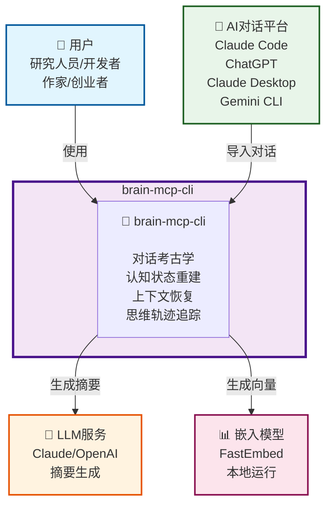
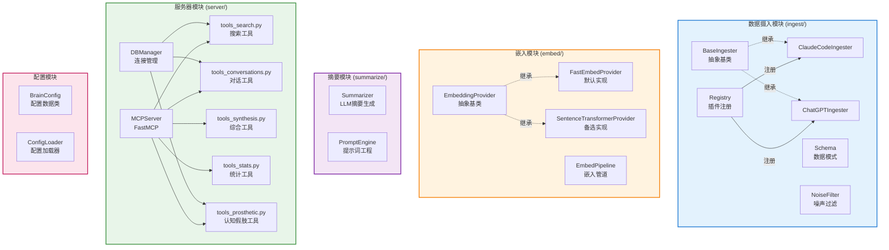
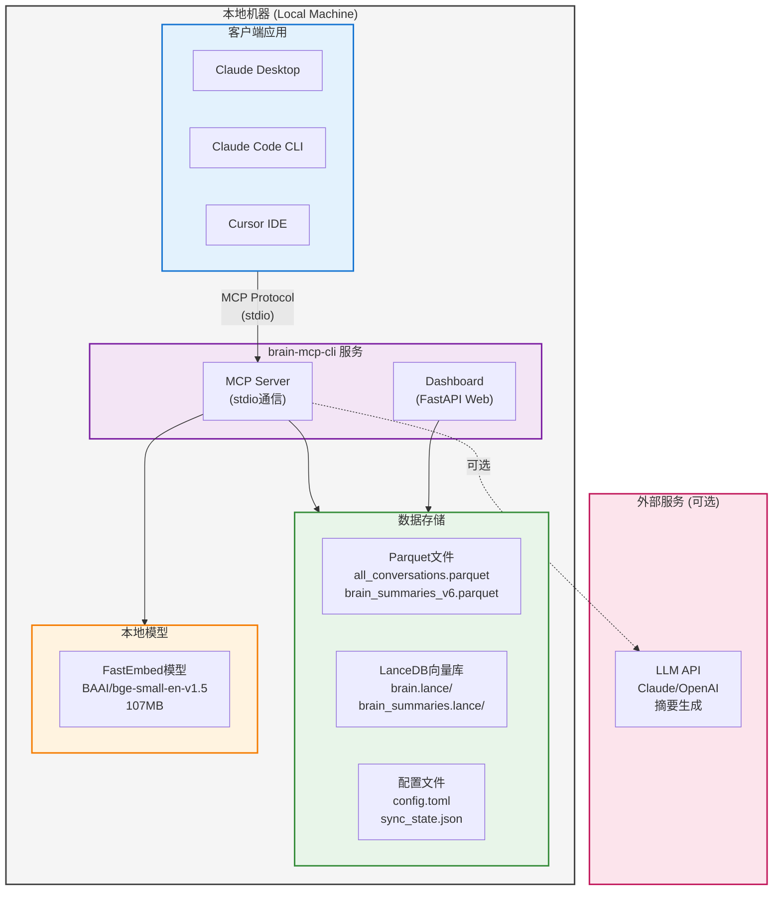
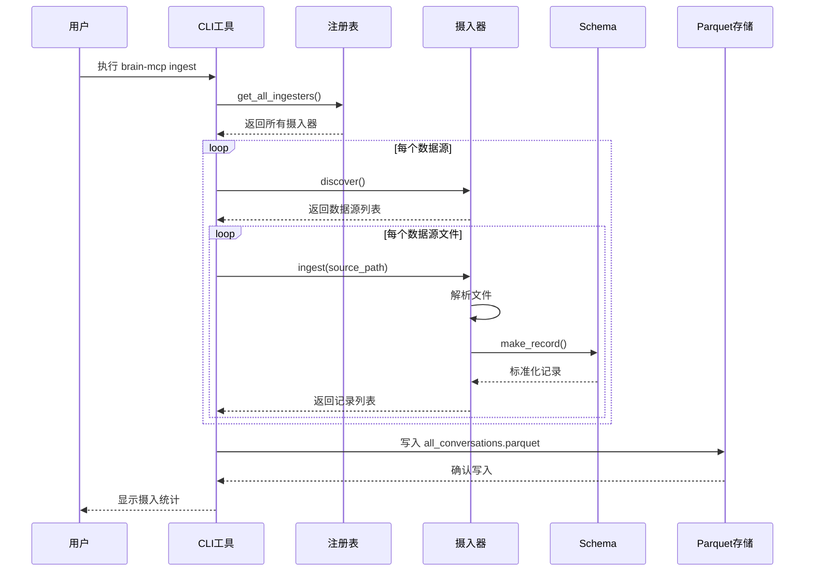
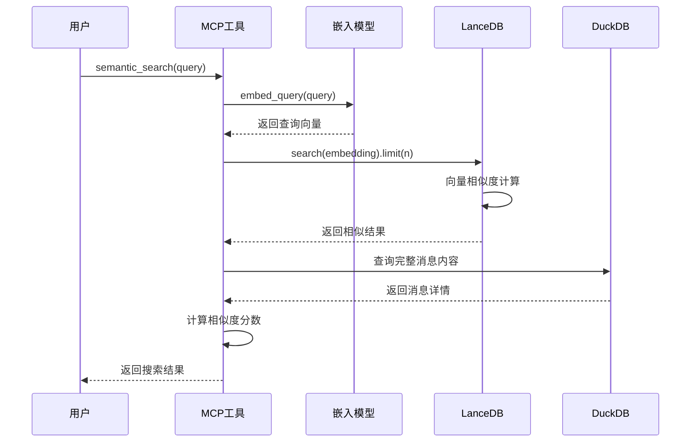
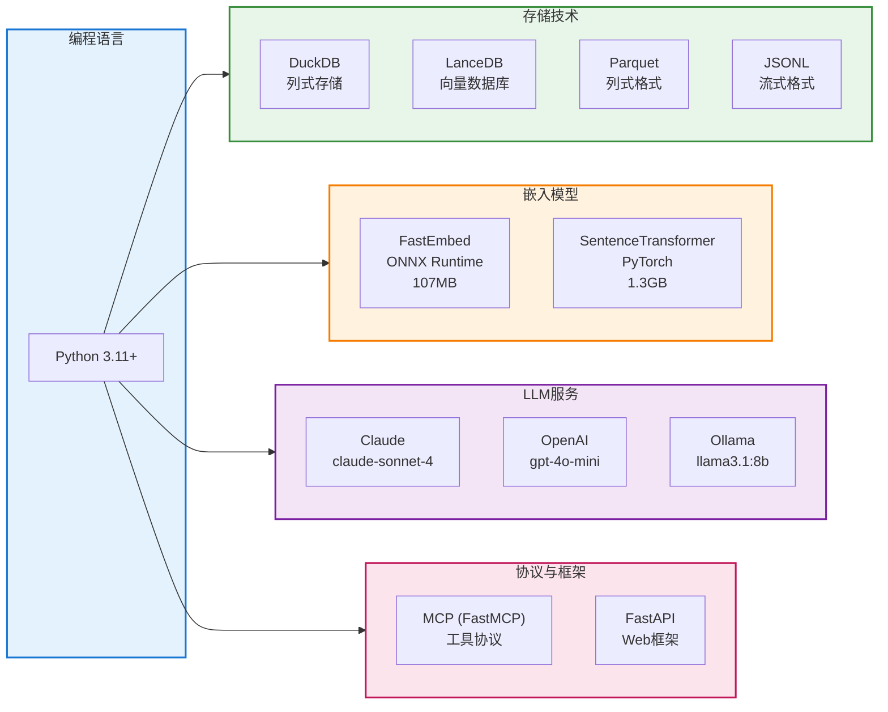

# brain-mcp-cli 架构图集

> 使用Mermaid语法创建的多视角架构图

---

## 1. 系统架构图 (System Architecture)

```mermaid
graph TB
    subgraph Client["客户端层 (Client Layer)"]
        CD[Claude Desktop]
        CC[Claude Code]
        CR[Cursor]
        WS[Windsurf]
        Custom[自定义客户端]
    end

    subgraph MCPServer["MCP服务器层 (MCP Server Layer)"]
        Search["🔍 搜索工具<br/>semantic_search<br/>search_summaries<br/>hybrid_search"]
        Conv["💬 对话工具<br/>get_conversation<br/>list_conversations<br/>get_messages"]
        Synth["🧪 综合工具<br/>what_do_i_think<br/>find_related<br/>unified_search"]
        Stats["📊 统计工具<br/>get_stats<br/>activity_timeline"]
        Cog["🧠 认知假肢工具<br/>tunnel_state<br/>thinking_trajectory<br/>switching_cost<br/>dormant_contexts"]
    end

    subgraph DataAccess["数据访问层 (Data Access Layer)"]
        DuckDB["DuckDB连接池<br/>对话查询<br/>SQL接口"]
        LanceDB["LanceDB连接池<br/>向量检索<br/>混合搜索"]
        EmbedModel["嵌入模型单例<br/>FastEmbed<br/>SentenceTransformer"]
    end

    subgraph Storage["数据存储层 (Storage Layer)"]
        Parquet["Parquet文件<br/>all_conversations.parquet<br/>brain_summaries_v6.parquet"]
        Lance["LanceDB向量库<br/>brain.lance/<br/>brain_summaries.lance/"]
        Config["配置文件<br/>config.toml<br/>sync_state.json"]
    end

    Client -->|"MCP Protocol<br/>(stdio)"| MCPServer
    MCPServer --> DataAccess
    DataAccess --> Storage

    style Client fill:#e3f2fd,stroke:#1976d2,stroke-width:2px
    style MCPServer fill:#f3e5f5,stroke:#7b1fa2,stroke-width:2px
    style DataAccess fill:#fff3e0,stroke:#f57c00,stroke-width:2px
    style Storage fill:#e8f5e9,stroke:#388e3c,stroke-width:2px
```

---

## 2. 四层记忆架构图 (Memory Architecture)

```mermaid
graph TB
    subgraph L4["L4: 认知状态层 (Cognitive State)"]
        Stage["思考阶段<br/>exploring<br/>crystallizing<br/>refining<br/>executing"]
        Questions["开放问题追踪<br/>Open Questions"]
        Decisions["决策历史<br/>Decisions"]
        Emotion["情感基调<br/>Emotional Tone"]
        Pattern["认知模式<br/>Cognitive Pattern"]
    end

    subgraph L3["L3: 结构化摘要层 (Structured Summary)"]
        Summary["对话摘要<br/>Summary"]
        Insights["关键洞察<br/>Key Insights"]
        Concepts["概念提取<br/>Concepts"]
        Domain["领域分类<br/>Domain Classification"]
        Importance["重要性分级<br/>breakthrough<br/>significant<br/>routine"]
    end

    subgraph L2["L2: 语义向量层 (Semantic Vector)"]
        MsgEmbed["消息嵌入向量<br/>Message Embeddings<br/>384/768维"]
        SumEmbed["摘要嵌入向量<br/>Summary Embeddings"]
        Similarity["语义相似度索引<br/>Similarity Index"]
        LanceStore["LanceDB存储<br/>向量数据库"]
    end

    subgraph L1["L1: 原始数据层 (Raw Data)"]
        Messages["对话消息<br/>Parquet格式"]
        Metadata["元数据<br/>时间/来源/项目"]
        Features["特征标记<br/>代码/URL/问题"]
        Noise["噪声过滤<br/>Noise Filter"]
    end

    L4 -->|"摘要系统生成"| L3
    L3 -->|"LLM分析"| L2
    L2 -->|"FastEmbed"| L1

    style L4 fill:#4caf50,stroke:#2e7d32,stroke-width:3px,color:#fff
    style L3 fill:#9c27b0,stroke:#6a1b9a,stroke-width:3px,color:#fff
    style L2 fill:#ff9800,stroke:#e65100,stroke-width:3px,color:#fff
    style L1 fill:#2196f3,stroke:#1565c0,stroke-width:3px,color:#fff
```

---

## 3. 数据流图 (Data Flow Diagram)

```mermaid
graph LR
    subgraph Sources["数据源"]
        ClaudeCode["Claude Code<br/>JSONL"]
        ChatGPT["ChatGPT<br/>JSON"]
        ClaudeDesktop["Claude Desktop<br/>JSONL"]
        Gemini["Gemini CLI<br/>JSONL"]
        Clawdbot["Clawdbot<br/>JSONL"]
        Generic["Generic<br/>JSONL"]
    end

    subgraph Ingest["数据摄入系统"]
        Parser["解析器<br/>Parser"]
        Normalizer["标准化<br/>Canonical Schema"]
        Filter["噪声过滤<br/>Noise Filter"]
        Feature["特征提取<br/>Feature Extract"]
        Registry["插件注册<br/>Registry Pattern"]
    end

    subgraph Storage["存储系统"]
        ParquetStore["Parquet存储<br/>列式存储<br/>高压缩率"]
        LanceStore["LanceDB存储<br/>向量索引<br/>混合搜索"]
    end

    subgraph Process["智能处理"]
        Embedding["嵌入生成<br/>FastEmbed<br/>384/768维"]
        Summary["摘要生成<br/>LLM分析<br/>结构化提取"]
        Search["语义搜索<br/>向量检索<br/>混合搜索"]
        Cognitive["认知分析<br/>状态重建<br/>轨迹追踪"]
    end

    subgraph Output["MCP工具输出"]
        SearchTools["🔍 搜索工具<br/>6个工具"]
        ConvTools["💬 对话工具<br/>5个工具"]
        SynthTools["🧪 综合工具<br/>4个工具"]
        StatsTools["📊 统计工具<br/>2个工具"]
        CogTools["🧠 认知假肢工具<br/>8个工具"]
    end

    Sources -->|"原始对话文件"| Ingest
    Ingest -->|"标准化记录"| Storage
    Storage -->|"数据查询"| Process
    Process -->|"结构化输出"| Output

    style Sources fill:#e3f2fd,stroke:#1976d2,stroke-width:2px
    style Ingest fill:#fff3e0,stroke:#f57c00,stroke-width:2px
    style Storage fill:#e8f5e9,stroke:#388e3c,stroke-width:2px
    style Process fill:#f3e5f5,stroke:#7b1fa2,stroke-width:2px
    style Output fill:#fce4ec,stroke:#c2185b,stroke-width:2px
```

---

## 4. C4 Context Diagram

---

## 5. 组件关系图 (Component Diagram)

---

## 6. 部署架构图 (Deployment Diagram)

---

## 7. 认知假肢工具流程图

```mermaid
graph TB
    subgraph Input["用户输入"]
        Query["查询/领域<br/>Query/Domain"]
    end

    subgraph TunnelState["tunnel_state<br/>领域状态重建"]
        TS1["查询领域相关摘要"]
        TS2["聚合开放问题"]
        TS3["聚合决策历史"]
        TS4["提取活跃概念"]
        TS5["构建领域记忆"]
    end

    subgraph Trajectory["thinking_trajectory<br/>思维轨迹追踪"]
        TR1["查询相关摘要"]
        TR2["按时间排序"]
        TR3["提取演变轨迹"]
        TR4["分析阶段转换"]
    end

    subgraph SwitchCost["switching_cost<br/>切换成本计算"]
        SC1["获取当前领域状态"]
        SC2["获取目标领域状态"]
        SC3["计算开放问题成本"]
        SC4["计算概念重叠"]
        SC5["计算重要性成本"]
        SC6["综合成本评分"]
    end

    subgraph Dormant["dormant_contexts<br/>休眠上下文发现"]
        DC1["扫描所有领域"]
        DC2["计算最后活跃时间"]
        DC3["检查开放问题"]
        DC4["检查重要性标记"]
        DC5["识别休眠领域"]
    end

    Query --> TunnelState
    Query --> Trajectory
    Query --> SwitchCost
    Query --> Dormant

    TS1 --> TS2 --> TS3 --> TS4 --> TS5
    TR1 --> TR2 --> TR3 --> TR4
    SC1 --> SC2 --> SC3 --> SC4 --> SC5 --> SC6
    DC1 --> DC2 --> DC3 --> DC4 --> DC5

    style Input fill:#e3f2fd,stroke:#1976d2,stroke-width:2px
    style TunnelState fill:#e8f5e9,stroke:#388e3c,stroke-width:2px
    style Trajectory fill:#fff3e0,stroke:#f57c00,stroke-width:2px
    style SwitchCost fill:#f3e5f5,stroke:#7b1fa2,stroke-width:2px
    style Dormant fill:#fce4ec,stroke:#c2185b,stroke-width:2px
```

---

## 8. 数据摄入流程时序图

---

## 9. 语义搜索流程时序图

---

## 10. 技术栈关系图

---

## 图表说明

### 图表类型说明

| 图表类型 | 用途 | 关键信息 |
|---------|------|---------|
| **系统架构图** | 展示整体系统层次结构 | 客户端、服务器、数据访问、存储四层 |
| **四层记忆架构图** | 展示记忆系统的层次设计 | L1-L4四层记忆模型 |
| **数据流图** | 展示数据流动路径 | 从数据源到工具输出的完整流程 |
| **C4 Context图** | 展示系统上下文关系 | 用户、系统、外部服务的关系 |
| **组件关系图** | 展示模块内部组件关系 | 各模块的类继承和依赖关系 |
| **部署架构图** | 展示部署拓扑结构 | 本地部署的完整架构 |
| **认知假肢工具流程图** | 展示核心工具的处理流程 | tunnel_state等工具的内部逻辑 |
| **时序图** | 展示交互顺序 | 数据摄入和搜索的详细步骤 |
| **技术栈关系图** | 展示技术选型 | 各技术的分类和关系 |

### 颜色编码说明

- 🔵 **蓝色** (#e3f2fd) - 数据源、客户端
- 🟢 **绿色** (#e8f5e9) - 存储层、认知状态层
- 🟠 **橙色** (#fff3e0) - 处理层、嵌入模块
- 🟣 **紫色** (#f3e5f5) - 服务器层、摘要层
- 🔴 **粉红** (#fce4ec) - 输出层、工具层

---

## 使用说明

### 在Markdown中查看

这些Mermaid图表可以在以下环境中直接渲染：
- GitHub Markdown
- GitLab Markdown
- VS Code (安装Mermaid插件)
- Typora
- Notion (部分支持)

### 导出为图片

可以使用以下工具将Mermaid图表导出为PNG/SVG：
- [Mermaid Live Editor](https://mermaid.live/)
- VS Code Mermaid插件
- 命令行工具: `mmdc` (mermaid-cli)

---

**文档生成时间**: 2026-03-21  
**基于**: brain-mcp-cli 项目研究文档  
**工具**: Mermaid + architecture-diagrams skill
