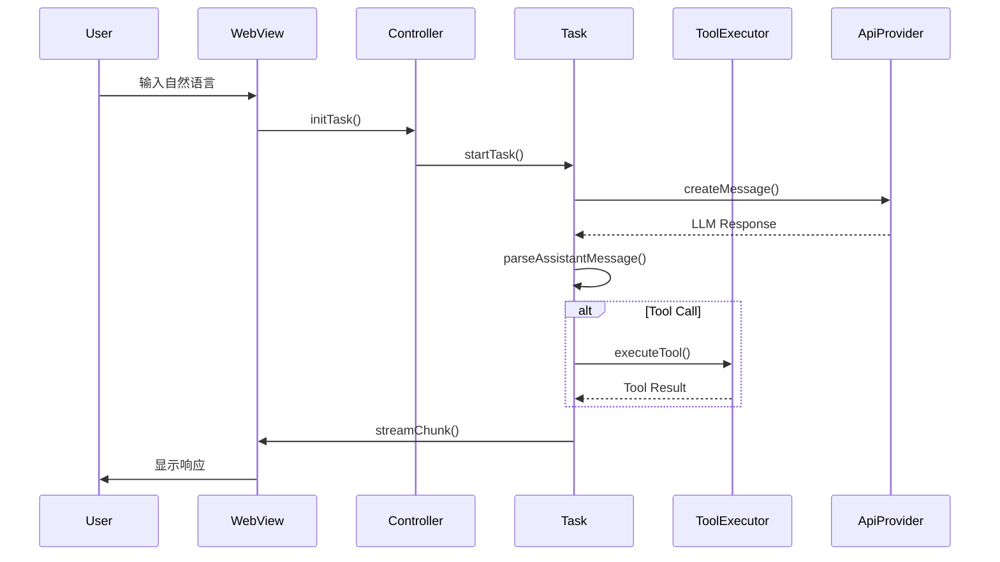
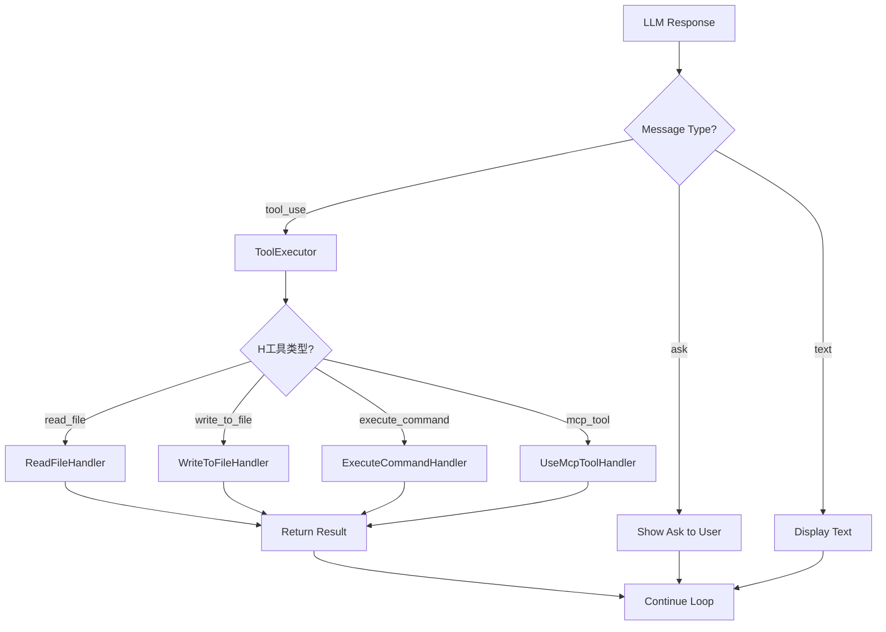

# Cline  autonomous Coding Agent 需求文档

**Author:** Claude (AI Brownfield Analysis)
**Date:** 2026-03-29
**Analysis Basis:** cline v3.x 源码逆向工程分析
**Project Context:** Brownfield（已有完整实现）

---

## Executive Summary（执行摘要）

### 功能定位

Cline 是一款**自主编码的 VS Code 扩展**，通过集成本地开发环境与 LLM API，将自然语言指令转换为可执行的代码操作。其核心定位为**AI Coding Assistant**，区别于简单的话痨式对话，强调**Tool-Based Agent**范式——让 AI 通过文件系统、Shell 命令、浏览器等工具真正执行任务。

| 设计要点 | 解决的问题 |
|----------|-----------|
| 多 Provider 统一接入 | 避免供应商锁定，支持 40+ LLM API |
| 工具执行引擎 | 让 AI 不仅回答问题，而是真正操作文件/终端 |
| Plan/Act 双模式 | Planning 模式保留用户控制权，Act 模式实现自动化 |
| MCP 协议集成 | 标准化扩展工具生态，实现第三方工具即插即用 |
| Checkpoint 快照 | 危险操作前自动备份，支持一键回滚 |

### 目标用户

| 用户类型 | 使用场景 |
|----------|----------|
| 前端/后端开发者 | 用自然语言描述需求，AI 自动生成代码 |
| DevOps 工程师 | 描述部署需求，AI 执行 Shell 命令完成配置 |
| 全栈开发者 | 跨前端、后端、数据库的多层任务自动化 |
| 学习者 | 通过 AI 解释代码、学习新框架 |

### 业务价值

- **效率提升**：减少机械性编码时间，开发者专注架构设计
- **降低门槛**：自然语言驱动，非程序员也可完成基础开发任务
- **质量保障**：Checkpoint 机制确保操作可回溯

### What Makes This Special

1. **Host 抽象层**：VS Code 扩展、CLI 工具、外部编辑器三种入口统一核心逻辑
2. **ACP (Agent Client Protocol)**：标准化的 Agent 通信协议，支持外部编辑器集成
3. **Permission System**：细粒度权限控制，YOLO 模式与逐项审批并存
4. **MCP Hub**：一站式 MCP 服务器管理，OAuth 认证支持

---

## Project Classification（项目分类）

| 维度 | 分类 |
|------|------|
| **项目类型** | VS Code Extension + CLI Tool |
| **领域** | AI Coding Assistant / Autonomous Agent |
| **复杂度** | High |
| **项目上下文** | Brownfield（已有完整实现） |
| **目标用户** | Software Developers, DevOps Engineers |
| **技术栈** | TypeScript + React + Node.js + VS Code API + Rust (CLI TUI) |
| **部署环境** | VS Code Marketplace / NPM Global |
| **依赖服务** | LLM API Providers (Anthropic, OpenAI, Google, AWS, GCP, Local) |

---

## Success Criteria（成功标准）

### User Success（用户成功）

**用户成功的"Aha时刻"：**

| 场景 | 成功表现 |
|------|----------|
| 首次完成代码修改 | 用户说"把这段代码改成箭头函数"，AI 实际修改了文件 |
| 执行危险 Shell 命令 | AI 执行 `rm -rf node_modules` 前请求确认，用户阻止了误操作 |
| 多文件重构 | 用户说"把所有 React class 改成 hooks"，AI 完成了 10+ 文件的批量修改 |
| Checkpoint 回滚 | 误操作后一键恢复到修改前的状态 |

**用户成功指标：**

| 指标 | 目标 |
|------|------|
| 任务完成率 | ≥ 80% |
| 用户主动取消率 | ≤ 15%（说明 AI 没有过度自作主张） |
| Checkpoint 使用率 | ≥ 10%（危险操作前的安全意识） |
| 重复使用率 | ≥ 50%（用户愿意再次使用） |

### Technical Success（技术成功）

| 指标 | 目标 |
|------|------|
| API 响应时间（不含 LLM 延迟） | < 500ms |
| 工具执行成功率 | ≥ 95% |
| 上下文窗口利用率 | ≥ 70% |
| VS Code 启动时间影响 | < 2s |
| CLI 冷启动时间 | < 1s |

### Measurable Outcomes（可衡量成果）

| 维度 | 关键指标 | 衡量方式 |
|------|----------|----------|
| 功能覆盖 | 支持 40+ LLM Provider | Provider 配置文件统计 |
| 工具生态 | MCP 服务器可连接数 | MCP Hub 连接测试 |
| 状态持久化 | 任务历史保存完整性 | 重新加载后历史记录验证 |
| 跨平台 | VS Code / CLI / JetBrains | 多 IDE 测试通过率 |

---

## Product Scope（产品范围）

### MVP - Minimum Viable Product（最小可行产品）

**必须具备的核心功能：**

| 模块 | 功能 |
|------|------|
| **Agent Core** | Task 引擎、消息解析、工具执行循环 |
| **API Providers** | Anthropic/OpenAI/Gemini 多 Provider 接入 |
| **File Tools** | read_file / write_to_file / search_files / replace_in_file |
| **Shell Tools** | execute_command（用户确认制） |
| **Web Tools** | web_search / web_fetch |
| **UI - Chat** | 消息列表、用户输入、发送按钮 |
| **UI - Settings** | API Key 配置、Model 选择 |
| **State** | Task History 持久化 |
| **Permission** | 逐项审批（默认）、Auto-Approve 规则 |

### Growth Features（增长功能）

| 功能 | 说明 |
|------|------|
| **Plan/Act Mode** | Plan 模式生成计划待审批，Act 模式自动执行 |
| **Checkpoint** | Workspace 快照与恢复 |
| **MCP Integration** | Model Context Protocol 工具生态 |
| **Browser Automation** | 浏览器录制与自动化回放 |
| **YOLO Mode** | 完全自动执行，无审批 |
| **Subagent** | 主任务派生子任务执行 |
| **CLI Tool** | 无图形界面下的 TUI 操作 |

### Vision（未来愿景）

| 功能 | 说明 |
|------|------|
| **Multi-Agent协作** | 多个 Cline 实例协作完成复杂任务 |
| **Custom Tools** | 用户自定义工具注册 |
| **Eval Framework** | 自动化评估 Agent 能力 |
| **JetBrains Integration** | 扩展到更多 IDE |

---

## User Journeys（用户旅程）

### Journey 1: 自然语言代码修改

**人物档案**
- **姓名**：张开发
- **角色**：前端工程师
- **现状**：需要将 20 个 React class 组件改成 hooks
- **内心渴望**：快速完成迁移，不出 bug

**旅程叙事**

```
1. 张开发在 VS Code 中打开 Cline 聊天面板
2. 输入："把所有 components 目录下的 class 组件改成 hooks"
3. Cline 分析目录结构，制定修改计划
4. 展示计划："将修改以下 20 个文件：
   - src/components/Button.tsx
   - src/components/Modal.tsx
   ..."
5. 张开发点击"批准"
6. Cline 逐一修改文件，每次修改后展示 Diff
7. 全部完成后显示摘要
```

**旅程需求**
- 自然语言理解与意图澄清
- 批量文件操作的进度展示
- Diff 可视化与审批机制

---

### Journey 2: 调试与修复

**人物档案**
- **姓名**：李测试
- **角色**：QA 工程师
- **现状**：发现一个 Bug，想让 AI帮忙排查
- **内心渴望**：快速定位问题根因

**旅程叙事**

```
1. 李测试复制报错信息到 Chat
2. 输入："这个错误是什么原因？怎么修复？"
3. Cline 分析错误堆栈，定位到 src/api/user.ts:45
4. 解释原因并提供修复方案
5. 询问："是否立即应用修复？"
6. 李测试点击"批准"
7. Cline 修改文件，运行测试验证
```

**旅程需求**
- 错误日志解析能力
- 代码修改 + 测试验证闭环
- 修改前 Checkpoint 备份

---

### Journey 3: CLI 自动化脚本

**人物档案**
- **姓名**：王运维
- **角色**：DevOps 工程师
- **现状**：需要在一台新服务器上配置环境
- **内心渴望**：减少重复性操作

**旅程叙事**

```
1. 王运维在终端中运行 cline task
2. 输入："帮我安装 Node.js、Nginx、Docker，并配置防火墙"
3. Cline 分步骤执行：
   - sudo apt-get install nodejs
   - sudo apt-get install nginx
   ...
4. 每步执行前显示命令，等待确认（auto-approve 规则已配置）
5. 安装完成后显示完整报告
```

**旅程需求**
- TUI 交互界面
- Shell 命令执行与输出实时显示
- auto-approve 规则灵活配置

---

### Journey Requirements Summary（旅程需求汇总）

| 能力领域 | 涉及旅程 | 关键功能 |
|----------|----------|----------|
| 自然语言理解 | J1, J2, J3 | LLM 多轮对话、意图解析 |
| 文件操作 | J1, J2 | read/write/search/edit |
| Shell 执行 | J2, J3 | execute_command |
| 审批机制 | J1, J2, J3 | Permission System |
| 状态持久化 | J1, J2 | Task History |
| Checkpoint | J1, J2 | Workspace Snapshot |
| MCP 扩展 | J1, J2, J3 | MCP Hub |

---

## Technical Requirements（技术需求）

### Technical Architecture（技术架构）

| 层级 | 技术选型 | 说明 |
|------|----------|------|
| **前端 (VS Code)** | VS Code Extension API + React 18 | Webview 渲染 UI |
| **前端 (CLI)** | React Ink + TypeScript | 终端 TUI 渲染 |
| **UI组件库** | 自定义组件 + Tailwind CSS | Webview UI 定制化 |
| **状态管理** | React Context + StateManager | 全局状态 + 持久化 |
| **后端 (Core)** | TypeScript (Node.js) | Agent 核心逻辑 |
| **通信协议** | gRPC / Protobuf | Extension ↔ Webview IPC |
| **数据库** | File System (JSON) | State 持久化 |
| **Agent 引擎** | Task + ToolExecutor | 任务循环执行 |

### Performance Targets（性能指标）

| 指标 | 目标值 |
|------|--------|
| VS Code 扩展激活时间 | < 2 秒 |
| Webview 首次渲染 | < 500ms |
| API 请求响应（不含 LLM） | < 500ms |
| 工具执行反馈延迟 | < 200ms |
| CLI 冷启动 | < 1 秒 |
| 状态保存延迟 | < 100ms |

### Security Requirements（安全要求）

| 安全措施 | 说明 |
|----------|------|
| API Key 安全存储 | VS Code SecretStorage，不明文存储 |
| Shell 命令审批 | 危险命令需用户明确批准 |
| Checkpoint 备份 | 敏感操作前自动快照 |
| 网络请求 | HTTPS 强制（LLM API 调用） |
| 权限隔离 | Auto-Approve 规则 vs 逐项审批 |

### Browser/Mobile Support（兼容性要求）

| 平台 | 版本要求 |
|------|----------|
| VS Code | ≥ 1.85.0 |
| Node.js | ≥ 20.x |
| Chrome (Webview) | 内置 Webview2 |
| CLI 支持 | macOS / Linux / Windows |

---

## Functional Requirements（功能需求）

### 模块一：Agent Core（Agent 核心引擎）

| 编号 | 功能描述 | 优先级 | 实现方式 |
|------|----------|--------|----------|
| FR-AC1 | Task 生命周期管理 | P0 | `Task` 类管理 init/cancel/clear |
| FR-AC2 | 消息解析与处理 | P0 | `parseAssistantMessage` 解析 LLM 响应 |
| FR-AC3 | 工具执行引擎 | P0 | `ToolExecutor` 调度各 Handler |
| FR-AC4 | 上下文窗口管理 | P0 | `ContextManager` 管理 Token 限额 |
| FR-AC5 | Checkpoint 快照 | P1 | `WorkspaceBackup` 文件系统快照 |
| FR-AC6 | Subagent 任务派发 | P2 | `SubagentToolHandler` 子任务执行 |

**关键实现代码路径：**
- `src/core/task/index.ts` - Task 引擎入口
- `src/core/task/tools/handlers/` - 工具 Handler 实现
- `src/core/api/` - API 调用封装

---

### 模块二：API Providers（多 Provider 接入）

| 编号 | 功能描述 | 优先级 | 实现方式 |
|------|----------|--------|----------|
| FR-API1 | Anthropic Provider | P0 | `src/core/api/anthropic.ts` |
| FR-API2 | OpenAI Compatible | P0 | `src/core/api/openai.ts` |
| FR-API3 | Google Gemini | P0 | `src/core/api/gemini.ts` |
| FR-API4 | AWS Bedrock | P1 | `src/core/api/bedrock.ts` |
| FR-API5 | GCP Vertex | P1 | `src/core/api/vertex.ts` |
| FR-API6 | Local Providers | P1 | Ollama / LM Studio |
| FR-API7 | OpenRouter 聚合 | P1 | `src/core/api/openrouter.ts` |
| FR-API8 | Provider 动态切换 | P0 | UI Settings 动态切换 |

**Provider 统一接口：**
```typescript
interface ApiProvider {
    createMessage(options: MessageOptions): Promise<ApiResponse>;
    getModels(): Promise<Model[]>;
    getCredentials(): CredentialStatus;
}
```

---

### 模块三：Tool System（工具系统）

| 编号 | 工具名称 | 功能描述 | 优先级 |
|------|----------|----------|--------|
| FR-T1 | `read_file` | 读取文件内容 | P0 |
| FR-T2 | `write_to_file` | 创建/覆盖文件 | P0 |
| FR-T3 | `replace_in_file` | 精准替换文件内容 | P0 |
| FR-T4 | `search_files` | 正则搜索文件 | P0 |
| FR-T5 | `list_files` | 列出目录结构 | P0 |
| FR-T6 | `execute_command` | 执行 Shell 命令 | P0 |
| FR-T7 | `browser_action` | 浏览器自动化 | P1 |
| FR-T8 | `web_search` | 网络搜索 | P0 |
| FR-T9 | `web_fetch` | 网页内容抓取 | P0 |
| FR-T10 | `use_mcp_tool` | 调用 MCP 工具 | P1 |
| FR-T11 | `access_mcp_resource` | 访问 MCP 资源 | P2 |
| FR-T12 | `ask_followup_question` | 向用户提问 | P0 |
| FR-T13 | `attempt_completion` | 任务完成报告 | P0 |
| FR-T14 | `apply_patch` | 应用补丁 | P1 |

**工具 Handler 实现路径：**
- `src/core/task/tools/handlers/ReadFileToolHandler.ts`
- `src/core/task/tools/handlers/WriteToFileToolHandler.ts`
- `src/core/task/tools/handlers/ExecuteCommandToolHandler.ts`
- `src/core/task/tools/handlers/BrowserToolHandler.ts`
- `src/core/task/tools/handlers/UseMcpToolHandler.ts`

---

### 模块四：UI - Chat Interface（聊天界面）

| 编号 | 功能描述 | 优先级 | 实现方式 |
|------|----------|--------|----------|
| FR-UI1 | 消息列表渲染 | P0 | `ChatView.tsx` + `ChatRow.tsx` |
| FR-UI2 | 用户输入框 | P0 | `textarea` + 提交处理 |
| FR-UI3 | 消息类型区分 | P0 | user/assistant/system/thinking |
| FR-UI4 | Diff 展示 | P0 | `DiffEditRow.tsx` 渲染 |
| FR-UI5 | Thinking 动画 | P1 | `ThinkingRow.tsx` |
| FR-UI6 | 工具调用展示 | P0 | `ToolCallRow.tsx` |
| FR-UI7 | 审批按钮 | P0 | `ActionButtons.tsx` |
| FR-UI8 | 取消/停止按钮 | P0 | Task 取消控制 |

**UI 组件路径：**
- `webview-ui/src/components/ChatView.tsx` - 主聊天视图
- `webview-ui/src/components/ChatRow.tsx` - 单条消息
- `webview-ui/src/components/DiffEditRow.tsx` - Diff 渲染
- `webview-ui/src/components/ThinkingRow.tsx` - AI 思考过程
- `webview-ui/src/components/ActionButtons.tsx` - 审批按钮

---

### 模块五：UI - Settings（设置面板）

| 编号 | 功能描述 | 优先级 | 实现方式 |
|------|----------|--------|----------|
| FR-SET1 | API Provider 选择 | P0 | 下拉选择 + 动态表单 |
| FR-SET2 | API Key 输入 | P0 | 密码输入 + SecretStorage |
| FR-SET3 | Model 选择 | P0 | Provider 下动态加载 |
| FR-SET4 | Temperature/Randomness | P0 | Slider 控制 |
| FR-SET5 | Auto-Approve 规则 | P1 | 规则列表 + 添加/编辑 |
| FR-SET6 | MCP Server 配置 | P1 | `McpConfigurationView.tsx` |
| FR-SET7 | Plan/Act 模式切换 | P0 | Toggle 开关 |
| FR-SET8 | YOLO Mode | P1 | Toggle 开关 + 警告提示 |

**UI 组件路径：**
- `webview-ui/src/components/SettingsView.tsx` - 设置主视图
- `webview-ui/src/components/McpConfigurationView.tsx` - MCP 配置

---

### 模块六：State Management（状态管理）

| 编号 | 功能描述 | 优先级 | 实现方式 |
|------|----------|--------|----------|
| FR-STATE1 | 全局状态存储 | P0 | `StateManager.ts` + JSON 文件 |
| FR-STATE2 | API 配置持久化 | P0 | `apiConfiguration` State Key |
| FR-STATE3 | Task History | P0 | `taskHistory` State Key |
| FR-STATE4 | 用户 Rules | P1 | `rules` State Key |
| FR-STATE5 | Workflows | P2 | `workflows` State Key |
| FR-STATE6 | Skills | P2 | `skills` State Key |
| FR-STATE7 | MCP Servers | P1 | `mcpServers` State Key |

**State Keys 定义路径：**
- `src/shared/storage/state-keys.ts` - 所有状态 key 定义

---

### 模块七：Permission System（权限系统）

| 编号 | 功能描述 | 优先级 | 实现方式 |
|------|----------|--------|----------|
| FR-PERM1 | 逐项审批 | P0 | `autoApprovalNever` 默认规则 |
| FR-PERM2 | Auto-Approve 规则 | P1 | Regex 匹配 + 命令白名单 |
| FR-PERM3 | YOLO Mode | P1 | 无审批直接执行 |
| FR-PERM4 | 危险命令警告 | P0 | `execute_command` Handler 检测 |
| FR-PERM5 | 会话超时 | P2 | 闲置后重新审批 |

**权限规则路径：**
- `src/core/task/tools/handlers/ExecuteCommandToolHandler.ts` - Shell 执行权限

---

### 模块八：MCP Integration（MCP 协议集成）

| 编号 | 功能描述 | 优先级 | 实现方式 |
|------|----------|--------|----------|
| FR-MCP1 | MCP Server 连接 | P1 | `McpHub.ts` STDIO/StreamableHTTP |
| FR-MCP2 | 工具路由 | P1 | `UseMcpToolHandler.ts` |
| FR-MCP3 | 资源访问 | P2 | `AccessMcpResourceHandler.ts` |
| FR-MCP4 | OAuth 认证 | P2 | MCP Hub OAuth 处理 |
| FR-MCP5 | Server 管理 UI | P1 | `McpConfigurationView.tsx` |

**MCP 实现路径：**
- `src/services/mcp/McpHub.ts` - MCP Hub 核心
- `src/core/task/tools/handlers/UseMcpToolHandler.ts` - MCP 工具调用

---

### 模块九：CLI Tool（命令行工具）

| 编号 | 功能描述 | 优先级 | 实现方式 |
|------|----------|--------|----------|
| FR-CLI1 | TUI 界面 | P0 | React Ink 组件 |
| FR-CLI2 | `cline task` 命令 | P0 | Commander.js |
| FR-CLI3 | `cline history` 命令 | P0 | 历史查看 |
| FR-CLI4 | `cline config` 命令 | P0 | 配置管理 |
| FR-CLI5 | ACP 协议 | P1 | `ClineAgent.ts` |
| FR-CLI6 | Auth 命令 | P2 | OAuth 流程 |

**CLI 实现路径：**
- `cli/src/index.ts` - CLI 入口
- `cli/src/components/ChatView.tsx` - TUI 聊天
- `cli/src/agent/ClineAgent.ts` - ACP 实现

---

## Non-Functional Requirements（非功能需求）

### Performance（性能）

| 编号 | 需求 | 指标 |
|------|------|------|
| NFR1 | 扩展激活时间 | < 2s |
| NFR2 | UI 响应延迟 | < 200ms |
| NFR3 | API 请求（不含 LLM） | < 500ms |
| NFR4 | 状态保存 | < 100ms |
| NFR5 | CLI 启动 | < 1s |

### Security（安全）

| 编号 | 需求 | 说明 |
|------|------|------|
| NFR6 | API Key 存储 | VS Code SecretStorage |
| NFR7 | 危险命令拦截 | rm -rf 等高危操作需确认 |
| NFR8 | 网络安全 | HTTPS 强制 |

### Reliability（可靠性）

| 编号 | 需求 | 指标 |
|------|------|------|
| NFR9 | Checkpoint 备份 | 危险操作前自动备份 |
| NFR10 | 任务可恢复 | crash 后可继续未完成任务 |
| NFR11 | 错误处理 | 工具执行失败友好提示 |

### Accessibility（无障碍）

| 编号 | 需求 | 说明 |
|------|------|------|
| NFR12 | 键盘导航 | Tab / Enter 操作支持 |
| NFR13 | 高对比度 | 深色/浅色主题支持 |

### Maintainability（可维护性）

| 编号 | 需求 | 说明 |
|------|------|------|
| NFR14 | 模块化 | 工具 Handler 独立可测试 |
| NFR15 | 日志记录 | 完整操作审计日志 |
| NFR16 | 配置外部化 | config.ts 集中管理常量 |

---

## Appendix（附录）

### A. 目录结构对照表

| 路径 | 说明 |
|------|------|
| `src/core/task/index.ts` | Task 引擎入口 |
| `src/core/task/tools/handlers/` | 工具 Handler 实现 |
| `src/core/api/` | API Provider 实现 |
| `src/core/controller/index.ts` | Controller 入口 |
| `src/services/mcp/McpHub.ts` | MCP Hub |
| `src/shared/storage/state-keys.ts` | State Key 定义 |
| `webview-ui/src/components/` | Webview UI 组件 |
| `cli/src/` | CLI 工具实现 |
| `proto/cline/` | gRPC Protocol 定义 |

### B. 消息流时序图



### C. 工具执行流程图



### D. State 数据结构

```typescript
// 核心 State Keys
interface StateKeys {
    apiConfiguration: {
        provider: string;
        apiKey?: string;
        baseUrl?: string;
        models: string[];
    };
    autoApprovalSettings: {
        mode: 'never' | 'browser' | 'shell' | 'always';
        rules: AutoApproveRule[];
    };
    taskHistory: TaskHistoryItem[];
    mcpServers: McpServerConfig[];
    mode: 'plan' | 'act';
}
```

### E. 版本历史

| 版本 | 日期 | 变更说明 |
|------|------|----------|
| 1.0 | 2026-03-29 | 初始 PRD 文档，基于 cline v3.x 源码分析 |

---

## 参考资源

- **Cline 源码**：`I:\AI-Automated-office\开源库参考项目\cline`
- **VS Code Extension API**：[VS Code API Documentation](https://code.visualstudio.com/api)
- **Model Context Protocol**：[MCP Spec](https://modelcontextprotocol.io)
- **React Ink**：[React Ink Documentation](https://github.com/vadimdemedes/ink)
