# 架构图集

本文档包含记忆架构的所有核心架构图，使用 Mermaid 语法绘制。

---

## 一、系统架构图

### 1.1 总体架构

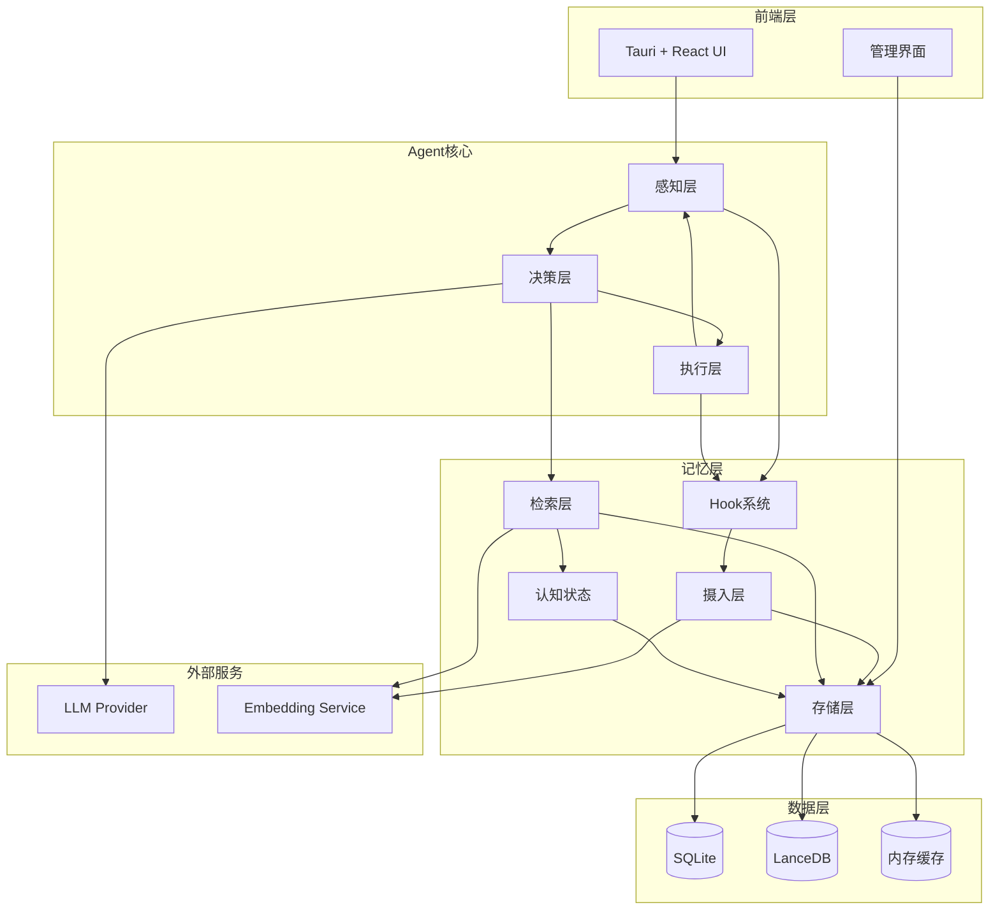
```mermaid
graph TB
    subgraph "前端层"
        UI[Tauri + React UI]
        Admin[管理界面]
    end
    
    subgraph "Agent核心"
        Perception[感知层]
        Decision[决策层]
        Execution[执行层]
    end
    
    subgraph "记忆层"
        Hook[Hook系统]
        Ingestion[摄入层]
        Storage[存储层]
        Retrieval[检索层]
        Cognitive[认知状态]
    end
    
    subgraph "数据层"
        SQLite[(SQLite)]
        LanceDB[(LanceDB)]
        Cache[(内存缓存)]
    end
    
    subgraph "外部服务"
        LLM[LLM Provider]
        Embedding[Embedding Service]
    end
    
    UI --> Perception
    Admin --> Storage
    
    Perception --> Decision
    Decision --> Execution
    Execution --> Perception
    
    Perception --> Hook
    Decision --> Retrieval
    Execution --> Hook
    
    Hook --> Ingestion
    Ingestion --> Storage
    Storage --> SQLite
    Storage --> LanceDB
    Storage --> Cache
    
    Retrieval --> Storage
    Retrieval --> Cognitive
    
    Cognitive --> Storage
    
    Decision --> LLM
    Ingestion --> Embedding
    Retrieval --> Embedding
```

### 1.2 记忆层详细架构

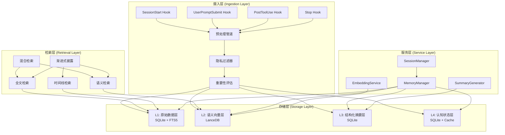
```mermaid
graph TB
    subgraph "摄入层 (Ingestion Layer)"
        H1[SessionStart Hook]
        H2[UserPromptSubmit Hook]
        H3[PostToolUse Hook]
        H4[Stop Hook]
        
        Preprocessor[预处理管道]
        PrivacyFilter[隐私过滤器]
        ImportanceScorer[重要性评估]
    end
    
    subgraph "存储层 (Storage Layer)"
        L1[L1: 原始数据层<br/>SQLite + FTS5]
        L2[L2: 语义向量层<br/>LanceDB]
        L3[L3: 结构化摘要层<br/>SQLite]
        L4[L4: 认知状态层<br/>SQLite + Cache]
    end
    
    subgraph "检索层 (Retrieval Layer)"
        Semantic[语义检索]
        FTS[全文检索]
        Timeline[时间线检索]
        Hybrid[混合检索]
        
        Progressive[渐进式披露]
    end
    
    subgraph "服务层 (Service Layer)"
        MemoryManager[MemoryManager]
        SessionManager[SessionManager]
        EmbeddingService[EmbeddingService]
        SummaryGenerator[SummaryGenerator]
    end
    
    H1 --> Preprocessor
    H2 --> Preprocessor
    H3 --> Preprocessor
    H4 --> Preprocessor
    
    Preprocessor --> PrivacyFilter
    PrivacyFilter --> ImportanceScorer
    
    ImportanceScorer --> L1
    ImportanceScorer --> L2
    ImportanceScorer --> L3
    ImportanceScorer --> L4
    
    Semantic --> L2
    FTS --> L1
    Timeline --> L1
    Hybrid --> Semantic
    Hybrid --> FTS
    
    Progressive --> Semantic
    Progressive --> FTS
    Progressive --> Timeline
    
    MemoryManager --> L1
    MemoryManager --> L2
    MemoryManager --> L3
    MemoryManager --> L4
    
    SessionManager --> MemoryManager
    EmbeddingService --> L2
    SummaryGenerator --> L3
```

---

## 二、数据流图

### 2.1 数据摄入流程

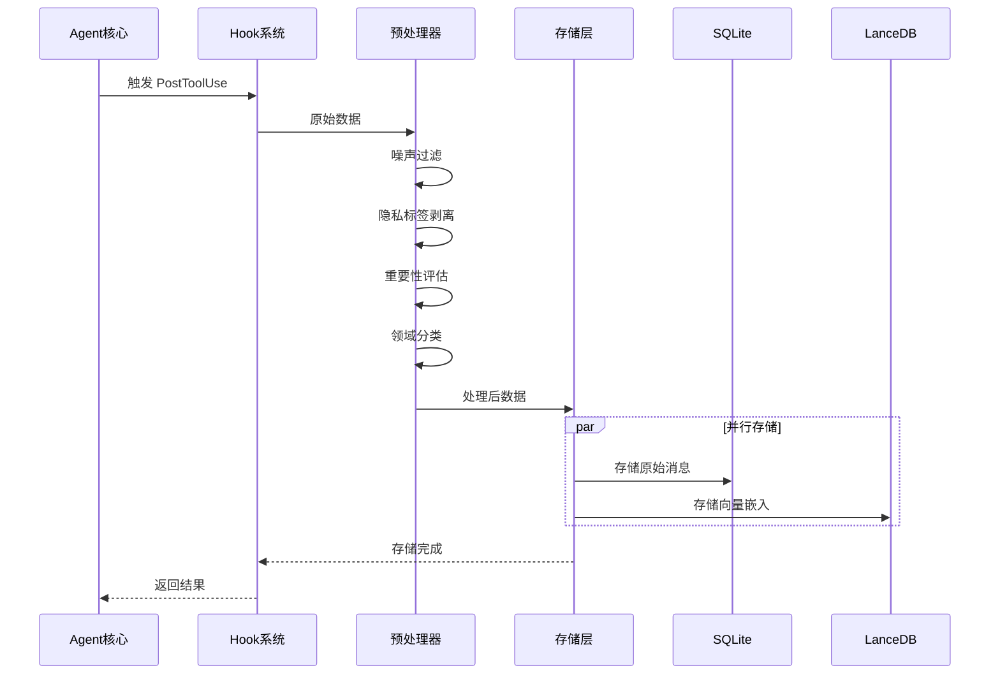
```mermaid
sequenceDiagram
    participant Agent as Agent核心
    participant Hook as Hook系统
    participant Pre as 预处理器
    participant Store as 存储层
    participant SQLite as SQLite
    participant Lance as LanceDB
    
    Agent->>Hook: 触发 PostToolUse
    Hook->>Pre: 原始数据
    
    Pre->>Pre: 噪声过滤
    Pre->>Pre: 隐私标签剥离
    Pre->>Pre: 重要性评估
    Pre->>Pre: 领域分类
    
    Pre->>Store: 处理后数据
    
    par 并行存储
        Store->>SQLite: 存储原始消息
        Store->>Lance: 存储向量嵌入
    end
    
    Store-->>Hook: 存储完成
    Hook-->>Agent: 返回结果
```

### 2.2 检索流程

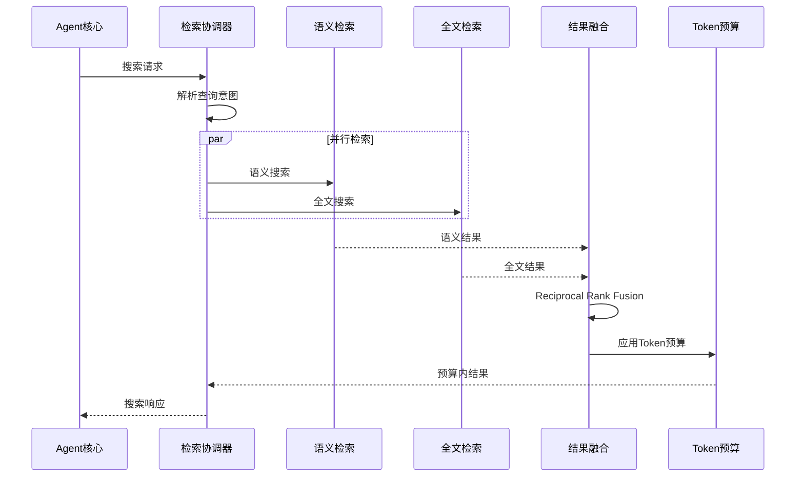
```mermaid
sequenceDiagram
    participant Agent as Agent核心
    participant Coord as 检索协调器
    participant Semantic as 语义检索
    participant FTS as 全文检索
    participant RRF as 结果融合
    participant Budget as Token预算
    
    Agent->>Coord: 搜索请求
    
    Coord->>Coord: 解析查询意图
    
    par 并行检索
        Coord->>Semantic: 语义搜索
        Coord->>FTS: 全文搜索
    end
    
    Semantic-->>RRF: 语义结果
    FTS-->>RRF: 全文结果
    
    RRF->>RRF: Reciprocal Rank Fusion
    
    RRF->>Budget: 应用Token预算
    Budget-->>Coord: 预算内结果
    
    Coord-->>Agent: 搜索响应
```

### 2.3 认知状态重建流程

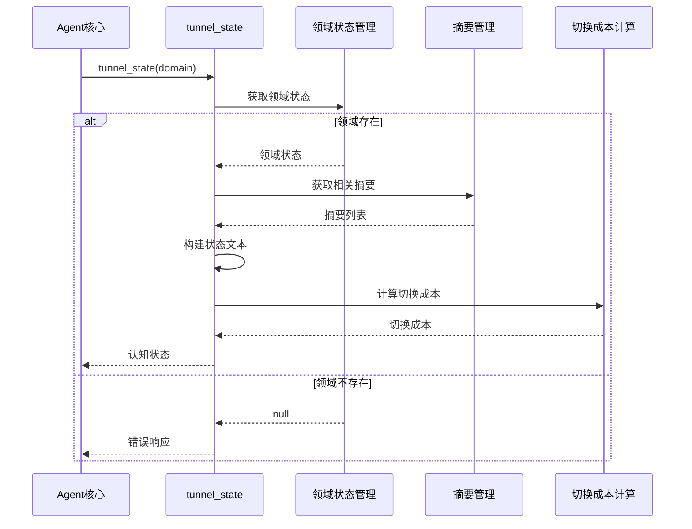
```mermaid
sequenceDiagram
    participant Agent as Agent核心
    participant Tunnel as tunnel_state
    participant Domain as 领域状态管理
    participant Summary as 摘要管理
    participant Cost as 切换成本计算
    
    Agent->>Tunnel: tunnel_state(domain)
    Tunnel->>Domain: 获取领域状态
    
    alt 领域存在
        Domain-->>Tunnel: 领域状态
        Tunnel->>Summary: 获取相关摘要
        Summary-->>Tunnel: 摘要列表
        Tunnel->>Tunnel: 构建状态文本
        Tunnel->>Cost: 计算切换成本
        Cost-->>Tunnel: 切换成本
        Tunnel-->>Agent: 认知状态
    else 领域不存在
        Domain-->>Tunnel: null
        Tunnel-->>Agent: 错误响应
    end
```

---

## 三、组件交互图

### 3.1 Hook生命周期

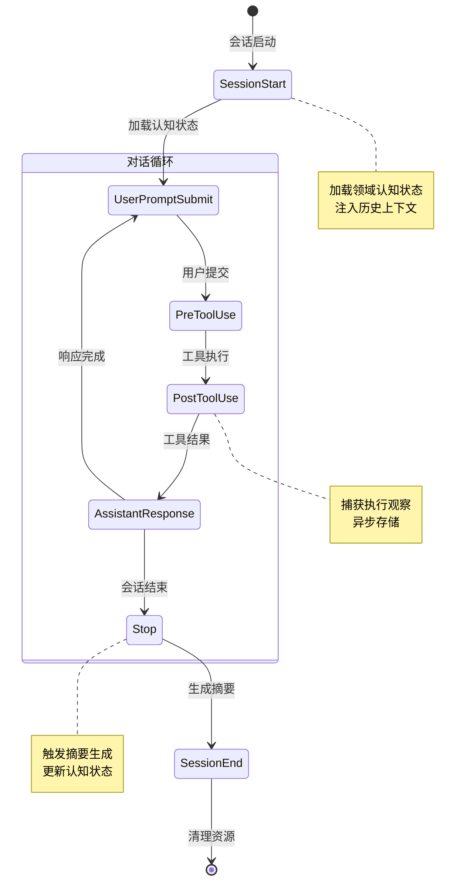
```mermaid
stateDiagram-v2
    [*] --> SessionStart: 会话启动
    
    SessionStart --> UserPromptSubmit: 加载认知状态
    
    state "对话循环" as Loop {
        UserPromptSubmit --> PreToolUse: 用户提交
        PreToolUse --> PostToolUse: 工具执行
        PostToolUse --> AssistantResponse: 工具结果
        AssistantResponse --> UserPromptSubmit: 响应完成
        AssistantResponse --> Stop: 会话结束
    }
    
    Stop --> SessionEnd: 生成摘要
    SessionEnd --> [*]: 清理资源
    
    note right of SessionStart
        加载领域认知状态
        注入历史上下文
    end note
    
    note right of PostToolUse
        捕获执行观察
        异步存储
    end note
    
    note right of Stop
        触发摘要生成
        更新认知状态
    end note
```

### 3.2 存储层交互

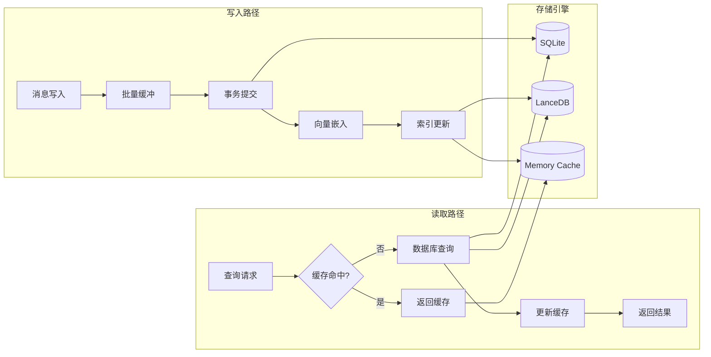
```mermaid
graph LR
    subgraph "写入路径"
        W1[消息写入] --> W2[批量缓冲]
        W2 --> W3[事务提交]
        W3 --> W4[向量嵌入]
        W4 --> W5[索引更新]
    end
    
    subgraph "读取路径"
        R1[查询请求] --> R2{缓存命中?}
        R2 -->|是| R3[返回缓存]
        R2 -->|否| R4[数据库查询]
        R4 --> R5[更新缓存]
        R5 --> R6[返回结果]
    end
    
    subgraph "存储引擎"
        S1[(SQLite)]
        S2[(LanceDB)]
        S3[(Memory Cache)]
    end
    
    W3 --> S1
    W5 --> S2
    W5 --> S3
    
    R3 --> S3
    R4 --> S1
    R4 --> S2
```

---

## 四、实体关系图

### 4.1 核心实体关系

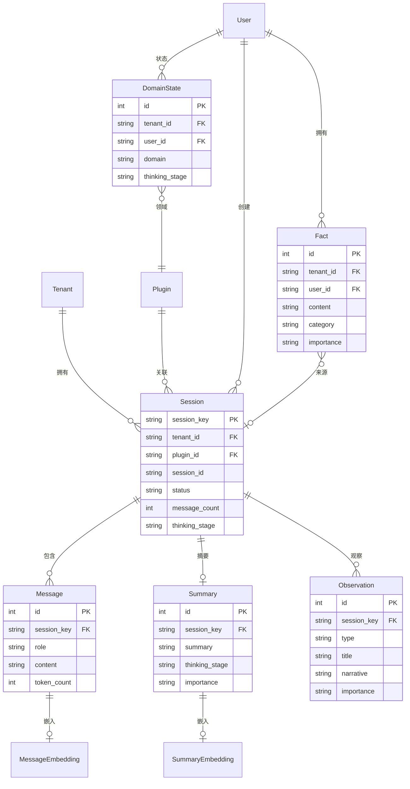
```mermaid
erDiagram
    Tenant ||--o{ Session : "拥有"
    Plugin ||--o{ Session : "关联"
    User ||--o{ Session : "创建"
    
    Session ||--o{ Message : "包含"
    Session ||--o| Summary : "摘要"
    Session ||--o{ Observation : "观察"
    
    Message ||--o| MessageEmbedding : "嵌入"
    Summary ||--o| SummaryEmbedding : "嵌入"
    
    User ||--o{ Fact : "拥有"
    Fact }o--o| Session : "来源"
    
    User ||--o{ DomainState : "状态"
    DomainState }o--|| Plugin : "领域"
    
    Session {
        string session_key PK
        string tenant_id FK
        string plugin_id FK
        string session_id
        string status
        int message_count
        string thinking_stage
    }
    
    Message {
        int id PK
        string session_key FK
        string role
        string content
        int token_count
    }
    
    Summary {
        int id PK
        string session_key FK
        string summary
        string thinking_stage
        string importance
    }
    
    Observation {
        int id PK
        string session_key FK
        string type
        string title
        string narrative
        string importance
    }
    
    Fact {
        int id PK
        string tenant_id FK
        string user_id FK
        string content
        string category
        string importance
    }
    
    DomainState {
        int id PK
        string tenant_id FK
        string user_id FK
        string domain
        string thinking_stage
    }
```

### 4.2 向量存储模型

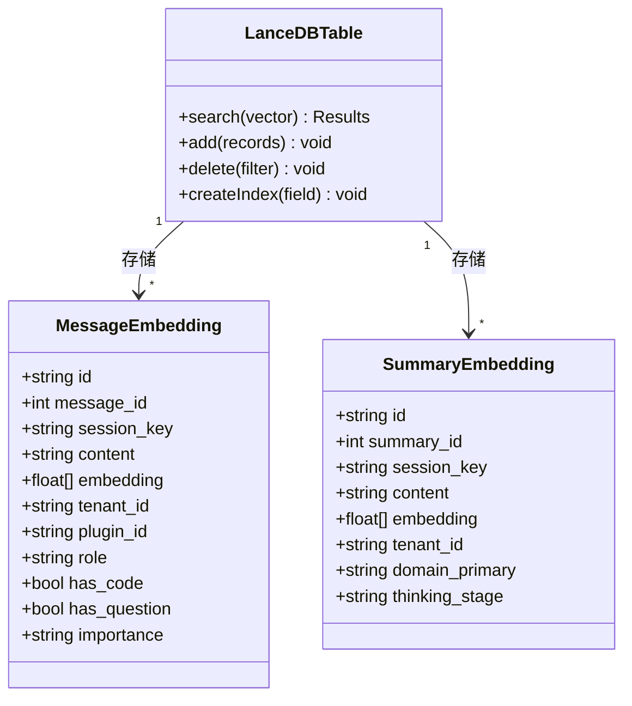
```mermaid
classDiagram
    class MessageEmbedding {
        +string id
        +int message_id
        +string session_key
        +string content
        +float[] embedding
        +string tenant_id
        +string plugin_id
        +string role
        +bool has_code
        +bool has_question
        +string importance
    }
    
    class SummaryEmbedding {
        +string id
        +int summary_id
        +string session_key
        +string content
        +float[] embedding
        +string tenant_id
        +string domain_primary
        +string thinking_stage
    }
    
    class LanceDBTable {
        +search(vector) Results
        +add(records) void
        +delete(filter) void
        +createIndex(field) void
    }
    
    LanceDBTable "1" --> "*" MessageEmbedding : 存储
    LanceDBTable "1" --> "*" SummaryEmbedding : 存储
```

---

## 五、部署架构图

### 5.1 单机部署

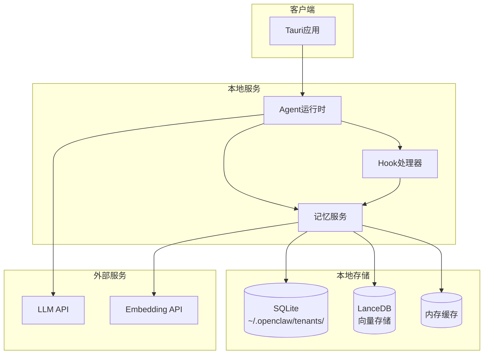
```mermaid
graph TB
    subgraph "客户端"
        App[Tauri应用]
    end
    
    subgraph "本地服务"
        Agent[Agent运行时]
        Memory[记忆服务]
        Hooks[Hook处理器]
    end
    
    subgraph "本地存储"
        SQLite[(SQLite<br/>~/.openclaw/tenants/)]
        Lance[(LanceDB<br/>向量存储)]
        Cache[(内存缓存)]
    end
    
    subgraph "外部服务"
        LLM[LLM API]
        Embed[Embedding API]
    end
    
    App --> Agent
    Agent --> Memory
    Agent --> Hooks
    
    Memory --> SQLite
    Memory --> Lance
    Memory --> Cache
    
    Hooks --> Memory
    
    Agent --> LLM
    Memory --> Embed
```

### 5.2 多租户架构

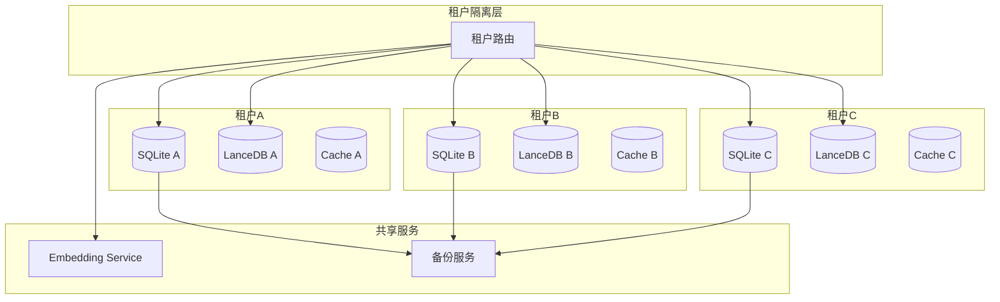
```mermaid
graph TB
    subgraph "租户隔离层"
        Router[租户路由]
    end
    
    subgraph "租户A"
        DB_A[(SQLite A)]
        Vec_A[(LanceDB A)]
        Cache_A[(Cache A)]
    end
    
    subgraph "租户B"
        DB_B[(SQLite B)]
        Vec_B[(LanceDB B)]
        Cache_B[(Cache B)]
    end
    
    subgraph "租户C"
        DB_C[(SQLite C)]
        Vec_C[(LanceDB C)]
        Cache_C[(Cache C)]
    end
    
    subgraph "共享服务"
        Embedding[Embedding Service]
        Backup[备份服务]
    end
    
    Router --> DB_A
    Router --> DB_B
    Router --> DB_C
    
    Router --> Vec_A
    Router --> Vec_B
    Router --> Vec_C
    
    DB_A --> Backup
    DB_B --> Backup
    DB_C --> Backup
    
    Router --> Embedding
```

---

## 六、思考阶段状态机

### 6.1 阶段转换

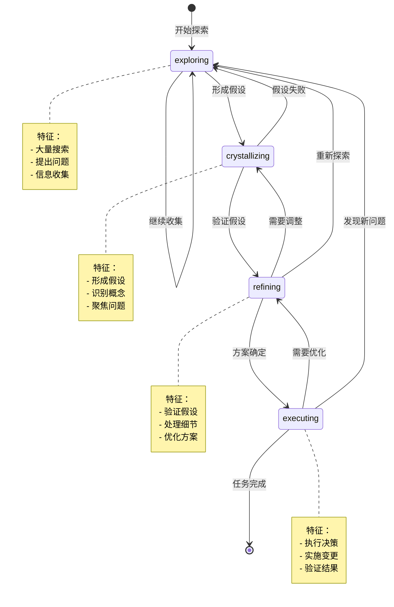
```mermaid
stateDiagram-v2
    [*] --> exploring: 开始探索
    
    exploring --> crystallizing: 形成假设
    exploring --> exploring: 继续收集
    
    crystallizing --> refining: 验证假设
    crystallizing --> exploring: 假设失败
    
    refining --> executing: 方案确定
    refining --> crystallizing: 需要调整
    refining --> exploring: 重新探索
    
    executing --> [*]: 任务完成
    executing --> refining: 需要优化
    executing --> exploring: 发现新问题
    
    note right of exploring
        特征：
        - 大量搜索
        - 提出问题
        - 信息收集
    end note
    
    note right of crystallizing
        特征：
        - 形成假设
        - 识别概念
        - 聚焦问题
    end note
    
    note right of refining
        特征：
        - 验证假设
        - 处理细节
        - 优化方案
    end note
    
    note right of executing
        特征：
        - 执行决策
        - 实施变更
        - 验证结果
    end note
```

### 6.2 认知状态重建

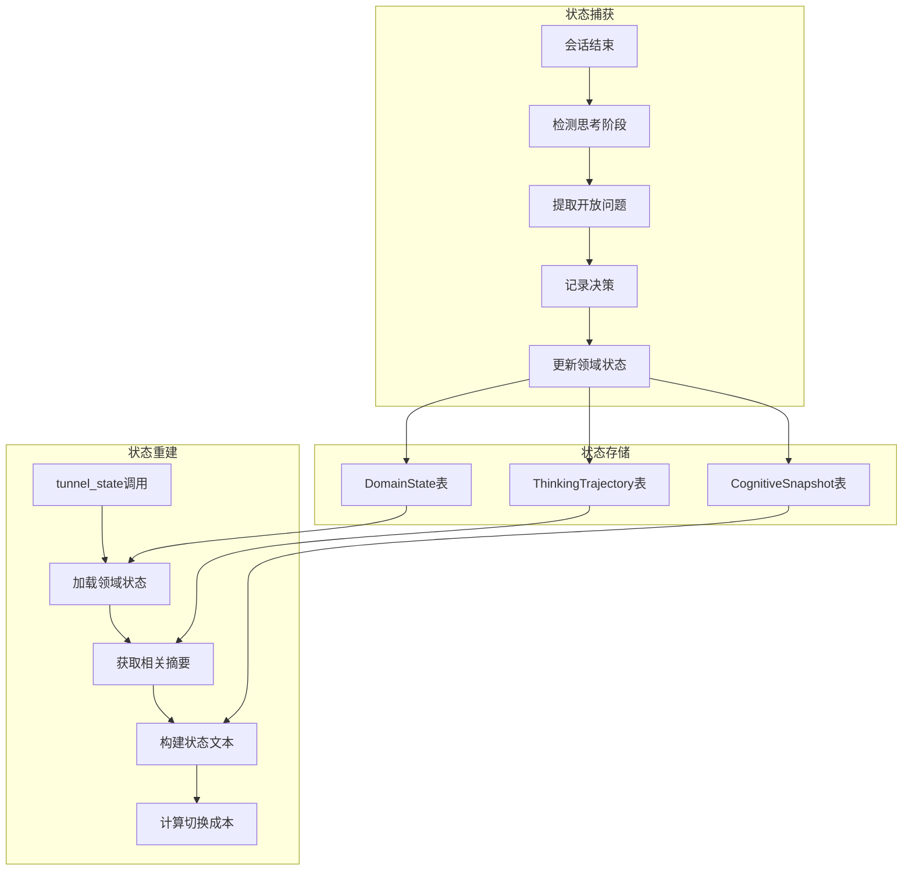
```mermaid
graph TB
    subgraph "状态捕获"
        A1[会话结束] --> A2[检测思考阶段]
        A2 --> A3[提取开放问题]
        A3 --> A4[记录决策]
        A4 --> A5[更新领域状态]
    end
    
    subgraph "状态存储"
        B1[DomainState表]
        B2[ThinkingTrajectory表]
        B3[CognitiveSnapshot表]
    end
    
    subgraph "状态重建"
        C1[tunnel_state调用] --> C2[加载领域状态]
        C2 --> C3[获取相关摘要]
        C3 --> C4[构建状态文本]
        C4 --> C5[计算切换成本]
    end
    
    A5 --> B1
    A5 --> B2
    A5 --> B3
    
    B1 --> C2
    B2 --> C3
    B3 --> C4
```

---

## 七、检索策略图

### 7.1 混合检索流程

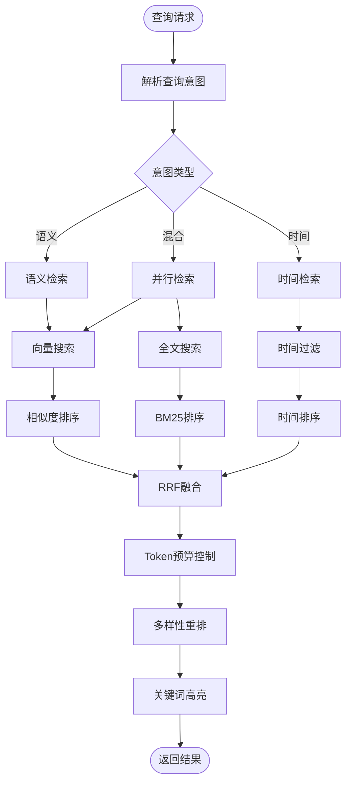
```mermaid
flowchart TB
    Start([查询请求]) --> Parse[解析查询意图]
    
    Parse --> Intent{意图类型}
    
    Intent -->|语义| Semantic[语义检索]
    Intent -->|时间| Temporal[时间检索]
    Intent -->|混合| Both[并行检索]
    
    Semantic --> VectorSearch[向量搜索]
    VectorSearch --> Rank1[相似度排序]
    
    Temporal --> TimeFilter[时间过滤]
    TimeFilter --> Rank2[时间排序]
    
    Both --> VectorSearch
    Both --> FTSSearch[全文搜索]
    
    FTSSearch --> Rank3[BM25排序]
    
    Rank1 --> RRF[RRF融合]
    Rank3 --> RRF
    Rank2 --> RRF
    
    RRF --> Budget[Token预算控制]
    Budget --> Diversify[多样性重排]
    Diversify --> Highlight[关键词高亮]
    Highlight --> End([返回结果])
```

### 7.2 渐进式披露

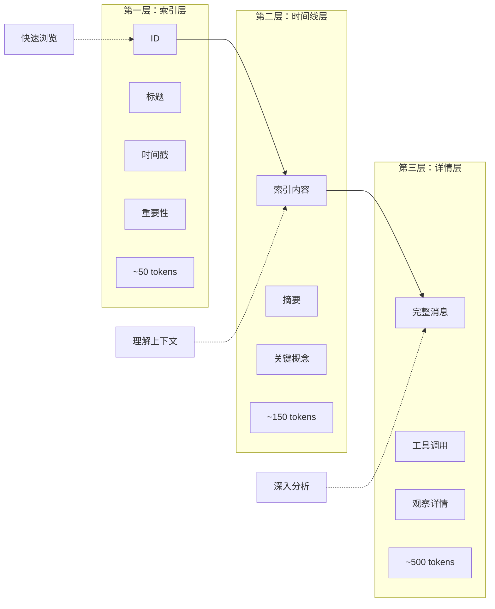
```mermaid
graph LR
    subgraph "第一层：索引层"
        I1[ID]
        I2[标题]
        I3[时间戳]
        I4[重要性]
        I5[~50 tokens]
    end
    
    subgraph "第二层：时间线层"
        T1[索引内容]
        T2[摘要]
        T3[关键概念]
        T4[~150 tokens]
    end
    
    subgraph "第三层：详情层"
        D1[完整消息]
        D2[工具调用]
        D3[观察详情]
        D4[~500 tokens]
    end
    
    I1 --> T1
    T1 --> D1
    
    note1[快速浏览] -.-> I1
    note2[理解上下文] -.-> T1
    note3[深入分析] -.-> D1
```

---

## 八、性能优化图

### 8.1 缓存策略

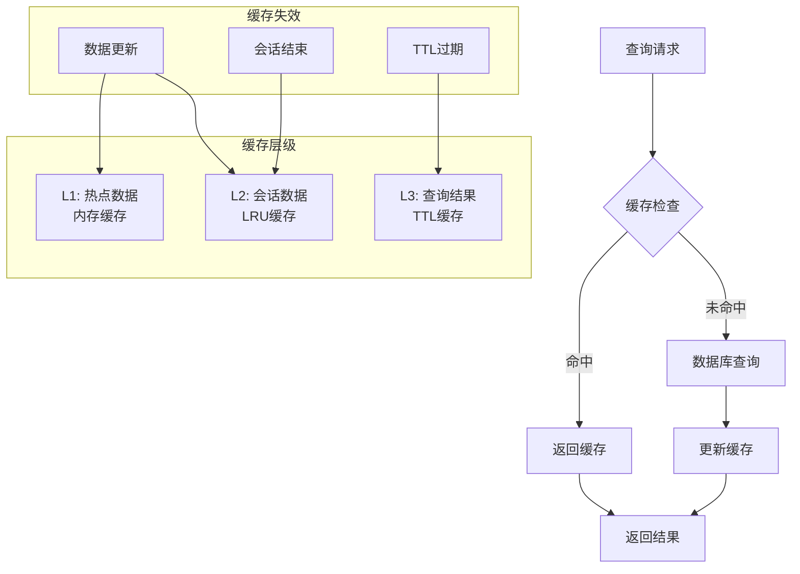
```mermaid
flowchart TB
    Request[查询请求] --> CacheCheck{缓存检查}
    
    CacheCheck -->|命中| CacheHit[返回缓存]
    CacheCheck -->|未命中| DBQuery[数据库查询]
    
    DBQuery --> UpdateCache[更新缓存]
    UpdateCache --> Return[返回结果]
    
    CacheHit --> Return
    
    subgraph "缓存层级"
        L1[L1: 热点数据<br/>内存缓存]
        L2[L2: 会话数据<br/>LRU缓存]
        L3[L3: 查询结果<br/>TTL缓存]
    end
    
    subgraph "缓存失效"
        E1[会话结束]
        E2[数据更新]
        E3[TTL过期]
    end
    
    E1 --> L2
    E2 --> L1
    E2 --> L2
    E3 --> L3
```

### 8.2 批量写入优化

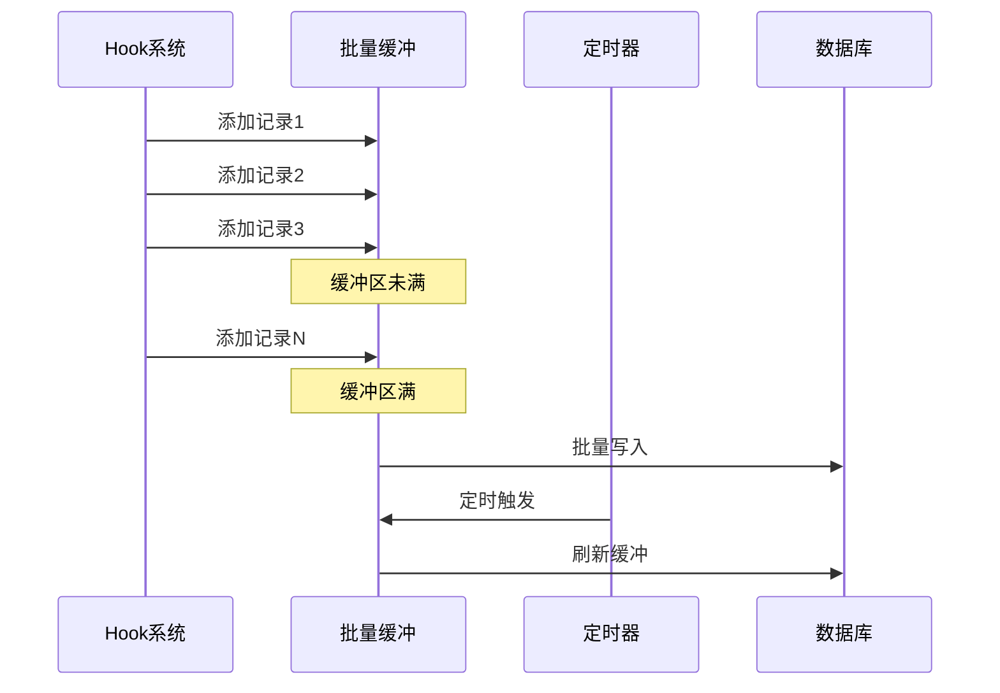
```mermaid
sequenceDiagram
    participant Hook as Hook系统
    participant Buffer as 批量缓冲
    participant Timer as 定时器
    participant DB as 数据库
    
    Hook->>Buffer: 添加记录1
    Hook->>Buffer: 添加记录2
    Hook->>Buffer: 添加记录3
    
    Note over Buffer: 缓冲区未满
    
    Hook->>Buffer: 添加记录N
    Note over Buffer: 缓冲区满
    
    Buffer->>DB: 批量写入
    
    Timer->>Buffer: 定时触发
    Buffer->>DB: 刷新缓冲
```

---

*文档版本: 1.0*
*创建日期: 2026-03-21*
*作者: Winston (Architect Agent)*
