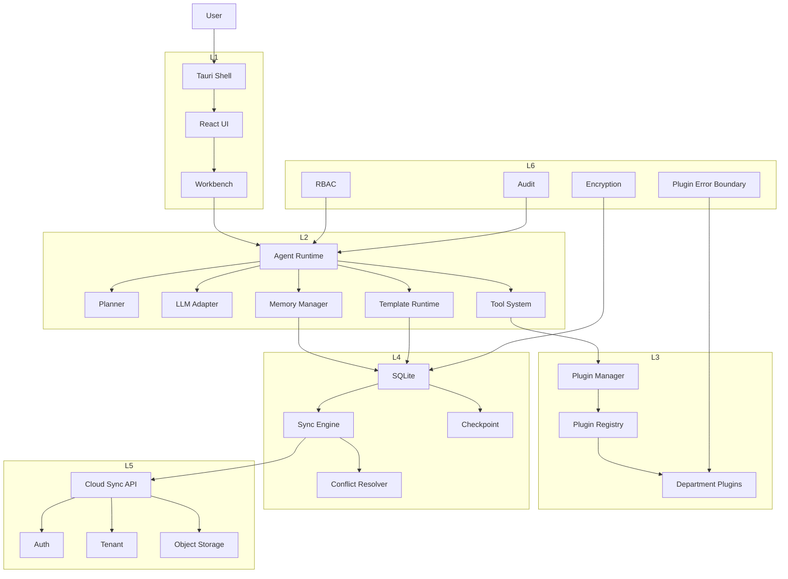
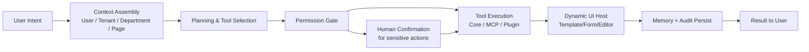
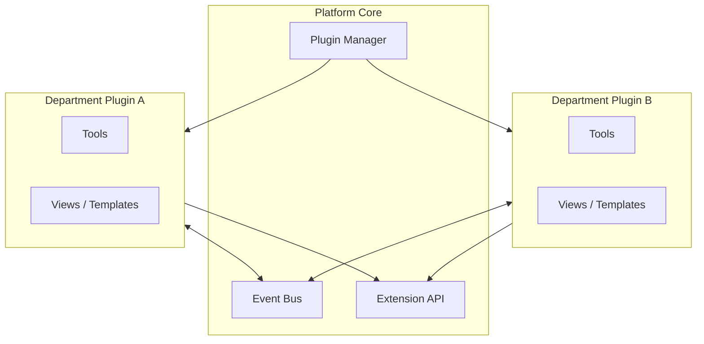
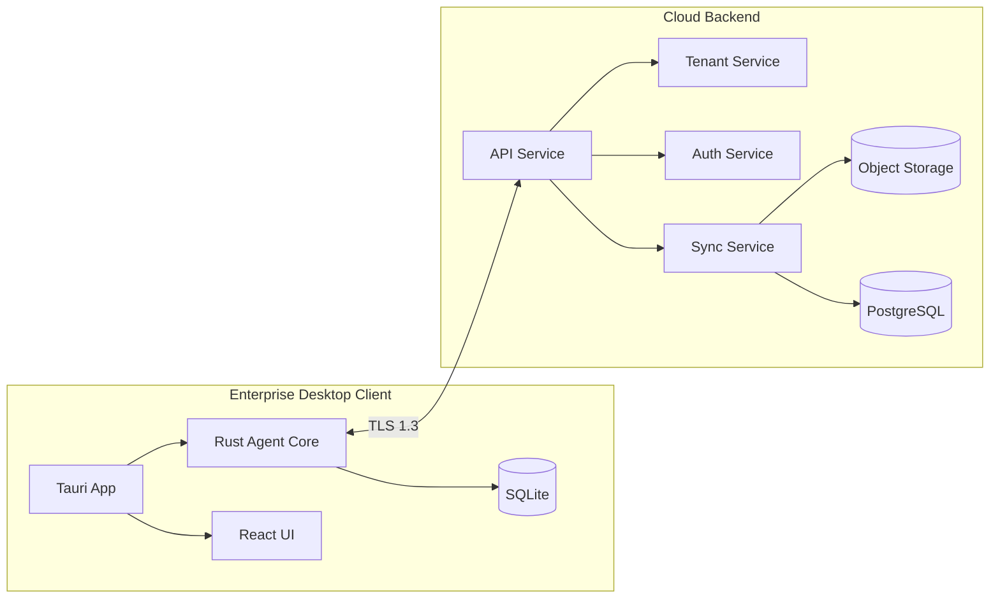
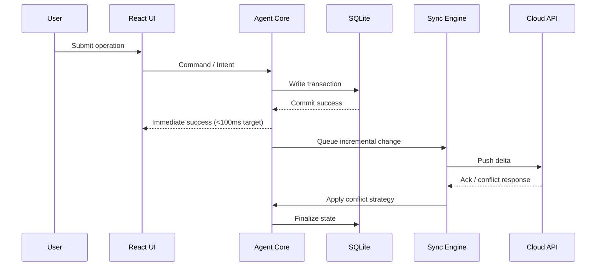
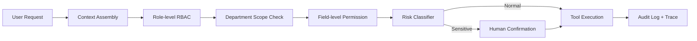
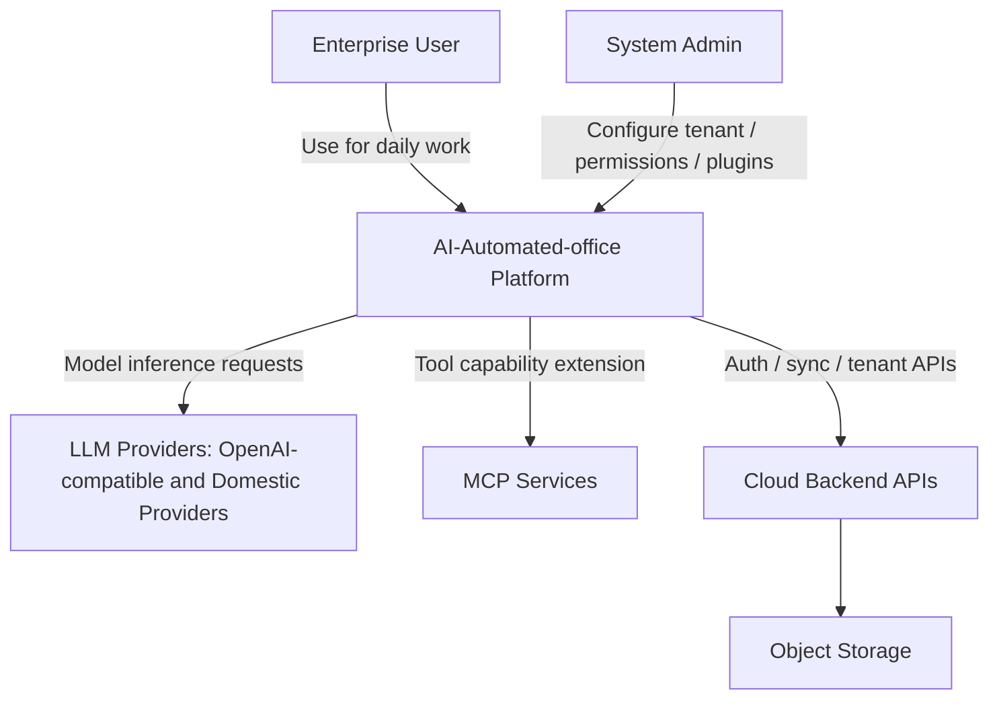
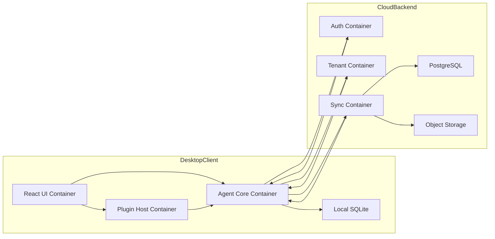
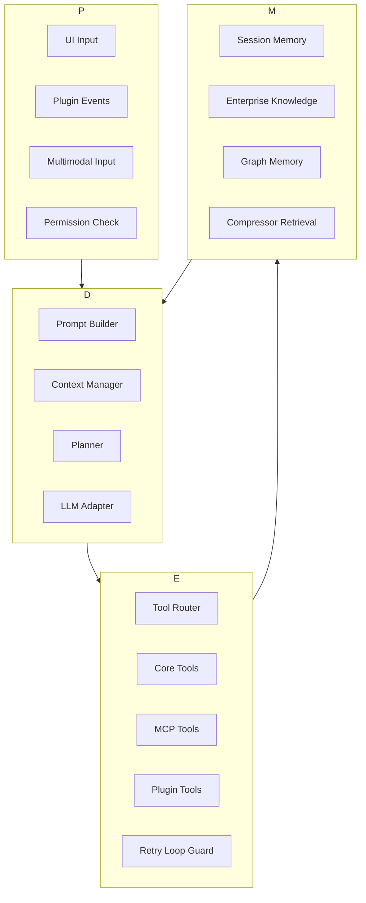
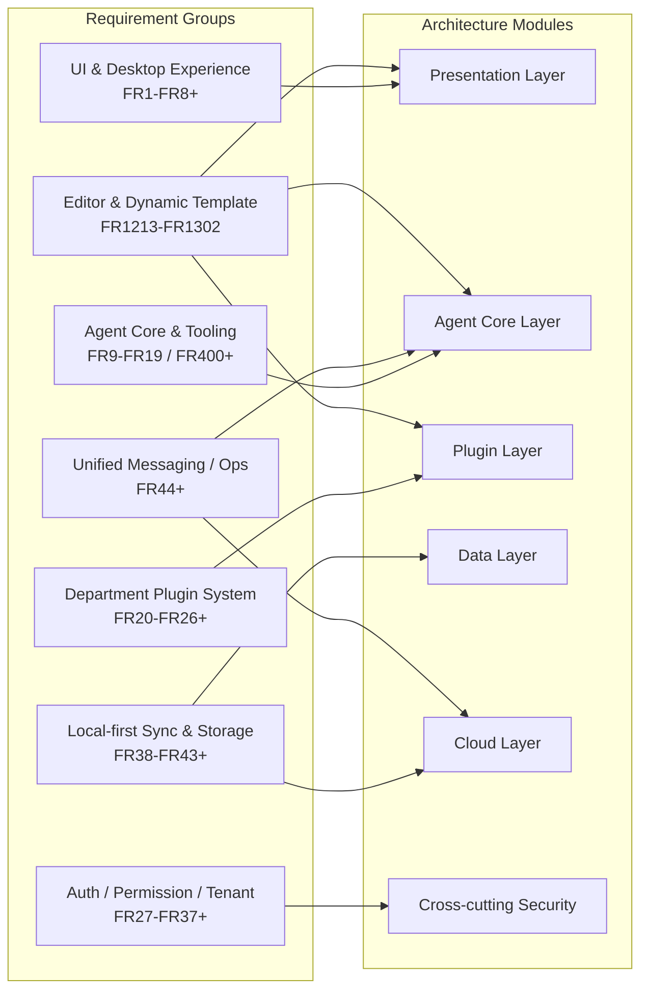

# AI-Automated-office Architecture Diagrams

Source: `architecture.md`

## 1) Layered System Architecture

## 2) Agent Runtime Execution Flow

## 3) Plugin Integration Boundary

## 4) Deployment Architecture (Desktop + Cloud)

## 5) Local-first Data Sync Flow

## 6) Permission & Safety Control Path

## 7) C4 Context Diagram

## 8) C4 Container Diagram

## 9) Agent Four-Layer Mapping

## 10) Module-to-Requirement Mapping (High Level)

