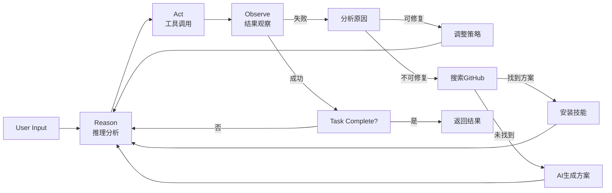
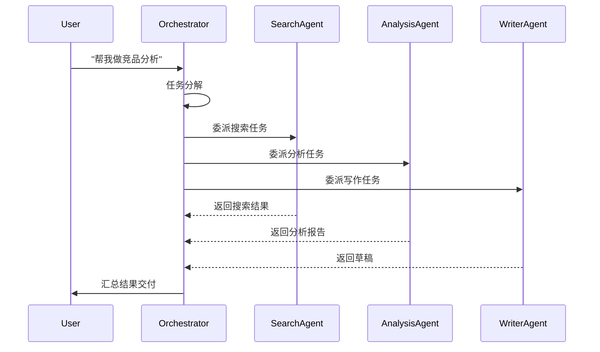
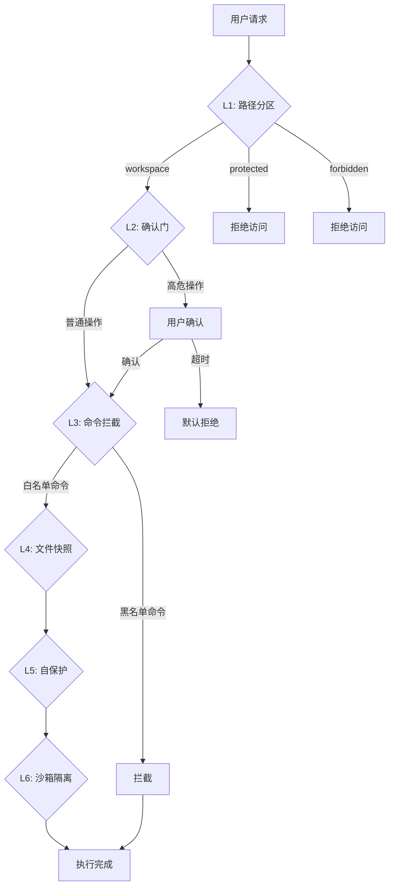

# OpenAkita 需求文档 (PRD)

**Author:** Claude Code (AI-Automated-office 分析)
**Date:** 2026-03-26
**Project:** OpenAkita - 开源多 Agent AI 助手
**Version:** 1.27.0
**Source:** https://github.com/openakita/openakita

---

## Executive Summary（执行摘要）

### 功能定位

OpenAkita 是一款**开源全能 AI 助手平台**，核心理念是"不只是聊天，是帮你做事的 AI 团队"。不同于传统的单一日志对话式 AI，OpenAkita 通过多 Agent 协作、ReAct 推理引擎、三层记忆系统和丰富的工具生态，实现真正能替代人工完成复杂任务的智能助手。

### 业务价值

| 价值维度 | 具体表现 |
|----------|----------|
| **效率提升** | 多 Agent 并行工作，复杂任务自动分解执行 |
| **门槛降低** | 5 分钟图形化安装配置，零命令行依赖 |
| **能力扩展** | 89+ 内置工具 + Skill 市场 + MCP 扩展 |
| **多端协同** | 桌面端/Web 端/移动端 + 6 大 IM 平台 |
| **自主进化** | 每日自检修复、失败根因分析、技能自动生成 |

### 目标用户

| 用户群体 | 使用场景 |
|----------|----------|
| **企业用户** | 接入钉钉/飞书/企微，实现智能化工作流 |
| **开发者** | 通过 CLI/API 构建 AI 原生应用 |
| **普通用户** | 桌面端一键安装，日常任务自动化 |
| **AI 爱好者** | 多模型自由切换，探索 Agent 技术 |

### 问题与机遇

**当前痛点：**
- 现有 AI 助手多为"对话机器"，无法真正执行任务
- 多模型切换复杂，缺乏统一接口
- 跨平台 IM 接入门槛高，碎片化严重
- 长对话记忆丢失，缺乏持续学习能力

**市场机遇：**
- Agent 元年到来，企业级 Agent 需求爆发
- 开源生态逐步完善，开发者社区活跃
- 多模态模型能力成熟，支持图片/语音/视频

### 解决方案

| 设计要点 | 解决的问题 |
|----------|-----------|
| **多 Agent 协作系统** | 复杂任务并行分解，专业分工协同 |
| **ReAct 推理引擎** | 显式推理 + 检查点回滚 + 策略切换 |
| **三层记忆架构** | 工作/核心/动态检索，越用越懂用户 |
| **89+ 内置工具** | 文件/浏览器/桌面/Shell/MCP 全覆盖 |
| **Skill 生态系统** | SKILL.md 声明式规范，在线市场一键安装 |
| **6 大 IM 平台** | Telegram/飞书/钉钉/企微/QQ/OneBot |
| **30+ LLM 支持** | Anthropic/OpenAI/DeepSeek/Qwen 等自由切换 |
| **六层安全体系** | 路径分区/确认门/命令拦截/快照/自保/沙箱 |

### What Makes This Special

**差异化价值主张：**

1. **Ralph Wiggum 模式**：永不放弃的核心理念，任务未完成绝不终止，自动分析错误并重试
2. **零门槛上手**：全图形化配置向导，5 分钟从安装到对话，无需碰命令行
3. **真正的多 Agent**：不是简单的角色切换，而是真正的并行协作和委派机制
4. **自我进化能力**：每日 04:00 自检修复，缺失能力自动从 GitHub 安装或 AI 生成

---

## Project Classification（项目分类）

| 维度 | 分类 |
|------|------|
| **项目类型** | 跨平台桌面应用 + CLI 工具 + API 服务 |
| **领域** | AI Agent / 智能助手 / 任务自动化 |
| **复杂度** | High（多 Agent 协作、ReAct 推理引擎、多层记忆系统） |
| **项目上下文** | Brownfield（已有完整实现，开源活跃） |
| **目标用户** | 企业用户、开发者、普通用户、AI 爱好者 |
| **技术栈** | Python 3.11+ / FastAPI / Tauri 2.x / React 18 / TypeScript |
| **部署环境** | Windows / macOS / Linux / Web 浏览器 / 移动端 |
| **开源协议** | Apache License 2.0 |
| **当前版本** | 1.27.0 |

---

## Success Criteria（成功标准）

### User Success（用户成功）

**用户成功的"Aha时刻"：**

| 场景 | 成功表现 |
|------|----------|
| 首次安装 | 5 分钟内完成配置，开始第一次对话 |
| 复杂任务 | 说出"帮我做竞品分析"，看到多 Agent 并行工作 |
| IM 接入 | 在钉钉/飞书中@机器人，获得即时响应 |
| 技能安装 | 搜索"小红书创作"，一键安装并使用 |
| 记忆学习 | 两个月前提到的偏好，AI 仍然记得 |

**用户成功指标：**

| 指标 | 目标 |
|------|------|
| 首次响应时间 | < 3 秒 |
| 任务完成率 | > 80%（复杂任务） |
| 用户留存率 | > 60%（30 日） |
| 技能安装成功率 | > 95% |

### Business Success（业务成功）

| 指标 | 目标 |
|------|------|
| GitHub Stars | > 10,000 |
| 月活跃用户 | > 5,000 |
| 企业客户数 | > 500 |
| 社区贡献者 | > 100 |

### Technical Success（技术成功）

| 指标 | 目标 |
|------|------|
| 系统可用性 | ≥ 99% |
| API 响应时间 | < 2 秒（p95） |
| 并发会话支持 | > 100 |
| 工具调用成功率 | > 98% |
| 内存占用（桌面端） | < 500MB |
| 冷启动时间 | < 10 秒 |

### Measurable Outcomes（可衡量成果）

| 维度 | 关键指标 | 衡量方式 |
|------|----------|----------|
| **功能覆盖** | 89+ 工具可用 | 工具目录完整性检查 |
| **模型支持** | 30+ LLM 提供商 | 端点配置验证 |
| **IM 平台** | 6 大平台接入 | 通道适配器测试 |
| **技能市场** | 30+ 可安装技能 | 市场 API 查询 |
| **多 Agent** | 支持 5 层委派深度 | 集成测试验证 |
| **记忆系统** | 7 种记忆类型 | 单元测试覆盖 |

---

## Product Scope（产品范围）

### MVP - Minimum Viable Product（最小可行产品）

**必须具备的核心功能：**

| 模块 | 功能 | 优先级 |
|------|------|--------|
| **Agent 核心** | ReAct 推理引擎 | P0 |
| **Agent 核心** | Ralph Wiggum 循环（永不放弃） | P0 |
| **Agent 核心** | 基础工具调用（Shell/File/Web） | P0 |
| **LLM 层** | Anthropic Claude 集成 | P0 |
| **LLM 层** | OpenAI 兼容 API 支持 | P0 |
| **记忆** | 工作记忆（MEMORY.md） | P0 |
| **记忆** | 核心记忆（用户画像） | P1 |
| **界面** | CLI 交互界面 | P0 |
| **界面** | 桌面端（Tauri） | P0 |
| **IM** | Telegram 适配器 | P1 |
| **IM** | 飞书适配器 | P1 |

### Growth Features（增长功能）

| 功能 | 说明 | 优先级 |
|------|------|--------|
| **多 Agent** | AgentOrchestrator 协调器 | P1 |
| **多 Agent** | AgentFactory 实例池 | P1 |
| **多 Agent** | 委派深度控制（MAX=5） | P1 |
| **记忆** | 三层记忆系统 | P1 |
| **记忆** | 向量存储检索 | P2 |
| **LLM** | 30+ 模型提供商 | P1 |
| **LLM** | 自动故障切换 | P1 |
| **工具** | 浏览器自动化 | P1 |
| **工具** | 桌面自动化 | P2 |
| **工具** | MCP 协议支持 | P1 |
| **技能** | Skill 市场 | P2 |
| **技能** | 在线搜索安装 | P2 |
| **IM** | 钉钉适配器 | P2 |
| **IM** | 企业微信适配器 | P2 |
| **IM** | QQ 官方机器人 | P2 |
| **IM** | OneBot 协议 | P2 |
| **界面** | 移动端（Capacitor） | P2 |
| **界面** | Web 端远程访问 | P2 |
| **进化** | 每日自检修复 | P2 |
| **进化** | 技能自动生成 | P3 |
| **安全** | 六层防护体系 | P1 |

### Vision（未来愿景）

| 功能 | 说明 | 状态 |
|------|------|------|
| **多 Agent 协作** | 神经网络可视化仪表盘 | 已实现 |
| **计划模式** | 复杂任务自动分解步骤 | 已实现 |
| **深度思考** | 可控 thinking 模式 | 已实现 |
| **自我进化** | AI 驱动的能力获取 | 已实现 |
| **跨平台同步** | 多设备状态同步 | 规划中 |
| **插件市场** | 第三方插件生态 | 规划中 |
| **企业版** | 多租户/权限管理 | 规划中 |

---

## User Journeys（用户旅程）

### Journey 1: 普通用户 - 桌面端快速上手

**人物档案**
- **姓名**：小美
- **角色**：产品经理，非技术背景
- **现状**：需要处理大量日报、周报，频繁在微信群沟通
- **内心渴望**：高效完成重复性工作，有 AI 助手随时响应

**旅程叙事**

**Day 1 - 初次接触**

1. 小美在微信公众号看到 OpenAkita 介绍，下载了 Windows 安装包
2. 双击安装，弹出图形化向导引导配置
3. 输入 Anthropic API Key（已有账户）
4. 2 分钟后，开始第一次对话："帮我写一份本周工作汇总"
5. AI 立即生成格式规范的周报，小美惊讶于响应速度

**Day 3 - IM 接入**

1. 小美想在小憩时也能用 AI
2. 打开桌面端 IM Channels 配置
3. 扫码连接飞书，配置 Webhook
4. 在飞书群 @机器人，获得即时响应

**Day 7 - 习惯养成**

1. 小美开始每天用 AI 辅助写邮件
2. AI 记住她的写作风格偏好
3. 定时任务功能帮助提醒每日站会

**旅程需求**

- 零门槛安装配置
- 自然语言任务表达
- 多端随时访问
- 个性化偏好记忆

### Journey 2: 开发者 - 构建 AI 原生应用

**人物档案**
- **姓名**：老王
- **角色**：全栈工程师，技术背景深厚
- **现状**：想基于 AI Agent 构建企业内部知识库问答系统
- **内心渴望**：通过 API 集成AI能力，自定义 Agent 行为

**旅程叙事**

**Hour 1 - 快速探索**

1. 老王 clone 项目到本地
2. `pip install openakita[all]`
3. 运行 `openakita init` 配置 API Key
4. `openakita serve --dev` 启动 API 服务

**Hour 2 - API 集成**

1. 阅读 API 文档，发现 `/api/chat` 端点
2. 用 curl 测试基础对话
3. 配置 WebSocket 获取流式响应
4. 集成到现有 React 前端

**Day 2 - 自定义 Agent**

1. 创建自定义 SOUL.md 定义 Agent 价值观
2. 配置 AGENT.md 调整行为模式
3. 安装 MCP 扩展连接企业知识库
4. 编写 SKILL.md 定义问答技能

**Day 3 - 生产部署**

1. 配置 Docker 环境
2. 接入企业微信通道
3. 设置每日自检任务
4. 监控 Token 统计面板

**旅程需求**

- 丰富的 API 接口
- 自定义 Agent 行为
- MCP 扩展集成
- 生产环境部署指南

### Journey 3: 企业管理员 - 多 Agent 团队管理

**人物档案**
- **姓名**：IT 负责人 Clara
- **角色**：企业 IT 负责人，管理 50 人团队
- **现状**：需要为不同部门配置专属 AI 助手
- **内心渴望**：统一管理、安全可控、可观测

**旅程叙事**

**Week 1 - 平台搭建**

1. Clara 在服务器部署 OpenAkita
2. 配置 LDAP/SSO 企业认证
3. 设置多租户数据隔离
4. 配置审计日志收集

**Week 2 - Agent 配置**

1. 为销售部创建"客服 Agent"
2. 为研发部创建"代码助手 Agent"
3. 为市场部创建"文案助手 Agent"
4. 配置不同 IM 渠道权限

**Week 3 - 运营治理**

1. 通过 Token 统计面板监控使用
2. 配置 POLICIES.yaml 安全策略
3. 设置敏感操作确认门
4. 定期审查审计日志

**旅程需求**

- 多租户隔离
- 统一认证集成
- 细粒度权限控制
- 完整审计日志

---

### Journey Requirements Summary（旅程需求汇总）

| 能力领域 | 涉及旅程 | 关键功能 |
|----------|----------|----------|
| **安装配置** | 普通用户/开发者/管理员 | 图形化向导、API Key 配置 |
| **对话交互** | 所有旅程 | 自然语言理解、流式输出 |
| **任务执行** | 所有旅程 | 工具调用、ReAct 推理 |
| **多 Agent** | 开发者/管理员 | 协作编排、委派机制 |
| **记忆系统** | 所有旅程 | 偏好记忆、跨会话学习 |
| **IM 接入** | 普通用户/管理员 | 6 大平台适配器 |
| **API 集成** | 开发者 | FastAPI 端点、WebSocket |
| **安全治理** | 管理员 | 六层防护、审计日志 |
| **可观测性** | 管理员 | Token 统计、追踪系统 |

---

## Technical Requirements（技术需求）

### Technical Architecture（技术架构）

| 层级 | 技术选型 | 说明 |
|------|----------|------|
| **前端（桌面端）** | Tauri 2.x + React 18 + TypeScript | 跨平台原生桌面应用 |
| **前端（移动端）** | Capacitor + React | Android/iOS 原生封装 |
| **前端（Web）** | Vite 6 + React 18 | PC/手机浏览器访问 |
| **后端核心** | Python 3.11+ / FastAPI / asyncio | 异步非阻塞架构 |
| **LLM 集成** | Anthropic SDK / OpenAI SDK | 统一客户端封装 |
| **数据库** | SQLite + 向量存储 | 本地持久化 + 语义检索 |
| **IM 协议** | python-telegram-bot / lark-oapi 等 | 6 大平台适配 |
| **浏览器自动化** | Playwright + browser-use | AI 驱动的浏览器操作 |
| **桌面自动化** | PyAutoGUI / pywinauto | Windows 桌面控制 |
| **实时通信** | WebSocket + SSE | 流式响应、事件推送 |
| **任务调度** | APScheduler | Cron 风格定时任务 |
| **代码质量** | Ruff / MyPy / Pytest | Lint + Type + Test |

### System Architecture Diagram（系统架构图）

```
┌─────────────────────────────────────────────────────────────────────┐
│                        User Interfaces                                │
│  ┌─────────┐  ┌──────────┐  ┌────────┐  ┌────────┐  ┌────────────┐ │
│  │   CLI   │  │ Desktop  │  │  Web   │  │ Mobile │  │    IM      │ │
│  │(终端)   │  │(Tauri)   │  │(Vite)  │  │(Capacitor)│ │ (6平台)   │ │
│  └────┬────┘  └────┬─────┘  └───┬────┘  └───┬────┘  └─────┬──────┘ │
│       └─────────────┴───────────┴──────────┴───────────────┘          │
│                              ↓                                         │
├──────────────────────────────────────────────────────────────────────┤
│                    Channel Gateway (消息网关)                          │
│              消息路由 · 格式标准化 · 媒体预处理                          │
├──────────────────────────────────────────────────────────────────────┤
│                         Agent Core (Agent 核心)                       │
│  ┌────────────────────────────────────────────────────────────────┐ │
│  │                    Identity Layer (身份层)                       │ │
│  │  ┌─────────┐  ┌─────────┐  ┌─────────┐  ┌─────────────────┐   │ │
│  │  │ SOUL.md │  │AGENT.md │  │ USER.md │  │   MEMORY.md     │   │ │
│  │  │ (价值观) │  │ (行为)  │  │(偏好)   │  │   (工作记忆)    │   │ │
│  │  └─────────┘  └─────────┘  └─────────┘  └─────────────────┘   │ │
│  └────────────────────────────────────────────────────────────────┘ │
│  ┌────────────────────────────────────────────────────────────────┐ │
│  │                 Processing Layer (处理层)                        │ │
│  │  ┌─────────────────┐    ┌─────────────────┐                  │ │
│  │  │ Prompt Compiler  │    │  Session Manager │                  │ │
│  │  │    (Stage 1)    │    │   (会话管理)     │                  │ │
│  │  └────────┬────────┘    └─────────────────┘                  │ │
│  │           ↓                                                     │ │
│  │  ┌─────────────────┐    ┌─────────────────────────────────┐   │ │
│  │  │  Brain (Claude) │    │      Ralph Loop (永不放弃)       │   │ │
│  │  │    (LLM 推理)   │    │  (重试 · 分析 · 策略调整)       │   │ │
│  │  └─────────────────┘    └─────────────────────────────────┘   │ │
│  └────────────────────────────────────────────────────────────────┘ │
│  ┌────────────────────────────────────────────────────────────────┐ │
│  │                Reasoning Engine (ReAct 推理引擎)                  │ │
│  │  Reason → Act → Observe 三阶段显式推理循环                        │ │
│  │  · 检查点/回滚 · 循环检测 · 策略切换 · 资源预算                    │ │
│  └────────────────────────────────────────────────────────────────┘ │
├──────────────────────────────────────────────────────────────────────┤
│                      Tool Layer (工具层)                              │
│  ┌────────┐ ┌────────┐ ┌────────┐ ┌────────┐ ┌────────┐ ┌────────┐ │
│  │ Shell  │ │  File  │ │  Web   │ │Browser │ │Desktop │ │  MCP   │ │
│  │  命令  │ │  文件  │ │  网络  │ │ 浏览器 │ │ 桌面   │ │ 扩展   │ │
│  └────────┘ └────────┘ └────────┘ └────────┘ └────────┘ └────────┘ │
│  ┌────────┐ ┌────────┐ ┌────────┐ ┌────────┐ ┌────────┐ ┌────────┐ │
│  │Memory  │ │ Skills │ │Scheduler│ │Persona │ │ Sticker│ │ Plan  │ │
│  │ 记忆   │ │ 技能   │ │ 定时   │ │ 人格   │ │ 表情包 │ │ 计划  │ │
│  └────────┘ └────────┘ └────────┘ └────────┘ └────────┘ └────────┘ │
├──────────────────────────────────────────────────────────────────────┤
│                    Evolution Engine (进化引擎)                        │
│  ┌──────────┐  ┌───────────┐  ┌────────────────┐  ┌──────────────┐  │
│  │ Analyzer │  │ Installer │  │ SkillGenerator  │  │SelfChecker   │  │
│  │ (分析器) │  │ (安装器)  │  │ (技能生成器)   │  │ (自检器)    │  │
│  └──────────┘  └───────────┘  └────────────────┘  └──────────────┘  │
├──────────────────────────────────────────────────────────────────────┤
│                    Multi-Agent System (多 Agent 系统)                 │
│  ┌─────────────────┐  ┌─────────────────┐  ┌─────────────────────┐  │
│  │AgentOrchestrator│  │AgentInstancePool│  │ FallbackResolver    │  │
│  │   (协调器)      │  │   (实例池)      │  │   (故障切换)       │  │
│  └─────────────────┘  └─────────────────┘  └─────────────────────┘  │
│  ┌─────────────────┐  ┌─────────────────┐  ┌─────────────────────┐  │
│  │ AgentFactory    │  │  AgentProfiles  │  │  TaskQueue         │  │
│  │   (工厂)        │  │   (配置档)      │  │   (任务队列)       │  │
│  └─────────────────┘  └─────────────────┘  └─────────────────────┘  │
├──────────────────────────────────────────────────────────────────────┤
│                    Memory System (记忆系统)                           │
│  ┌─────────────┐  ┌──────────────┐  ┌─────────────────────────┐    │
│  │UnifiedStore │  │VectorStore    │  │  RetrievalEngine       │    │
│  │ (SQLite)    │  │ (向量存储)    │  │  (多路召回检索)        │    │
│  └─────────────┘  └──────────────┘  └─────────────────────────┘    │
│  ┌─────────────┐  ┌──────────────┐  ┌─────────────────────────┐    │
│  │ Extractor   │  │Consolidator  │  │  DailyConsolidator      │    │
│  │ (提取器)    │  │ (整理器)     │  │  (每日整理)             │    │
│  └─────────────┘  └──────────────┘  └─────────────────────────┘    │
├──────────────────────────────────────────────────────────────────────┤
│                    Tracing (可观测性)                                 │
│  ┌─────────────┐  ┌──────────────┐  ┌─────────────────────────┐    │
│  │AgentTracer  │  │DecisionTrace │  │  TokenStats             │    │
│  │ (12种Span)  │  │ (决策追踪)   │  │  (Token统计)            │    │
│  └─────────────┘  └──────────────┘  └─────────────────────────┘    │
├──────────────────────────────────────────────────────────────────────┤
│                    Storage Layer (存储层)                             │
│  ┌────────────┐  ┌─────────────┐  ┌───────────────┐  ┌─────────┐ │
│  │  Sessions  │  │   Skills    │  │    Config     │  │  Logs   │ │
│  │  (会话)    │  │   (技能)    │  │   (配置)      │  │  (日志) │ │
│  └────────────┘  └─────────────┘  └───────────────┘  └─────────┘ │
└──────────────────────────────────────────────────────────────────────┘
```

### Multi-Agent Collaboration Architecture（多 Agent 协作架构）

```
User: "帮我做一份竞品分析报告"
           │
           ↓
┌─────────────────────────────────────────┐
│      AgentOrchestrator (总指挥)           │
│   1. 任务分解：研究 → 分析 → 写作         │
│   2. Agent 选择与委派                     │
│   3. 进度追踪与结果汇总                   │
└───────────┬──────────────────┬───────────┘
            │                  │
     ┌──────▼──────┐    ┌──────▼──────┐
     │ Search Agent│    │Analysis Agent│
     │ (搜索 Agent) │    │ (分析 Agent) │
     │ · Web Search │    │ · Data Cite │
     │ · Web Fetch  │    │ · Compare   │
     └──────┬──────┘    └──────┬──────┘
            │                  │
            └────────┬─────────┘
                     │
              ┌──────▼──────┐
              │Writer Agent │
              │ (写作 Agent) │
              │ · Draft     │
              │ · Review    │
              └──────┬──────┘
                     │
                     ↓
            Results merged, delivered to user
```

### Performance Targets（性能指标）

| 指标 | 目标值 |
|------|--------|
| 首屏加载时间（桌面端） | < 3 秒 |
| API 响应时间（p95） | < 2 秒 |
| 流式输出首字时间 | < 1 秒 |
| 工具调用成功率 | > 98% |
| 并发用户支持 | > 100 会话 |
| 内存占用（桌面端） | < 500MB |
| 冷启动时间 | < 10 秒 |
| 记忆检索延迟 | < 500ms |

### Security Requirements（安全要求）

| 安全措施 | 说明 |
|----------|------|
| **六层防护体系** | 路径分区/确认门/命令拦截/快照/自保/沙箱 |
| **L1 路径分区** | workspace/controlled/protected/forbidden 四区隔离 |
| **L2 确认门** | 高危操作需用户确认，超时默认拒绝 |
| **L3 命令拦截** | Shell 命令黑名单（reg/schtasks/sc 等） |
| **L4 文件快照** | 每次写操作前创建快照，最大 50 份 |
| **L5 自保护** | 防止删除核心数据目录（data/identity/logs/src） |
| **L6 沙箱** | 高风险命令在沙箱中执行，禁用网络 |
| **HTTPS** | 所有外部通信强制 HTTPS |
| **本地存储** | 记忆、配置、对话全部本地加密存储 |
| **审计日志** | 所有操作记录到 audit/policy_decisions.jsonl |

### Browser/Mobile Support（兼容性要求）

| 平台 | 版本要求 |
|------|----------|
| **Windows** | Windows 10/11 (x64) |
| **macOS** | macOS 11+ (Intel/Apple Silicon) |
| **Linux** | Ubuntu 20.04+, Debian 11+ |
| **Chrome** | 最新 2 个版本 |
| **Firefox** | 最新 2 个版本 |
| **Safari** | macOS/iOS 最新版本 |
| **Android** | Android 8.0+ |
| **iOS** | iOS 14+ |

---

## Functional Requirements（功能需求）

### FR-1: Agent 核心引擎

| 编号 | 功能描述 | 优先级 | 详细说明 |
|------|----------|--------|----------|
| FR-1.1 | ReAct 推理引擎 | P0 | Reason→Act→Observe 三阶段显式推理，支持检查点回滚和策略切换 |
| FR-1.2 | Ralph Wiggum 循环 | P0 | 永不放弃模式，任务未完成绝不终止，最多 100 次迭代 |
| FR-1.3 | 上下文管理 | P0 | 自动上下文窗口管理，支持压缩和优先级调度 |
| FR-1.4 | 资源预算控制 | P0 | Token/成本/时长/迭代/工具调用五维限制 |
| FR-1.5 | 运行时监督 | P0 | 工具抖动检测、推理死循环检测、Token 异常检测 |
| FR-1.6 | 响应处理器 | P1 | 任务完成度验证，结果格式化，错误恢复建议 |
| FR-1.7 | 中断处理 | P1 | 用户取消、优先消息插入、会话切换处理 |
| FR-1.8 | 意图分析 | P1 | 解析用户意图，分类任务类型，触发对应处理流程 |

### FR-2: 多 Agent 协作系统

| 编号 | 功能描述 | 优先级 | 详细说明 |
|------|----------|--------|----------|
| FR-2.1 | AgentOrchestrator | P0 | 多 Agent 协调器，负责任务分解、Agent 选择与委派 |
| FR-2.2 | AgentFactory | P0 | Agent 实例工厂，根据 Profile 创建/回收 Agent |
| FR-2.3 | AgentInstancePool | P1 | Agent 实例池化，复用空闲实例提高效率 |
| FR-2.4 | FallbackResolver | P1 | 故障切换解析器，Agent 失败时自动切换备用 |
| FR-2.5 | 委派深度控制 | P0 | 最大 5 层委派深度，防止递归失控 |
| FR-2.6 | 并行执行 | P1 | 支持多个 Sub-Agent 并行工作，提升吞吐 |
| FR-2.7 | AgentProfiles | P1 | 预定义 Agent 配置档（角色/能力/权限） |
| FR-2.8 | 任务队列 | P1 | 异步任务队列，支持优先级和取消 |
| FR-2.9 | 健康监控 | P2 | Agent 健康指标追踪（成功率/延迟/错误率） |
| FR-2.10 | 委派日志 | P2 | JSONL 格式委派事件日志，便于调试分析 |

### FR-3: LLM 集成层

| 编号 | 功能描述 | 优先级 | 详细说明 |
|------|----------|--------|----------|
| FR-3.1 | 统一 LLM 客户端 | P0 | 封装多提供商，提供统一调用接口 |
| FR-3.2 | Anthropic 支持 | P0 | Claude 系列模型集成，支持流式输出 |
| FR-3.3 | OpenAI 兼容 | P0 | GPT 系列及兼容 API 的第三方提供商 |
| FR-3.4 | 30+ 提供商 | P1 | 国际：Anthropic/OpenAI/Gemini/Grok 等；国内：DeepSeek/Qwen/Kimi/MiniMax 等 |
| FR-3.5 | 自动故障切换 | P0 | 模型失败时自动切换到备用端点 |
| FR-3.6 | 能力分流 | P1 | 根据请求类型自动选择最合适的端点 |
| FR-3.7 | 端点管理 | P1 | 多端点配置、健康检查、优先级排序 |
| FR-3.8 | 模型切换 | P1 | 临时/永久切换模型，会话级覆盖 |
| FR-3.9 | 思考模式 | P1 | 可控 thinking 模式，模型名加 -thinking 后缀启用 |
| FR-3.10 | 语音识别 | P2 | 语音消息转文本（IM 通道） |

### FR-4: 工具系统

| 编号 | 功能描述 | 优先级 | 详细说明 |
|------|----------|--------|----------|
| FR-4.1 | 工具目录 | P0 | 89+ 内置工具，按 16 类别组织 |
| FR-4.2 | Shell 工具 | P0 | 执行系统命令（Windows/macOS/Linux） |
| FR-4.3 | 文件工具 | P0 | 读写/编辑/搜索/glob/删除文件 |
| FR-4.4 | Web 搜索 | P0 | DuckDuckGo 搜索、网页抓取 |
| FR-4.5 | 浏览器自动化 | P1 | Playwright 驱动的 AI 浏览器操作 |
| FR-4.6 | 桌面自动化 | P2 | PyAutoGUI 驱动的 Windows 桌面控制 |
| FR-4.7 | MCP 集成 | P1 | Model Context Protocol 外部服务桥接 |
| FR-4.8 | 定时任务 | P1 | Cron 风格定时任务调度 |
| FR-4.9 | 技能市场 | P2 | SKILL.md 声明式技能，在线搜索安装 |
| FR-4.10 | 表情包 | P2 | 5700+ 表情包，按心情/人格发送 |
| FR-4.11 | 渐进式披露 | P0 | Level 1 清单/Level 2 详情/Level 3 执行 |
| FR-4.12 | 工具过滤 | P0 | 按模式（agent/ask/plan）过滤可用工具 |
| FR-4.13 | 并行执行 | P1 | 单轮多工具并行调用（可配置串行/并行） |
| FR-4.14 | ForceToolCall | P1 | 追问推动工具调用，避免模型只给文本 |

### FR-5: 记忆系统

| 编号 | 功能描述 | 优先级 | 详细说明 |
|------|----------|--------|----------|
| FR-5.1 | 三层记忆架构 | P0 | 工作记忆 + 核心记忆 + 动态检索 |
| FR-5.2 | 7 种记忆类型 | P1 | 事实/偏好/技能/错误/规则/性格/经验 |
| FR-5.3 | AI 驱动提取 | P1 | 对话后自动提炼有价值信息 |
| FR-5.4 | 多路召回 | P1 | 语义 + 全文 + 时间 + 附件搜索 |
| FR-5.5 | 向量存储 | P2 | 语义相似度检索 |
| FR-5.6 | MEMORY.md | P0 | 基于 Markdown 的工作记忆持久化 |
| FR-5.7 | 记忆整理 | P2 | 每日 consolidation，自动清理过期记忆 |
| FR-5.8 | 记忆优先级 | P1 | TRANSIENT/SHORT_TERM/LONG_TERM/PERMANENT |
| FR-5.9 | 记忆作用域 | P1 | GLOBAL/AGENT/SESSION 三级作用域 |

### FR-6: 身份与人格系统

| 编号 | 功能描述 | 优先级 | 详细说明 |
|------|----------|--------|----------|
| FR-6.1 | SOUL.md | P0 | 核心价值观定义（编译到运行时） |
| FR-6.2 | AGENT.md | P0 | 行为规范定义 |
| FR-6.3 | USER.md | P1 | 用户偏好与背景 |
| FR-6.4 | POLICIES.yaml | P0 | 安全策略配置（六层防护） |
| FR-6.5 | 8 种人格预设 | P1 | 默认/技术专家/男友/女友/Jarvis/管家/商务/家庭 |
| FR-6.6 | 人格切换 | P1 | 一句话切换人格模式 |
| FR-6.7 | Prompt 编译 | P0 | SOUL/AGENT/USER 编译为运行时格式 |
| FR-6.8 | Prompt 装配 | P0 | 分层装配：Identity→Persona→Runtime→Session→Memory |

### FR-7: IM 频道集成

| 编号 | 功能描述 | 优先级 | 详细说明 |
|------|----------|--------|----------|
| FR-7.1 | Telegram 适配器 | P1 | Webhook/Long Polling，支持 Markdown |
| FR-7.2 | 飞书适配器 | P1 | WebSocket/Webhook，卡片消息 |
| FR-7.3 | 钉钉适配器 | P2 | Stream WebSocket，无需公网 IP |
| FR-7.4 | 企业微信适配器 | P2 | 智能机器人回调，流式回复 |
| FR-7.5 | QQ 官方机器人 | P2 | WebSocket/Webhook，群聊/DM |
| FR-7.6 | OneBot 适配器 | P2 | WebSocket 正向连接，兼容 NapCat/Lagrange |
| FR-7.7 | 消息规范化 | P0 | 统一消息格式，支持文本/图片/语音/文件 |
| FR-7.8 | 媒体处理 | P1 | 语音识别（Whisper）、图片理解 |
| FR-7.9 | 群聊策略 | P1 | @触发回复，不@静默 |
| FR-7.10 | 配对验证 | P1 | 防止未授权访问 |
| FR-7.11 | 思维链推送 | P2 | IM 通道实时推送推理过程 |

### FR-8: 用户界面

| 编号 | 功能描述 | 优先级 | 详细说明 |
|------|----------|--------|----------|
| FR-8.1 | CLI 界面 | P0 | 交互式终端界面，Rich 库美化 |
| FR-8.2 | 桌面端（Tauri） | P0 | 11 个功能面板，深色/浅色主题 |
| FR-8.3 | 移动端（Capacitor） | P2 | Android/iOS 原生封装 |
| FR-8.4 | Web 端 | P2 | Vite 构建，浏览器远程访问 |
| FR-8.5 | Onboarding 向导 | P0 | 图形化配置引导，5 分钟上手 |
| FR-8.6 | Agent 仪表盘 | P1 | 神经网络可视化，多 Agent 状态追踪 |
| FR-8.7 | 技能市场面板 | P1 | 在线搜索、一键安装、启用/禁用 |
| FR-8.8 | 记忆管理面板 | P1 | LLM 审查清理，多路检索 |
| FR-8.9 | 定时任务面板 | P1 | Cron 配置，可视化任务管理 |
| FR-8.10 | Token 统计面板 | P1 | 全链路 Token 消耗统计 |
| FR-8.11 | 配置面板 | P0 | LLM 端点、系统设置、高级选项 |
| FR-8.12 | 反馈面板 | P2 | Bug 报告 + 需求建议 |
| FR-8.13 | 自动更新 | P1 | 桌面端静默更新 |

### FR-9: 自我进化系统

| 编号 | 功能描述 | 优先级 | 详细说明 |
|------|----------|--------|----------|
| FR-9.1 | 每日自检 | P2 | 每日 04:00 分析错误日志，AI 诊断修复 |
| FR-9.2 | 失败根因分析 | P2 | 上下文丢失/工具限制/循环/预算分析 |
| FR-9.3 | 技能自动生成 | P3 | AI 现场生成新技能 SKILL.md |
| FR-9.4 | 依赖自动安装 | P2 | 自动 pip install，自动镜像切换（国内） |
| FR-9.5 | GitHub 技能搜索 | P2 | 自动搜索安装 GitHub 技能 |
| FR-9.6 | 偏好提取 | P1 | 每轮对话提取偏好存入长期记忆 |

### FR-10: 安全与治理

| 编号 | 功能描述 | 优先级 | 详细说明 |
|------|----------|--------|----------|
| FR-10.1 | 路径分区 | P0 | workspace/controlled/protected/forbidden 四区 |
| FR-10.2 | 确认门 | P0 | 高危操作用户确认，超时默认拒绝 |
| FR-10.3 | 命令拦截 | P0 | Shell 黑名单（reg/schtasks/sc/wmic 等） |
| FR-10.4 | 文件快照 | P1 | 写操作前快照，最大 50 份 |
| FR-10.5 | 自保护 | P1 | 防止删除 data/identity/logs/src 目录 |
| FR-10.6 | 沙箱隔离 | P2 | 高风险命令沙箱执行，禁用网络 |
| FR-10.7 | 审计日志 | P1 | 操作记录到 audit/policy_decisions.jsonl |
| FR-10.8 | Death Switch | P2 | 连续 3 次危险操作触发自我保护 |

### FR-11: 可观测性

| 编号 | 功能描述 | 优先级 | 详细说明 |
|------|----------|--------|----------|
| FR-11.1 | AgentTracer | P1 | 12 种 Span 类型，全链路追踪 |
| FR-11.2 | DecisionTrace | P2 | LLM 决策过程记录 |
| FR-11.3 | TokenStats | P1 | Token 消耗统计面板 |
| FR-11.4 | 委派日志 | P2 | JSONL 格式委派事件记录 |
| FR-11.5 | 错误日志 | P1 | 结构化错误日志，便于排查 |
| FR-11.6 | 健康检查 | P1 | /health 端点，/api/status 详细状态 |

### FR-12: 主动引擎

| 编号 | 功能描述 | 优先级 | 详细说明 |
|------|----------|--------|----------|
| FR-12.1 | 主动问候 | P2 | 根据时间/场景智能问候 |
| FR-12.2 | 任务跟进 | P2 | 主动跟进进行中的任务 |
| FR-12.3 | 闲聊关怀 | P2 | 空闲时自然闲聊 |
| FR-12.4 | 晚安问候 | P2 | 检测到睡眠时间主动道别 |
| FR-12.5 | 反馈调频 | P2 | 根据用户反馈自适应调整主动频率 |

---

## Non-Functional Requirements（非功能需求）

### Performance（性能）

| 编号 | 需求 | 指标 |
|------|------|------|
| NFR-1.1 | 桌面端冷启动 | < 10 秒 |
| NFR-1.2 | 首屏加载时间 | < 3 秒 |
| NFR-1.3 | API 响应时间（p95） | < 2 秒 |
| NFR-1.4 | 流式输出首字时间 | < 1 秒 |
| NFR-1.5 | 工具调用成功率 | > 98% |
| NFR-1.6 | 并发会话支持 | > 100 |
| NFR-1.7 | 内存占用（桌面端） | < 500MB |
| NFR-1.8 | 记忆检索延迟 | < 500ms |

### Security（安全）

| 编号 | 需求 | 说明 |
|------|------|------|
| NFR-2.1 | 六层防护 | 路径分区/确认门/命令拦截/快照/自保/沙箱 |
| NFR-2.2 | HTTPS 加密 | 所有外部通信强制 HTTPS |
| NFR-2.3 | 本地数据存储 | 记忆/配置/对话本地加密存储 |
| NFR-2.4 | 审计日志 | 所有管理操作记录日志 |
| NFR-2.5 | 配对验证 | IM 通道防未授权访问 |

### Reliability（可靠性）

| 编号 | 需求 | 指标 |
|------|------|------|
| NFR-3.1 | 系统可用性 | ≥ 99% |
| NFR-3.2 | 故障自动恢复 | 自动重启/切换备用端点 |
| NFR-3.3 | Ralph 永不放弃 | 最多 100 次重试迭代 |
| NFR-3.4 | 数据持久化 | SQLite 本地存储，断电不丢失 |

### Accessibility（无障碍）

| 编号 | 需求 | 说明 |
|------|------|------|
| NFR-4.1 | 多语言支持 | 中英双语界面 |
| NFR-4.2 | 主题切换 | 深色/浅色主题 |
| NFR-4.3 | 无障碍支持 | 基础屏幕阅读器兼容 |

### Maintainability（可维护性）

| 编号 | 需求 | 说明 |
|------|------|------|
| NFR-5.1 | 模块化架构 | 分层设计，便于维护 |
| NFR-5.2 | 完整日志 | 结构化错误日志 |
| NFR-5.3 | 代码规范 | Ruff lint + MyPy type + Pytest |
| NFR-5.4 | 自动更新 | 桌面端静默更新机制 |

### Compatibility（兼容性）

| 编号 | 需求 | 说明 |
|------|------|------|
| NFR-6.1 | 操作系统 | Windows/macOS/Linux |
| NFR-6.2 | 浏览器 | Chrome/Firefox/Safari 最新 2 版本 |
| NFR-6.3 | 移动端 | Android 8.0+/iOS 14+ |
| NFR-6.4 | Python 版本 | Python 3.11+ |

---

## Appendix（附录）

### A. 相关文件列表

| 类别 | 文件路径 | 说明 |
|------|----------|------|
| **核心** | `src/openakita/core/agent.py` | Agent 主逻辑 |
| **核心** | `src/openakita/core/brain.py` | LLM 交互核心 |
| **核心** | `src/openakita/core/ralph.py` | Ralph Wiggum 循环 |
| **核心** | `src/openakita/core/reasoning_engine.py` | ReAct 推理引擎 |
| **Agent** | `src/openakita/agents/orchestrator.py` | 多 Agent 协调器 |
| **Agent** | `src/openakita/agents/factory.py` | Agent 工厂 |
| **Agent** | `src/openakita/agents/profile.py` | Agent 配置档 |
| **LLM** | `src/openakita/llm/client.py` | 统一 LLM 客户端 |
| **LLM** | `src/openakita/llm/providers/anthropic.py` | Anthropic 提供商 |
| **工具** | `src/openakita/tools/catalog.py` | 工具目录 |
| **工具** | `src/openakita/tools/shell.py` | Shell 工具 |
| **工具** | `src/openakita/tools/file.py` | 文件工具 |
| **工具** | `src/openakita/tools/mcp.py` | MCP 集成 |
| **记忆** | `src/openakita/memory/manager.py` | 记忆管理器 |
| **记忆** | `src/openakita/memory/storage.py` | 存储层 |
| **记忆** | `src/openakita/memory/types.py` | 记忆类型定义 |
| **频道** | `src/openakita/channels/adapters/telegram.py` | Telegram 适配器 |
| **频道** | `src/openakita/channels/adapters/feishu.py` | 飞书适配器 |
| **频道** | `src/openakita/channels/gateway.py` | 消息网关 |
| **技能** | `src/openakita/skills/loader.py` | 技能加载器 |
| **技能** | `src/openakita/skills/parser.py` | SKILL.md 解析器 |
| **身份** | `identity/SOUL.md.example` | 价值观模板 |
| **身份** | `identity/AGENT.md.example` | 行为规范模板 |
| **身份** | `identity/POLICIES.yaml` | 安全策略 |
| **桌面端** | `apps/setup-center/` | Tauri + React 桌面应用 |
| **配置** | `src/openakita/config.py` | 应用配置 |
| **API** | `src/openakita/api/routes/chat.py` | 聊天 API |
| **API** | `src/openakita/api/routes/agents.py` | Agent API |
| **调度** | `src/openakita/scheduler/scheduler.py` | 任务调度器 |

### B. 数据模型补充

#### B.1 核心数据模型

```python
# 记忆类型
class MemoryType(Enum):
    FACT = "fact"              # 事实
    PREFERENCE = "preference"  # 偏好
    SKILL = "skill"           # 技能
    CONTEXT = "context"       # 上下文
    RULE = "rule"            # 规则
    ERROR = "error"           # 错误经验
    PERSONA_TRAIT = "persona_trait"  # 性格特征
    EXPERIENCE = "experience" # 任务经验

# 记忆优先级
class MemoryPriority(Enum):
    TRANSIENT = "transient"      # 瞬时
    SHORT_TERM = "short_term"    # 短期
    LONG_TERM = "long_term"      # 长期
    PERMANENT = "permanent"      # 永久

# 记忆作用域
class MemoryScope(Enum):
    GLOBAL = "global"   # 全局共享
    AGENT = "agent"     # Agent 私有
    SESSION = "session" # 会话私有

# 语义记忆
@dataclass
class SemanticMemory:
    id: str
    type: MemoryType
    priority: MemoryPriority
    content: str
    subject: str      # 实体
    predicate: str    # 属性
    tags: list[str]
    importance_score: float  # 重要性评分
    confidence: float        # 置信度
```

#### B.2 Agent 数据模型

```python
# Agent 配置档
@dataclass
class AgentProfile:
    id: str
    name: str
    description: str
    model: str
    tools: list[str]
    max_depth: int = 5
    persona: str = "default"

# 委派请求
@dataclass
class DelegationRequest:
    from_agent: str
    to_agent: str
    message: str
    session_key: str
    depth: int = 0
    parent_request_id: str | None = None

# Agent 健康状态
@dataclass
class AgentHealth:
    agent_id: str
    total_requests: int
    successful: int
    failed: int
    avg_latency_ms: float
    last_error: str | None
```

### C. API 接口补充

#### C.1 核心 API 端点

| 方法 | 路径 | 说明 |
|------|------|------|
| POST | `/api/chat` | 发送聊天消息 |
| GET | `/api/sessions` | 获取会话列表 |
| POST | `/api/sessions` | 创建新会话 |
| GET | `/api/sessions/{id}` | 获取会话详情 |
| DELETE | `/api/sessions/{id}` | 删除会话 |
| POST | `/api/agents/delegate` | 委派任务给 Agent |
| GET | `/api/agents/health` | Agent 健康状态 |
| GET | `/api/memory/search` | 记忆检索 |
| POST | `/api/memory/add` | 添加记忆 |
| GET | `/api/skills` | 获取技能列表 |
| POST | `/api/skills/install` | 安装技能 |
| DELETE | `/api/skills/{id}` | 卸载技能 |
| GET | `/api/token-stats` | Token 统计 |
| GET | `/api/status` | 系统状态 |
| GET | `/health` | 健康检查 |

#### C.2 WebSocket 事件

| 事件 | 方向 | 说明 |
|------|------|------|
| `chat.message` | bidirectional | 聊天消息 |
| `chat.stream` | server→client | 流式输出 |
| `agent.update` | server→client | Agent 状态更新 |
| `memory.updated` | server→client | 记忆更新 |
| `tool.start` | server→client | 工具开始执行 |
| `tool.complete` | server→client | 工具执行完成 |

### D. 配置项补充

| 配置项 | 类型 | 默认值 | 说明 |
|--------|------|--------|------|
| `agent_name` | str | "OpenAkita" | Agent 名称 |
| `default_model` | str | "claude-opus-4-5-..." | 默认模型 |
| `max_iterations` | int | 300 | 最大迭代次数 |
| `progress_timeout_seconds` | int | 1200 | 无进展超时（秒） |
| `hard_timeout_seconds` | int | 0 | 硬超时上限（秒） |
| `thinking_mode` | str | "auto" | 思考模式 |
| `tool_max_parallel` | int | 1 | 并行工具数 |
| `selfcheck_autofix` | bool | True | 自检自动修复 |
| `force_tool_call_max_retries` | int | 1 | 强制工具调用重试 |

### E. 工具分类详细列表

| 类别 | 工具数 | 代表工具 |
|------|--------|----------|
| **File System** | 10+ | read_file, write_file, edit_file, glob, grep |
| **Shell** | 5+ | run_shell, run_python, run_javascript |
| **Web Search** | 3+ | web_search, semantic_search |
| **Browser** | 10+ | browser_open, browser_click, browser_type |
| **Desktop** | 10+ | desktop_window, desktop_screenshot |
| **Memory** | 5+ | add_memory, search_memory |
| **Skills** | 5+ | install_skill, list_skills |
| **Scheduled** | 5+ | create_schedule, cancel_schedule |
| **Plan** | 3+ | create_plan, execute_plan |
| **Persona** | 3+ | switch_persona, list_personas |
| **MCP** | 5+ | call_mcp_tool, list_mcp_servers |
| **Agent** | 5+ | delegate_to_agent, get_agent_status |
| **IM Channel** | 5+ | send_message, get_conversations |
| **Config** | 5+ | get_config, update_config |

### F. 版本历史

| 版本 | 日期 | 变更说明 |
|------|------|----------|
| 1.27.0 | 2026-03 | 最新版本，多 Agent 协作增强
| 1.26.0 | 2026-02 | 记忆系统重构，三层架构 |
| 1.25.0 | 2026-01 | 移动端 Capacitor 支持 |
| 1.24.0 | 2025-12 | Web 端远程访问 |
| 1.23.0 | 2025-11 | 企业微信/钉钉适配器 |
| 1.22.0 | 2025-10 | MCP 协议集成 |
| 1.21.0 | 2025-09 | Skill 市场上线 |
| 1.20.0 | 2025-08 | 桌面端 Tauri 2.x 重构 |
| ... | ... | ... |

### G. Mermaid 图表

#### G.1 ReAct 推理循环



#### G.2 多 Agent 协作时序



#### G.3 安全防护层级



---

## Document Information

| 属性 | 值 |
|------|---|
| **文档名称** | OpenAkita 需求文档 (PRD) |
| **版本** | 1.0 |
| **作者** | Claude Code (AI-Automated-office) |
| **创建日期** | 2026-03-26 |
| **源项目** | https://github.com/openakita/openakita |
| **源项目版本** | 1.27.0 |
| **分析范围** | 完整代码库 + 文档 |
