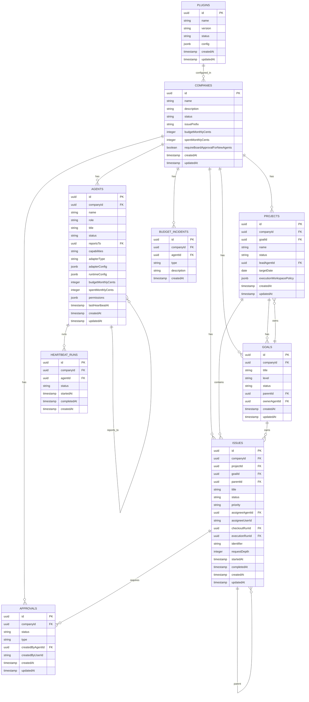

# Paperclip 需求文档

**Author:** AI-Automated-office Analysis
**Date:** 2026-03-26
**Project:** Paperclip - 开源 AI Agent 编排平台
**Codebase Version:** master branch (2026-03-20)

---

## Executive Summary（执行摘要）

### 功能定位

Paperclip 是一个**开源的 AI Agent 编排平台**，用于构建和运行自主 AI 公司。它将多个 AI Agent（OpenClaw、Claude Code、Codex、Cursor 等）组织成企业级结构，提供目标管理、任务分配、成本控制、审批治理等企业运营能力。

> **核心理念：** "If OpenClaw is an _employee_, Paperclip is the _company_"

### 业务价值

| 解决的问题 | 带来的价值 |
|-----------|-----------|
| 协调多个 AI Agent 向同一目标工作 | 统一的任务管理和进度跟踪 |
| Agent 运行成本失控 | 精确的预算控制和预警机制 |
| Agent 工作上下文丢失 | 持久化的会话状态和完整的审计日志 |
| Agent 协作和委派流程不清 | 组织架构、汇报关系和审批流程 |
| 缺乏对 Agent 工作的监管 | 阶段性的审批门禁和回滚能力 |

### 目标用户

- **AI 创业者：** 希望构建自主运行的 AI 公司
- **开发者：** 需要协调多个 AI Agent 协同工作
- **企业：** 需要对 AI Agent 工作进行治理和审计

### 问题与机遇

| 痛点 | 机遇 |
|------|------|
| 20 个 Claude Code 终端同时运行，无法追踪谁在做什么 | 票据式任务管理，会话持久化 |
| 手动从多个地方收集上下文 | 目标驱动，任务自动关联项目和公司目标 |
| 成本失控，运行循环浪费大量资金 | 预算追踪和 Agent 节流 |
| 定期任务需要人工触发 | 心跳机制自动调度 |

### 解决方案

| 设计要点 | 解决的问题 |
|---------|-----------|
| 原子化任务检出和预算执行 | 防止双重工作和超支 |
| 持久化 Agent 状态 | Agent 在心跳间恢复相同任务上下文 |
| 运行时技能注入 | Agent 可在运行时学习 Paperclip 工作流和项目上下文 |
| 治理与回滚 | 审批门禁强制执行，配置变更版本化 |
| 目标感知执行 | 任务携带完整目标祖先，Agent 始终理解"为什么" |
| 公司模板导入/导出 | 秘密擦除和冲突处理 |
| 真正的多公司隔离 | 每个实体按公司作用域划分 |

### What Makes This Special

- **不是聊天机器人：** Agent 有工作职责，而非聊天窗口
- **不是 Agent 框架：** 不告诉如何构建 Agent，而是如何运营一个由 Agent 组成的公司
- **不是工作流构建器：** 不做拖放管道，而是建模公司——包括组织图、目标、预算和治理
- **不是提示管理器：** Agent 携带自己的提示、模型和运行时

---

## Project Classification（项目分类）

| 维度 | 分类 |
|------|------|
| **项目类型** | Web Application + CLI Tool |
| **领域** | AI Agent 编排 / 自主公司运营平台 |
| **复杂度** | High |
| **项目上下文** | Brownfield（已有完整实现） |
| **目标用户** | AI 创业者、开发者、企业 AI 治理 |
| **技术栈** | Node.js + Express + TypeScript (后端) / React + Vite + TailwindCSS + Shadcn/ui (前端) |
| **部署环境** | Docker / 本地 Node.js / 云部署 |
| **数据库** | PostgreSQL + Drizzle ORM |
| **Monorepo** | pnpm workspace |

---

## Success Criteria（成功标准）

### User Success（用户成功）

**用户成功的"Aha时刻"：**

| 场景 | 成功表现 |
|------|----------|
| 用户创建公司并任命 CEO Agent | Agent 开始自主调度任务 |
| 任务分配给 Agent 后心跳触发 | Agent 领取任务并开始执行 |
| Agent 到达审批节点 | 任务暂停等待人工审批 |
| Agent 超出预算 | Agent 自动停止，防止超支 |

**用户成功指标：**

| 指标 | 目标 |
|------|------|
| 公司创建完成时间 | < 5 分钟 |
| Agent 首次心跳响应时间 | < 30 秒 |
| 任务从创建到完成转化率 | > 70% |

### Business Success（业务成功）

| 指标 | 目标 |
|------|------|
| 单部署多公司支持数量 | 无限 |
| Agent 调度准确率 | > 99% |
| 预算超支发生率 | 0% |

### Technical Success（技术成功）

| 指标 | 目标 |
|------|------|
| 系统可用性 | ≥ 99% |
| API 响应时间 (p95) | < 500ms |
| 数据库查询时间 (p95) | < 100ms |
| 心跳调度延迟 | < 5 秒 |

### Measurable Outcomes（可衡量成果）

| 维度 | 关键指标 | 衡量方式 |
|------|---------|---------|
| 任务管理 | 任务创建数/日、任务完成率 | Dashboard 统计 |
| Agent 活动 | 心跳次数/日、活跃 Agent 数 | Activity 面板 |
| 成本控制 | 预算消耗率、预算预警触发次数 | Costs 页面 |
| 审批流程 | 待审批数量、平均审批时间 | Approvals 列表 |

---

## Product Scope（产品范围）

### MVP - Minimum Viable Product（最小可行产品）

**必须具备的核心功能：**

| 模块 | 功能 |
|------|------|
| **公司管理** | 创建公司、公司设置、公司导入/导出 |
| **Agent 管理** | 创建 Agent、配置 Adapter、Agent 状态管理 |
| **目标管理** | 创建目标、目标树、目标分配 |
| **项目/Issue 管理** | 创建项目、创建 Issue、Issue 状态流转 |
| **心跳调度** | 心跳配置、心跳触发、心跳日志 |
| **审批流程** | 创建审批、审批操作 |
| **预算控制** | 公司预算、Agent 预算、预算追踪 |
| **成本追踪** | 成本事件记录、成本报表 |
| **认证授权** | Board 用户认证、Agent JWT 认证 |

### Growth Features（增长功能）

| 功能 | 说明 |
|------|------|
| **插件系统** | 可扩展的能力体系 |
| **执行工作空间** | Agent 隔离执行环境 |
| **公司模板市场 (Clipmart)** | 预构建公司模板导入 |
| **移动端支持** | 手机监控和管理 |

### Vision（未来愿景）

| 功能 | 说明 |
|------|------|
| 云端 Agent 支持 | Cursor / e2b agents |
| 知识库集成 | 插件化知识库支持 |
| 自定义追溯 | 自定义追踪系统 |
| 队列集成 | 消息队列支持 |

---

## User Journeys（用户旅程）

### Journey 1: 创始人创建 AI 公司

**人物档案**
- **姓名：** 张老板
- **角色：** AI 创业者
- **现状：** 有多个 AI Agent 概念，需要整合
- **内心渴望：** 快速建立自主运行的 AI 公司

**旅程叙事**

1. 张老板运行 `npx paperclipai onboard --yes` 启动系统
2. 系统创建默认公司，张老板成为 Board 成员
3. 张老板创建 CEO Agent，配置 Claude Code 作为 Adapter
4. CEO Agent 收到创建团队的目标，开始自主工作
5. 张老板通过 Dashboard 监控团队进度和成本

**旅程需求**
- 快速 onboarding 流程
- 默认配置可用
- 清晰的 Dashboard 展示

---

### Journey 2: Agent 接收并完成任务

**人物档案**
- **姓名：** DevBot
- **角色：** AI Developer Agent
- **现状：** 处于空闲状态，等待任务分配
- **内心渴望：** 明确的任务目标和执行上下文

**旅程叙事**

1. CEO Agent 创建 Issue 指派给 DevBot
2. DevBot 的心跳触发，检查分配的任务
3. DevBot 检出 Issue，开始执行
4. DevBot 创建子 Issue 委派给其他 Agent
5. DevBot 完成工作，提交审批

**旅程需求**
- 完整的目标上下文传递
- 任务检出锁防止冲突
- 子任务委派机制

---

### Journey 3: 预算超额保护

**人物档案**
- **姓名：** 财务 Agent
- **角色：** AI Finance Controller
- **现状：** 监控团队支出
- **内心渴望：** 防止任何超额支出

**旅程叙事**

1. 系统配置 Agent 月度预算
2. Agent 执行任务产生成本事件
3. 成本实时累加到 Agent 支出
4. 接近预算时触发预警
5. 达到预算时 Agent 自动停止

**旅程需求**
- 实时成本追踪
- 预算预警机制
- 原子化的预算扣减

---

### Journey Requirements Summary（旅程需求汇总）

| 能力领域 | 涉及旅程 | 关键功能 |
|---------|---------|---------|
| 公司运营 | Journey 1, 2 | 多公司隔离、公司导入/导出 |
| Agent 编排 | Journey 1, 2 | Agent 创建、配置、状态管理 |
| 任务管理 | Journey 2 | Issue 创建、分配、状态流转 |
| 成本控制 | Journey 3 | 预算配置、实时追踪、超支保护 |
| 审批治理 | Journey 2 | 审批创建、审批操作 |

---

## Technical Requirements（技术需求）

### Technical Architecture（技术架构）

| 层级 | 技术选型 | 说明 |
|------|---------|------|
| **前端** | React 18 + Vite + TypeScript | 响应式 Web UI |
| **UI组件库** | Shadcn/ui + Tailwind CSS | 现代企业级组件 |
| **状态管理** | React Context + Hooks | 轻量级状态管理 |
| **后端** | Node.js + Express + TypeScript | RESTful API |
| **数据库** | PostgreSQL + Drizzle ORM | 关系型数据存储 |
| **实时通信** | Server-Sent Events (SSE) | 实时事件推送 |
| **文件存储** | 本地文件系统 | 附件和文档存储 |
| **容器化** | Docker + Docker Compose | 一键部署 |
| **Monorepo** | pnpm workspace | 统一依赖管理 |

### Performance Targets（性能指标）

| 指标 | 目标值 |
|------|--------|
| 首屏加载时间 | < 2秒 |
| API响应时间 (p95) | < 500ms |
| 数据库查询时间 (p95) | < 100ms |
| 并发用户支持 | 100+ |
| 同时运行 Agent | 20+ |

### Security Requirements（安全要求）

| 安全措施 | 说明 |
|---------|------|
| HTTPS | 生产环境强制 HTTPS |
| JWT 认证 | Board 用户和 Agent 认证 |
| 密钥加密 | 敏感信息加密存储 |
| 秘密严格模式 | 可选的严格秘密管理 |
| 公司数据隔离 | 完整的多租户隔离 |
| 审计日志 | 所有操作记录日志 |

### Browser/Mobile Support（兼容性要求）

| 平台 | 版本要求 |
|------|---------|
| Chrome | 最新 2 个版本 |
| Firefox | 最新 2 个版本 |
| Safari | 最新 2 个版本 |
| Edge | 最新 2 个版本 |

---

## Functional Requirements（功能需求）

### 模块一：公司管理 (Companies)

| 编号 | 功能描述 | 优先级 |
|------|---------|--------|
| FR-C1 | 创建公司 | P0 |
| FR-C2 | 公司列表展示 | P0 |
| FR-C3 | 公司详情查看 | P0 |
| FR-C4 | 公司设置更新 | P0 |
| FR-C5 | 公司导入/导出 | P1 |
| FR-C6 | 公司 Logo 管理 | P1 |
| FR-C7 | 公司统计信息 | P1 |
| FR-C8 | 公司暂停/恢复 | P2 |

### 模块二：Agent 管理 (Agents)

| 编号 | 功能描述 | 优先级 |
|------|---------|--------|
| FR-A1 | 创建 Agent | P0 |
| FR-A2 | 配置 Agent Adapter | P0 |
| FR-A3 | Agent 列表展示 | P0 |
| FR-A4 | Agent 详情查看 | P0 |
| FR-A5 | Agent 状态管理 (idle/running/paused) | P0 |
| FR-A6 | Agent 权限配置 | P0 |
| FR-A7 | Agent 层级关系 (reportsTo) | P0 |
| FR-A8 | Agent JWT 密钥管理 | P0 |
| FR-A9 | Agent 预算配置 | P0 |
| FR-A10 | Agent 暂停/恢复 | P1 |
| FR-A11 | 支持的 Adapter 类型 | P0 |
| FR-A12 | Adapter 环境测试 | P1 |

**支持的 Adapter 类型：**

| Adapter | 说明 |
|---------|------|
| claude_local | Claude Code 本地 |
| codex_local | Codex 本地 |
| cursor_local | Cursor 本地 |
| gemini_local | Gemini 本地 |
| opencode_local | OpenCode 本地 |
| openclaw_gateway | OpenClaw Gateway |
| pi_local | Pi 本地 |

### 模块三：目标管理 (Goals)

| 编号 | 功能描述 | 优先级 |
|------|---------|--------|
| FR-G1 | 创建目标 | P0 |
| FR-G2 | 目标树展示 | P0 |
| FR-G3 | 目标分配 | P0 |
| FR-G4 | 目标状态管理 | P0 |
| FR-G5 | 目标详情查看 | P0 |
| FR-G6 | 子目标创建 | P1 |

### 模块四：项目管理 (Projects)

| 编号 | 功能描述 | 优先级 |
|------|---------|--------|
| FR-P1 | 创建项目 | P0 |
| FR-P2 | 项目列表展示 | P0 |
| FR-P3 | 项目详情查看 | P0 |
| FR-P4 | 项目目标关联 | P0 |
| FR-P5 | 项目状态管理 | P0 |
| FR-P6 | 项目执行空间策略 | P1 |
| FR-P7 | 项目归档 | P2 |

### 模块五：工单管理 (Issues)

| 编号 | 功能描述 | 优先级 |
|------|---------|--------|
| FR-I1 | 创建 Issue | P0 |
| FR-I2 | Issue 列表展示 (Kanban/列表) | P0 |
| FR-I3 | Issue 详情查看 | P0 |
| FR-I4 | Issue 状态流转 | P0 |
| FR-I5 | Issue 分配 (Agent/User) | P0 |
| FR-I6 | Issue 检出 (Checkout) | P0 |
| FR-I7 | Issue 评论 | P0 |
| FR-I8 | Issue 附件 | P1 |
| FR-I9 | Issue 标签 | P1 |
| FR-I10 | Issue 文档关联 | P1 |
| FR-I11 | Issue 工作产出 | P1 |
| FR-I12 | Issue 优先级 | P0 |
| FR-I13 | Issue 审批关联 | P0 |
| FR-I14 | Issue 父子关系 | P1 |
| FR-I15 | Issue 隐藏/取消 | P1 |
| FR-I16 | Issue 编号自动生成 | P0 |

### 模块六：心跳调度 (Heartbeat)

| 编号 | 功能描述 | 优先级 |
|------|---------|--------|
| FR-H1 | 心跳配置 | P0 |
| FR-H2 | 心跳触发 | P0 |
| FR-H3 | 心跳运行日志 | P0 |
| FR-H4 | 心跳事件记录 | P0 |
| FR-H5 | 心跳摘要 | P1 |
| FR-H6 | Agent 唤醒请求 | P1 |
| FR-H7 | 实例调度器心跳 | P1 |

### 模块七：审批流程 (Approvals)

| 编号 | 功能描述 | 优先级 |
|------|---------|--------|
| FR-AP1 | 创建审批 | P0 |
| FR-AP2 | 审批列表展示 | P0 |
| FR-AP3 | 审批详情查看 | P0 |
| FR-AP4 | 审批操作 (批准/拒绝) | P0 |
| FR-AP5 | 审批评论 | P1 |
| FR-AP6 | Issue 审批关联 | P0 |
| FR-AP7 | 审批必要条件检查 | P1 |

### 模块八：成本与预算 (Costs & Budgets)

| 编号 | 功能描述 | 优先级 |
|------|---------|--------|
| FR-CO1 | 公司月度预算配置 | P0 |
| FR-CO2 | Agent 月度预算配置 | P0 |
| FR-CO3 | 成本事件记录 | P0 |
| FR-CO4 | 成本追踪展示 | P0 |
| FR-CO5 | 预算超支保护 | P0 |
| FR-CO6 | 预算预警机制 | P1 |
| FR-CO7 | 成本事件查询 | P1 |
| FR-CO8 | 财务时间线 | P1 |
| FR-CO9 | 预算政策配置 | P1 |
| FR-CO10 | 预算事故记录 | P1 |

### 模块九：插件系统 (Plugins)

| 编号 | 功能描述 | 优先级 |
|------|---------|--------|
| FR-PL1 | 插件安装 | P0 |
| FR-PL2 | 插件列表展示 | P0 |
| FR-PL3 | 插件配置 | P0 |
| FR-PL4 | 插件启用/禁用 | P0 |
| FR-PL5 | 插件生命周期管理 | P0 |
| FR-PL6 | 插件作业调度 | P0 |
| FR-PL7 | 插件作业协调 | P1 |
| FR-PL8 | 插件状态存储 | P0 |
| FR-PL9 | 插件工具注册 | P0 |
| FR-PL10 | 插件工具调度 | P0 |
| FR-PL11 | 插件事件总线 | P0 |
| FR-PL12 | 插件清单验证 | P1 |
| FR-PL13 | 插件能力验证 | P1 |
| FR-PL14 | 插件配置验证 | P1 |
| FR-PL15 | 插件隔离执行 | P1 |
| FR-PL16 | 插件开发观察器 | P1 |
| FR-PL17 | 插件日志保留 | P2 |
| FR-PL18 | 插件静态资源服务 | P1 |

### 模块十：执行工作空间 (Execution Workspaces)

| 编号 | 功能描述 | 优先级 |
|------|---------|--------|
| FR-EW1 | 创建执行空间 | P0 |
| FR-EW2 | 执行空间详情 | P0 |
| FR-EW3 | 执行空间策略 | P0 |
| FR-EW4 | 执行空间运行时 | P1 |
| FR-EW5 | 工作空间操作日志 | P1 |

### 模块十一：访问控制 (Access Control)

| 编号 | 功能描述 | 优先级 |
|------|---------|--------|
| FR-AC1 | 公司成员管理 | P0 |
| FR-AC2 | 权限授予 | P0 |
| FR-AC3 | 权限检查 | P0 |
| FR-AC4 | 邀请管理 | P1 |
| FR-AC5 | 加入请求 | P1 |

### 模块十二：实时事件 (Live Events)

| 编号 | 功能描述 | 优先级 |
|------|---------|--------|
| FR-LE1 | SSE 实时推送 | P0 |
| FR-LE2 | 实时事件订阅 | P0 |
| FR-LE3 | 活跃 Agent 面板 | P1 |

### 模块十三：资产与附件 (Assets & Attachments)

| 编号 | 功能描述 | 优先级 |
|------|---------|--------|
| FR-AT1 | 文件上传 | P0 |
| FR-AT2 | 文件下载 | P0 |
| FR-AT3 | 资产类型验证 | P0 |
| FR-AT4 | Issue 附件关联 | P0 |

### 模块十四：文档管理 (Documents)

| 编号 | 功能描述 | 优先级 |
|------|---------|--------|
| FR-D1 | 文档创建 | P0 |
| FR-D2 | 文档更新 | P0 |
| FR-D3 | Issue 文档关联 | P0 |
| FR-D4 | 文档修订历史 | P1 |

### 模块十五：实例设置 (Instance Settings)

| 编号 | 功能描述 | 优先级 |
|------|---------|--------|
| FR-IS1 | 实例配置 | P0 |
| FR-IS2 | 允许的主机名配置 | P0 |
| FR-IS3 | LLM 提供商配置 | P0 |

---

## Non-Functional Requirements（非功能需求）

### Performance（性能）

| 编号 | 需求 | 指标 |
|------|------|------|
| NFR-P1 | 页面首屏加载时间 | < 2秒 |
| NFR-P2 | API 响应时间 (p95) | < 500ms |
| NFR-P3 | 数据库查询时间 (p95) | < 100ms |
| NFR-P4 | 并发用户支持 | 100+ |
| NFR-P5 | 同时运行 Agent 支持 | 20+ |

### Security（安全）

| 编号 | 需求 | 说明 |
|------|------|------|
| NFR-S1 | HTTPS 加密 | 生产环境所有通信强制使用 HTTPS |
| NFR-S2 | JWT 认证 | Board 用户和 Agent 使用 JWT |
| NFR-S3 | 敏感信息加密 | 秘密信息加密存储 |
| NFR-S4 | 秘密严格模式 | 可选的严格秘密管理 |
| NFR-S5 | 公司数据隔离 | 完整的多租户数据隔离 |
| NFR-S6 | 审计日志 | 所有管理操作记录审计日志 |

### Reliability（可靠性）

| 编号 | 需求 | 指标 |
|------|------|------|
| NFR-R1 | 系统可用性 | ≥ 99% |
| NFR-R2 | 心跳调度可靠性 | > 99.5% |
| NFR-R3 | 任务原子性 | 任务检出和预算执行原子化 |

### Accessibility（无障碍）

| 编号 | 需求 | 说明 |
|------|------|------|
| NFR-A1 | WCAG 合规 | 目标符合 WCAG 2.1 AA 级 |

### Maintainability（可维护性）

| 编号 | 需求 | 说明 |
|------|------|------|
| NFR-M1 | 操作日志 | 所有管理操作记录日志 |
| NFR-M2 | 配置版本化 | 配置变更可追溯 |
| NFR-M3 | 错误恢复 | 支持配置回滚 |

### Scalability（可扩展性）

| 编号 | 需求 | 说明 |
|------|------|------|
| NFR-SC1 | 多公司支持 | 单部署支持无限公司 |
| NFR-SC2 | 插件扩展 | 支持插件化功能扩展 |

---

## Data Model（数据模型）

### ER Diagram（实体关系图）

---

## API Summary（API 汇总）

### Routes Overview（路由概览）

| 路由模块 | 端点数量 | 说明 |
|---------|---------|------|
| `/api/access` | 20+ | 访问控制和权限 |
| `/api/activity` | 5+ | 活动日志 |
| `/api/agents` | 30+ | Agent CRUD 和操作 |
| `/api/approvals` | 10+ | 审批管理 |
| `/api/assets` | 5+ | 资产管理 |
| `/api/companies` | 10+ | 公司管理 |
| `/api/costs` | 10+ | 成本追踪 |
| `/api/dashboard` | 3+ | 仪表板统计 |
| `/api/execution-workspaces` | 5+ | 执行工作空间 |
| `/api/goals` | 5+ | 目标管理 |
| `/api/health` | 2+ | 健康检查 |
| `/api/issues` | 40+ | Issue 完整 CRUD |
| `/api/llms` | 5+ | LLM 配置 |
| `/api/plugins` | 30+ | 插件管理 |
| `/api/projects` | 10+ | 项目管理 |
| `/api/secrets` | 5+ | 秘密管理 |

---

## Appendix（附录）

### 相关文件列表

**核心代码目录：**
- `server/src/` - 后端 Express API
- `server/src/routes/` - 路由处理
- `server/src/services/` - 业务逻辑服务
- `packages/db/src/schema/` - 数据库 schema 定义
- `packages/shared/src/` - 共享类型和验证
- `packages/adapters/` - Agent Adapter 实现
- `ui/src/pages/` - 前端页面组件
- `ui/src/components/` - 前端 UI 组件

**配置文件：**
- `package.json` - 根目录 pnpm 配置
- `pnpm-lock.yaml` - 依赖锁定
- `docker-compose.yml` - Docker 编排
- `.env.example` - 环境变量示例

**数据库 Schema：**
- `packages/db/src/schema/companies.ts` - 公司表
- `packages/db/src/schema/agents.ts` - Agent 表
- `packages/db/src/schema/projects.ts` - 项目表
- `packages/db/src/schema/goals.ts` - 目标表
- `packages/db/src/schema/issues.ts` - Issue 表
- `packages/db/src/schema/approvals.ts` - 审批表
- `packages/db/src/schema/heartbeat_runs.ts` - 心跳运行表
- `packages/db/src/schema/budget_incidents.ts` - 预算事故表
- `packages/db/src/schema/plugins.ts` - 插件表

### 版本历史

| 版本 | 日期 | 变更说明 |
|------|------|----------|
| 1.0 | 2026-03-26 | 初始 PRD 生成，基于 master 分支代码分析 |

---

## 参考资料

- **项目 README:** `README.md`
- **开发指南:** `doc/DEVELOPING.md`
- **AGENTS.md:** Agent 行为规范
- **贡献指南:** `CONTRIBUTING.md`
