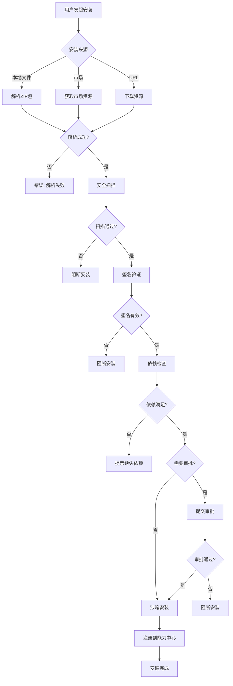

# Design: ClawHub生态 - Skill/Plugin安装与安全管理

## Context

基于Story 10.1已实现的Skill解析能力，本Story实现完整的安装与安全管理流程。ClawHub是平台能力分发中心，需要提供安全可信的安装机制。

当前系统状态：
- Skill解析器已实现（Story 10.1）
- 缺少安装、卸载、版本管理功能
- 缺少安全扫描和签名验证
- 缺少沙箱隔离机制
- 缺少安装审批流程

## Goals / Non-Goals

### Goals

- [x] 实现本地Skill文件导入功能
- [x] 实现私有市场和ClawHub官方市场安装
- [x] 实现Plugin沙箱执行环境
- [x] 实现安全扫描和来源验证
- [x] 实现签名验证机制
- [x] 实现版本更新检查和升级
- [x] 实现资源黑白名单配置
- [x] 实现安装审批流程

### Non-Goals

- [ ] ClawHub官方市场前端（Story 10.3）
- [ ] 插件市场的完整UI
- [ ] 自动回滚机制
- [ ] 能力市场的离线缓存

## Decisions

### 1. 安装流程设计

#### 流程图



#### 详细步骤

1. **解析资源包**：提取 Skill.md/Package.json 元数据
2. **安全扫描**：静态分析+病毒特征匹配
3. **签名验证**：验证发布者签名
4. **依赖检查**：确保前置能力已安装
5. **权限申请**：分析所需系统权限
6. **审批流程**：高风险能力需审批
7. **沙箱安装**：在隔离环境安装
8. **注册**：写入能力注册表

### 2. 核心数据模型

#### Rust 类型定义

```rust
//! 安装请求
#[derive(Debug, Clone, Serialize, Deserialize)]
pub struct InstallRequest {
    /// 安装来源
    pub source: InstallSource,
    /// 资源标识符
    pub resource_id: String,
    /// 指定版本（None表示最新）
    pub version: Option<String>,
    /// 安装选项
    pub options: InstallOptions,
    /// 租户ID
    pub tenant_id: String,
    /// 请求用户
    pub requested_by: String,
}

/// 安装来源
#[derive(Debug, Clone, Copy, PartialEq, Eq, Serialize, Deserialize)]
pub enum InstallSource {
    /// 本地文件
    Local,
    /// 官方市场
    Marketplace,
    /// 私有市场
    PrivateMarket,
    /// URL下载
    Url,
}

/// 安装选项
#[derive(Debug, Clone, Serialize, Deserialize)]
pub struct InstallOptions {
    /// 跳过审批
    pub skip_approve: bool,
    /// 强制覆盖已安装版本
    pub force_install: bool,
    /// 沙箱模式
    pub sandbox_mode: bool,
    /// 安装路径（可选）
    pub install_path: Option<String>,
}

impl Default for InstallOptions {
    fn default() -> Self {
        Self {
            skip_approve: false,
            force_install: false,
            sandbox_mode: true,
            install_path: None,
        }
    }
}

/// 安装结果
#[derive(Debug, Clone, Serialize, Deserialize)]
pub enum InstallResult {
    /// 安装成功
    Success {
        capability_id: String,
        installed_path: String,
        version: String,
    },
    /// 等待审批
    PendingApproval {
        request_id: String,
        estimated_wait: u32, // 分钟
    },
    /// 安全阻断
    SecurityBlocked {
        reason: SecurityBlockReason,
        details: String,
    },
    /// 依赖缺失
    DependencyMissing {
        missing: Vec<DependencyInfo>,
    },
    /// 安装错误
    Error {
        code: String,
        message: String,
    },
}

/// 安全阻断原因
#[derive(Debug, Clone, Serialize, Deserialize)]
pub enum SecurityBlockReason {
    /// 恶意代码检测
    MaliciousCode,
    /// 签名无效
    InvalidSignature,
    /// 签名缺失
    MissingSignature,
    /// 来源不明
    UnknownSource,
    /// 权限过大
    ExcessivePermissions,
    /// 扫描超时
    ScanTimeout,
}

/// 依赖信息
#[derive(Debug, Clone, Serialize, Deserialize)]
pub struct DependencyInfo {
    pub id: String,
    pub name: String,
    pub required_version: String,
    pub current_version: Option<String>,
}
```

#### 签名信息

```rust
/// 签名信息
#[derive(Debug, Clone, Serialize, Deserialize)]
pub struct SignatureInfo {
    /// 签名者ID
    pub signer_id: String,
    /// 签名者名称
    pub signer_name: String,
    /// 签名算法
    pub algorithm: SignatureAlgorithm,
    /// 签名数据
    pub signature: Vec<u8>,
    /// 证书指纹
    pub cert_fingerprint: String,
    /// 签名时间戳
    pub timestamp: i64,
    /// 证书有效期开始
    pub valid_from: i64,
    /// 证书有效期结束
    pub valid_until: i64,
}

/// 签名算法
#[derive(Debug, Clone, Copy, PartialEq, Eq, Serialize, Deserialize)]
pub enum SignatureAlgorithm {
    Ed25519,
    ECDSA_P256,
    RSA_2048,
    RSA_4096,
}
```

#### 沙箱配置

```rust
/// 沙箱配置
#[derive(Debug, Clone, Serialize, Deserialize)]
pub struct SandboxConfig {
    /// 最大内存MB
    pub max_memory_mb: u64,
    /// 最大CPU百分比
    pub max_cpu_percent: u32,
    /// 最大执行时间（秒）
    pub max_duration_secs: u64,
    /// 允许网络访问
    pub network_allowed: bool,
    /// 文件系统只读
    pub filesystem_readonly: bool,
    /// 环境变量
    pub environment_vars: HashMap<String, String>,
    /// 允许的系统调用
    pub allowed_syscalls: Vec<String>,
    /// 禁止的系统调用
    pub denied_syscalls: Vec<String>,
}

impl Default for SandboxConfig {
    fn default() -> Self {
        Self {
            max_memory_mb: 512,
            max_cpu_percent: 50,
            max_duration_secs: 300,
            network_allowed: false,
            filesystem_readonly: true,
            environment_vars: HashMap::new(),
            allowed_syscalls: Vec::new(),
            denied_syscalls: vec![
                "execve".to_string(),
                "fork".to_string(),
                "kill".to_string(),
            ],
        }
    }
}

/// 沙箱类型
#[derive(Debug, Clone, Copy, PartialEq, Eq, Serialize, Deserialize)]
pub enum SandboxType {
    /// 无隔离
    None,
    /// 进程隔离
    Process,
    /// WebAssembly沙箱
    Wasm,
    /// 容器隔离
    Container,
}
```

#### 安全扫描结果

```rust
/// 安全扫描结果
#[derive(Debug, Clone, Serialize, Deserialize)]
pub struct SecurityScanResult {
    /// 是否通过
    pub passed: bool,
    /// 安全评分 (0-100)
    pub score: u32,
    /// 警告列表
    pub warnings: Vec<SecurityWarning>,
    /// 错误列表
    pub errors: Vec<SecurityError>,
    /// 扫描耗时（毫秒）
    pub scan_duration_ms: u64,
    /// 扫描时间戳
    pub scanned_at: i64,
}

/// 安全警告
#[derive(Debug, Clone, Serialize, Deserialize)]
pub enum SecurityWarning {
    /// 网络访问
    NetworkAccess { path: String },
    /// 文件系统访问
    FileSystemAccess { path: String },
    /// 敏感API调用
    SensitiveApi { api: String },
    /// 动态代码执行
    DynamicCode { method: String },
}

/// 安全错误
#[derive(Debug, Clone, Serialize, Deserialize)]
pub enum SecurityError {
    /// 恶意代码特征
    MaliciousPattern { pattern: String, location: String },
    /// 签名被篡改
    TamperedSignature,
    /// 来源不明
    UnknownSource,
    /// 权限过大
    ExcessivePermissions { required: Vec<String> },
    /// 可疑行为
    SuspiciousBehavior { behavior: String },
}
```

#### 审批请求

```rust
/// 安装审批请求
#[derive(Debug, Clone, Serialize, Deserialize)]
pub struct ApprovalRequest {
    /// 请求ID
    pub request_id: String,
    /// 安装ID
    pub install_id: String,
    /// 能力ID
    pub capability_id: String,
    /// 能力名称
    pub capability_name: String,
    /// 版本
    pub version: String,
    /// 请求人
    pub requested_by: String,
    /// 请求时间
    pub requested_at: i64,
    /// 申请理由
    pub reason: String,
    /// 安全扫描结果
    pub security_scan: SecurityScanResult,
    /// 所需权限
    pub permissions_required: Vec<String>,
    /// 紧急程度
    pub urgency: ApprovalUrgency,
}

/// 审批紧急程度
#[derive(Debug, Clone, Copy, PartialEq, Eq, Serialize, Deserialize)]
pub enum ApprovalUrgency {
    /// 普通
    Normal,
    /// 紧急
    Urgent,
    /// 加急
    Critical,
}

/// 审批决策
#[derive(Debug, Clone, Serialize, Deserialize)]
pub enum ApprovalDecision {
    /// 批准
    Approve {
        approver: String,
        decided_at: i64,
        notes: Option<String>,
    },
    /// 拒绝
    Reject {
        rejector: String,
        decided_at: i64,
        reason: String,
    },
    /// 要求更多信息
    RequestMoreInfo {
        approver: String,
        decided_at: i64,
        questions: Vec<String>,
    },
}
```

### 3. API设计

#### Tauri命令

```rust
// ============ 安装命令 ============

/// 本地文件安装
#[tauri::command]
pub async fn capability_install_local(
    ctx: State<'_, AppContext>,
    file_data: Vec<u8>,
    file_name: String,
    options: InstallOptions,
) -> Result<InstallResult, CommandError> {
    // 1. 验证文件格式
    // 2. 解析ZIP包
    // 3. 执行安全扫描
    // 4. 验证签名
    // 5. 检查依赖
    // 6. 执行安装
    // 7. 返回结果
}

/// 从市场安装
#[tauri::command]
pub async fn capability_install_from_market(
    ctx: State<'_, AppContext>,
    resource_id: String,
    version: Option<String>,
    market_id: String,
    options: InstallOptions,
) -> Result<InstallResult, CommandError> {
    // 1. 获取市场资源
    // 2. 下载资源包
    // 3. 执行安全扫描
    // 4. 验证签名
    // 5. 检查依赖
    // 6. 执行安装
    // 7. 返回结果
}

/// 卸载能力
#[tauri::command]
pub async fn capability_uninstall(
    ctx: State<'_, AppContext>,
    capability_id: String,
    force: bool,
) -> Result<(), CommandError> {
    // 1. 检查是否有依赖
    // 2. 备份数据（如有）
    // 3. 卸载能力
    // 4. 清理注册表
    // 5. 返回结果
}

/// 获取已安装能力列表
#[tauri::command]
pub async fn capability_list_installed(
    ctx: State<'_, AppContext>,
    category: Option<String>,
) -> Result<Vec<InstalledCapability>, CommandError> {
    // 查询数据库
    // 返回列表
}

// ============ 安全命令 ============

/// 执行安全扫描
#[tauri::command]
pub async fn capability_security_scan(
    file_data: Vec<u8>,
) -> Result<SecurityScanResult, CommandError> {
    // 1. 提取代码特征
    // 2. 匹配恶意模式
    // 3. 分析敏感API
    // 4. 返回结果
}

/// 验证签名
#[tauri::command]
pub async fn capability_verify_signature(
    file_data: Vec<u8>,
    signature: Vec<u8>,
    public_key: String,
) -> Result<bool, CommandError> {
    // 1. 解析签名
    // 2. 验证签名
    // 3. 返回结果
}

// ============ 审批命令 ============

/// 提交安装审批
#[tauri::command]
pub async fn capability_submit_approval(
    ctx: State<'_, AppContext>,
    install_request: InstallRequest,
    reason: String,
) -> Result<ApprovalRequest, CommandError> {
    // 1. 创建审批请求
    // 2. 通知审批人
    // 3. 返回请求信息
}

/// 获取待审批列表
#[tauri::command]
pub async fn capability_pending_approvals(
    ctx: State<'_, AppContext>,
) -> Result<Vec<ApprovalRequest>, CommandError> {
    // 查询待审批
    // 返回列表
}

/// 处理审批
#[tauri::command]
pub async fn capability_process_approval(
    ctx: State<'_, AppContext>,
    request_id: String,
    decision: ApprovalDecision,
) -> Result<InstallResult, CommandError> {
    // 1. 更新审批状态
    // 2. 发送通知
    // 3. 执行或拒绝安装
}

// ============ 版本命令 ============

/// 检查更新
#[tauri::command]
pub async fn capability_check_updates(
    ctx: State<'_, AppContext>,
    capability_id: String,
) -> Result<Option<UpdateInfo>, CommandError> {
    // 1. 获取当前版本
    // 2. 查询市场最新版本
    // 3. 返回更新信息
}

/// 执行更新
#[tauri::command]
pub async fn capability_execute_update(
    ctx: State<'_, AppContext>,
    capability_id: String,
    target_version: String,
) -> Result<InstallResult, CommandError> {
    // 1. 备份当前版本
    // 2. 安装新版本
    // 3. 验证安装
    // 4. 返回结果
}
```

### 4. 数据库Schema

```sql
-- 安装记录表
CREATE TABLE capability_installs (
    id TEXT PRIMARY KEY,
    capability_id TEXT NOT NULL,
    version TEXT NOT NULL,
    source TEXT NOT NULL CHECK (source IN ('local', 'marketplace', 'private_market', 'url')),
    install_path TEXT NOT NULL,
    sandbox_type TEXT NOT NULL DEFAULT 'process' CHECK (sandbox_type IN ('none', 'process', 'wasm', 'container')),
    status TEXT NOT NULL DEFAULT 'installed' CHECK (status IN ('pending', 'scanning', 'installing', 'installed', 'failed', 'uninstalled')),
    security_score INTEGER,
    installed_by TEXT NOT NULL,
    installed_at INTEGER NOT NULL,
    updated_at INTEGER NOT NULL,
    tenant_id TEXT NOT NULL,
    UNIQUE(capability_id, version)
);

CREATE INDEX idx_installs_tenant ON capability_installs(tenant_id);
CREATE INDEX idx_installs_status ON capability_installs(status);
CREATE INDEX idx_installs_capability ON capability_installs(capability_id);

-- 安装审批表
CREATE TABLE install_approvals (
    id TEXT PRIMARY KEY,
    install_id TEXT NOT NULL REFERENCES capability_installs(id),
    capability_id TEXT NOT NULL,
    capability_name TEXT NOT NULL,
    version TEXT NOT NULL,
    status TEXT NOT NULL DEFAULT 'pending' CHECK (status IN ('pending', 'approved', 'rejected', 'cancelled')),
    requested_by TEXT NOT NULL,
    requested_at INTEGER NOT NULL,
    reason TEXT,
    security_scan_result TEXT, -- JSON
    permissions_required TEXT, -- JSON
    urgency TEXT DEFAULT 'normal' CHECK (urgency IN ('normal', 'urgent', 'critical')),
    approver TEXT,
    decided_at INTEGER,
    decision_note TEXT,
    tenant_id TEXT NOT NULL,
    created_at INTEGER NOT NULL
);

CREATE INDEX idx_approvals_status ON install_approvals(status);
CREATE INDEX idx_approvals_tenant ON install_approvals(tenant_id);
CREATE INDEX idx_approvals_requested_by ON install_approvals(requested_by);

-- 版本记录表
CREATE TABLE capability_versions (
    id TEXT PRIMARY KEY,
    capability_id TEXT NOT NULL,
    version TEXT NOT NULL,
    changelog TEXT,
    published_at INTEGER NOT NULL,
    is_latest INTEGER NOT NULL DEFAULT 0,
    is_stable INTEGER NOT NULL DEFAULT 1,
    download_count INTEGER DEFAULT 0,
    tenant_id TEXT NOT NULL,
    UNIQUE(capability_id, version)
);

CREATE INDEX idx_versions_capability ON capability_versions(capability_id);
CREATE INDEX idx_versions_latest ON capability_versions(capability_id, is_latest);

-- 签名记录表
CREATE TABLE signature_records (
    id TEXT PRIMARY KEY,
    capability_id TEXT NOT NULL,
    version TEXT NOT NULL,
    signer_id TEXT NOT NULL,
    signer_name TEXT NOT NULL,
    algorithm TEXT NOT NULL,
    signature TEXT NOT NULL, -- Base64
    cert_fingerprint TEXT NOT NULL,
    valid_from INTEGER NOT NULL,
    valid_until INTEGER NOT NULL,
    created_at INTEGER NOT NULL,
    tenant_id TEXT NOT NULL,
    UNIQUE(capability_id, version)
);

-- 安全扫描缓存表
CREATE TABLE security_scan_cache (
    id TEXT PRIMARY KEY,
    content_hash TEXT NOT NULL UNIQUE,
    result TEXT NOT NULL, -- JSON
    scanned_at INTEGER NOT NULL,
    expires_at INTEGER NOT NULL
);

CREATE INDEX idx_scan_cache_hash ON security_scan_cache(content_hash);
```

### 5. 目录结构

```
src-tauri/src/
├── capability/
│   ├── mod.rs                      # 模块入口
│   ├── types.rs                    # 公共类型
│   ├── installer/
│   │   ├── mod.rs                  # 安装器模块
│   │   ├── local.rs                # 本地安装
│   │   ├── marketplace.rs          # 市场安装
│   │   ├── url.rs                 # URL安装
│   │   └── dependency.rs           # 依赖解析
│   ├── sandbox/
│   │   ├── mod.rs                 # 沙箱模块
│   │   ├── process.rs              # 进程沙箱
│   │   ├── wasm.rs                # WASM沙箱
│   │   └── config.rs              # 沙箱配置
│   ├── security/
│   │   ├── mod.rs                 # 安全模块
│   │   ├── scanner.rs             # 安全扫描器
│   │   ├── signature.rs            # 签名验证
│   │   ├── patterns.rs            # 恶意模式库
│   │   └── cache.rs               # 扫描缓存
│   ├── approval/
│   │   ├── mod.rs                 # 审批模块
│   │   ├── requester.rs           # 审批请求
│   │   └── processor.rs           # 审批处理
│   ├── version/
│   │   ├── mod.rs                 # 版本模块
│   │   ├── checker.rs             # 版本检查
│   │   └── updater.rs            # 版本更新
│   └── commands.rs                 # Tauri命令
```

### 6. 前端组件结构

```
src/features/capability/
├── components/
│   ├── InstallWizard/
│   │   ├── index.tsx               # 向导入口
│   │   ├── StepSource.tsx         # 选择来源
│   │   ├── StepUpload.tsx         # 上传文件
│   │   ├── StepScan.tsx           # 安全扫描
│   │   ├── StepApprove.tsx        # 审批（如需）
│   │   ├── StepProgress.tsx        # 安装进度
│   │   └── StepComplete.tsx       # 完成
│   ├── SecurityResult/
│   │   ├── index.tsx             # 结果展示
│   │   ├── ScoreCard.tsx         # 评分卡片
│   │   ├── WarningList.tsx       # 警告列表
│   │   └── ErrorList.tsx         # 错误列表
│   ├── ApprovalDialog/
│   │   ├── index.tsx              # 审批对话框
│   │   ├── RequestInfo.tsx        # 请求信息
│   │   ├── SecuritySummary.tsx    # 安全摘要
│   │   └── ApproveForm.tsx       # 审批表单
│   ├── VersionManager/
│   │   ├── index.tsx              # 版本管理
│   │   ├── VersionList.tsx         # 版本列表
│   │   ├── UpdateCard.tsx         # 更新卡片
│   │   └── Changelog.tsx         # 变更日志
│   └── InstalledList/
│       ├── index.tsx              # 已安装列表
│       └── CapabilityCard.tsx    # 能力卡片
├── hooks/
│   ├── useInstaller.ts            # 安装Hook
│   ├── useSecurityScan.ts        # 安全扫描Hook
│   ├── useApproval.ts           # 审批Hook
│   └── useVersion.ts             # 版本Hook
├── api/
│   └── capability.api.ts          # API封装
├── types/
│   ├── installer.types.ts         # 安装类型
│   ├── security.types.ts         # 安全类型
│   └── approval.types.ts         # 审批类型
└── index.ts                       # 统一导出
```

### 7. 前端类型定义

```typescript
// 安装类型
export interface InstallRequest {
  source: 'local' | 'marketplace' | 'private_market' | 'url';
  resourceId: string;
  version?: string;
  options: InstallOptions;
}

export interface InstallOptions {
  skipApprove: boolean;
  forceInstall: boolean;
  sandboxMode: boolean;
  installPath?: string;
}

export type InstallResult =
  | { status: 'success'; capabilityId: string; installedPath: string; version: string }
  | { status: 'pending_approval'; requestId: string; estimatedWait: number }
  | { status: 'security_blocked'; reason: string; details: string }
  | { status: 'dependency_missing'; missing: DependencyInfo[] }
  | { status: 'error'; code: string; message: string };

// 安全类型
export interface SecurityScanResult {
  passed: boolean;
  score: number; // 0-100
  warnings: SecurityWarning[];
  errors: SecurityError[];
  scanDurationMs: number;
  scannedAt: number;
}

export interface SecurityWarning {
  type: 'network_access' | 'filesystem_access' | 'sensitive_api' | 'dynamic_code';
  path?: string;
  api?: string;
  method?: string;
  description: string;
}

export interface SecurityError {
  type: 'malicious_pattern' | 'tampered_signature' | 'unknown_source' | 'excessive_permissions';
  pattern?: string;
  location?: string;
  required?: string[];
  description: string;
}

// 审批类型
export interface ApprovalRequest {
  requestId: string;
  installId: string;
  capabilityId: string;
  capabilityName: string;
  version: string;
  requestedBy: string;
  requestedAt: number;
  reason: string;
  securityScan: SecurityScanResult;
  permissionsRequired: string[];
  urgency: 'normal' | 'urgent' | 'critical';
}

export type ApprovalDecision =
  | { action: 'approve'; notes?: string }
  | { action: 'reject'; reason: string }
  | { action: 'request_more_info'; questions: string[] };
```

## Risks / Trade-offs

| 风险 | 影响 | 可能性 | 缓解措施 |
|------|------|--------|----------|
| 恶意Skill执行 | 高 | 低 | 沙箱隔离+安全扫描+签名验证三重保障 |
| 安装包损坏 | 中 | 低 | SHA256完整性校验 |
| 依赖冲突 | 中 | 中 | 依赖解析器+版本范围检查+用户确认 |
| 审批流程阻塞 | 中 | 中 | 紧急安装通道（需高级权限） |
| 卸载后数据丢失 | 低 | 低 | 卸载前自动备份 |
| 安全扫描误报 | 中 | 中 | 人工复核机制 |
| 签名证书过期 | 低 | 低 | 证书续期机制 |
